This post is based on the Deep Learning course from the Master Datascience Paris Saclay. Materials of the course can be found [here](https://github.com/m2dsupsdlclass/lectures-labs). The complete code can be found on a Kaggle [kernel](https://www.kaggle.com/stevengolo/backpropagation-in-mlp-with-numpy).


**Goal of the notebook**

   * Implement a real gradient descent and a multilayer perceptron using `Numpy`.
   
**Dataset used**

   * The MNIST dataset ([Kaggle link](https://www.kaggle.com/c/digit-recognizer/overview)).


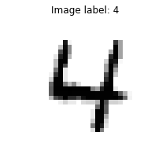
<center>
<p class="caption">
Figure 1: An example of an image in the dataset.
</p>
</center>

# Preprocessing

 * During this step, we will do some normalization on both the training and testing dataset.


```python
# Extract and convert the pixel as numpy array with dtype='float32'
train = np.asarray(digits_train.iloc[:, 1:], dtype='float32')
test = np.asarray(digits_test, dtype='float32')

train_target = np.asarray(digits_train.loc[:, 'label'], dtype='int32')
```

```python
# Scale the data
scaler = preprocessing.StandardScaler()
train_scale = scaler.fit_transform(train)
test_scale = scaler.transform(test)
```

# Implementation using Numpy

## The Logistic Regression

In this section, we will implement a logistic regression model trainable with Stochastic Gradient Descent (SGD) using `Numpy`. Here are the objectives:

* Implement a simple forward model with no hidden layer (equivalent to logisitic regression).
* Build a predict function which returns the most probable class given an input $x$.
* Build an accuracy function for a batch of inputs $X$ and the corresponding expected output $y_{true}$.
* Build a gradient function which computes the derivative of $-\log(softmax(Wx + b))$ with respect to $W$ for an $x$ and its corresponding expected output $y_{true}$.
* Build a train function which uses the gradient function out to update $\mathbf{W}$ and $b$.

**One-hot encoding for class label data**

First, let's define a helper function to compute the one hot encoding of an integer array for a fixed number of classes (similar to Keras `to_categorical` or sklearn `OneHotEncoder`).


**The softmax function**

Now, let's implement the softmax vector function:

$$softmax(\mathbf{x}) = \frac{1}{\sum \exp(x_i)}\begin{pmatrix}\exp(x_1) & \exp(x_2) & \dots & \exp(x_n)\end{pmatrix}^\top.$$

In fact, we will substract $\max{x}$ to each $x_i$ for implementation and more robust and stable computation.


**The negative log-likelihood**

Then, we implement a function that given the true one-hot encoded class `Y_true` and some predicted probabilities `Y_pred` returns the negative log-likelihood.

$$\log l(y_{pred}, y_{true}) = \frac{1}{n}\sum_n (\log(y_{pred}) * y_{true})$$
    
**Logistic regression with SGD**

Let us now study the following linear model trainable by SGD, **one sample at a time**.

```python
# Split the train set into train and validation set.
X_train, X_val, y_train, y_val = train_test_split(
    train_scale, train_target, test_size=0.15, random_state=42)
```

```python
# Build a logistic model and test its forward inference
n_features = X_train.shape[1]
n_classes = len(np.unique(y_train))
lr = LogisticRegression(n_features, n_classes)
```

    Evaluation of the untrained model (recall that the weight and the bias are initialized as random):
        * train loss: 3.4247201913957483
        * train accuracy: 0.08140056022408963
        * test accuracy: 0.08206349206349206
        

Of course, without training the results are very poor! With random initialization, we perform almost the same than just random guessing which have a test accuracy of $0.1$.


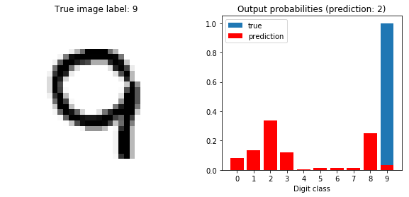
<center>
<p class="caption">
Figure 2: Prediction for the sample 42
</p>
</center>

Now, we will train the network for only one epoch.


    Update #0: train loss: 3.343585555443418, train accuracy: 0.0865266106442577, test accuracy: 0.08492063492063492
    Update #10000: train loss: 0.6733964206461568, train accuracy: 0.8738655462184874, test accuracy: 0.8649206349206349
    Update #20000: train loss: 0.6359774476553697, train accuracy: 0.8851260504201681, test accuracy: 0.8701587301587301
    Update #30000: train loss: 0.6354186281256217, train accuracy: 0.8918767507002802, test accuracy: 0.878095238095238


After one epoch, we can see that the test accuracy is a bit less than $0.9$ (which is quite nice). 
Now, we will evaluate the model on the same image as before to see if the result changes.

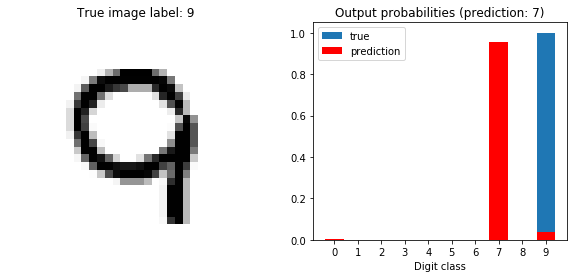
<center>
<p class="caption">
Figure 3: Prediction for the sample 42 after training
</p>
</center>

Even if it's wrong, the model is now very confident for the prediction of the new image, which was not the case before the first epoch (usually the probability to belong to a particular class is below $0.4$). 

## The Feedforward Multilayer

The objective of this section is to implement the backpropagation algorithm (SGD with the chain rule) on a single layer neural network using the sigmoid activation function.

**The sigmoid function**

The sigmoid function is defined by:
$$S(x) = \frac{1}{1 + \exp(-x)} = \frac{\exp(x)}{\exp(x) + 1}$$

The derivative of the sigmoid function is defined by:
$$\frac{dS(x)}{dx} = S(x)\left(1 - S(x)\right)$$


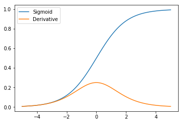
<center>
<p class="caption">
Figure 4: The sigmoid function
</p>
</center>

**The tanh function**

The tanh function is defined by:
$$T(x) = \frac{\exp(2x) - 1}{\exp(2x) + 1}$$

The derivative of the tanh function is defined by:
$$\frac{dT(x)}{dx} = 1 - T(x)^2$$


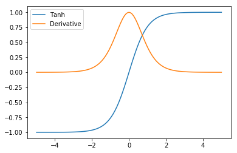
<center>
<p class="caption">
Figure 5: The tanh function
</p>
</center>

**The relu function**

The relu function is defined by:
$$R(x) = \max(0, x)$$

The derivative of the relu function is defined by:
$$\frac{dR(x)}{dx} = \mathbb{1}(x > 0)$$


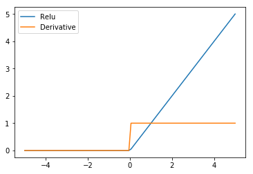
<center>
<p class="caption">
Figure 6: The relu function
</p>
</center>

**The feedforward neural network with one hidden layer**


```python
# Build a NeuralNet model and test its forward inference
n_features = X_train.shape[1]
n_classes = len(np.unique(y_train))
n_hidden = 10
model = NeuralNet(n_features, n_hidden, n_classes)
```

    Evaluation of the untrained model (recall that the weights are initialized as random):
        * train loss: 2.3078980546802033
        * train accuracy: 0.05605042016806722
        * test accuracy: 0.05206349206349206
        
As for the Logistic Regression model, the NeuralNet model performs very poorly before the training (because the weights are initialized as random). 


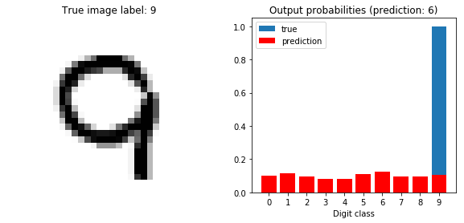
<center>
<p class="caption">
Figure 7: Prediction for the sample 42
</p>
</center>


```python
# Train the model for some epochs
EPOCHS = 15
learning_rate = 0.1

for epoch in range(EPOCHS):
    for i, (x, y) in enumerate(zip(X_train, y_train)):
        model.train(x, y, learning_rate)
```


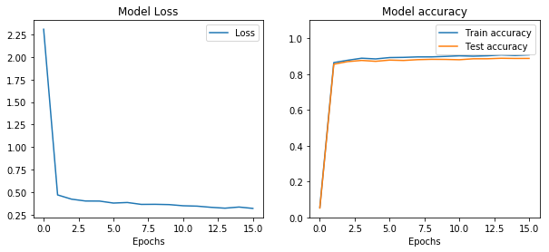
<center>
<p class="caption">
Figure 8: Training losses and accuracy with one hidden layer
</p>
</center>


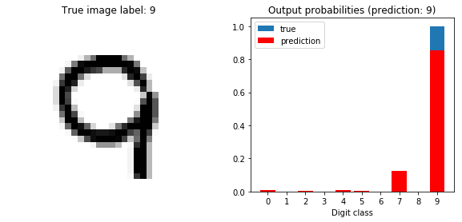
<center>
<p class="caption">
Figure 9: Prediction for the sample 42 after training
</p>
</center>

**Worst prediction errors**

Let's compute the loss for each of the image in the validation set. We will plot the 5 pictures with the higher loss (its corresponds to the ones where the network made the worst prediction).


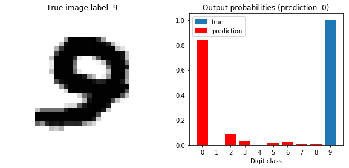

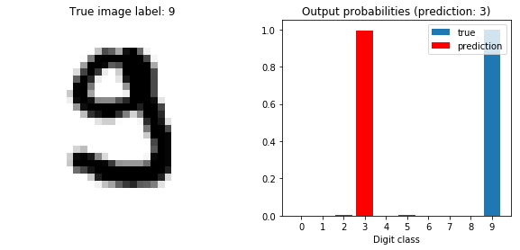

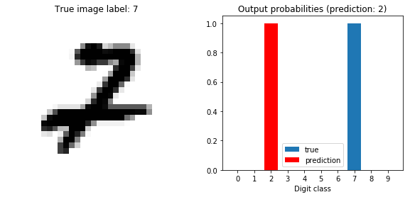

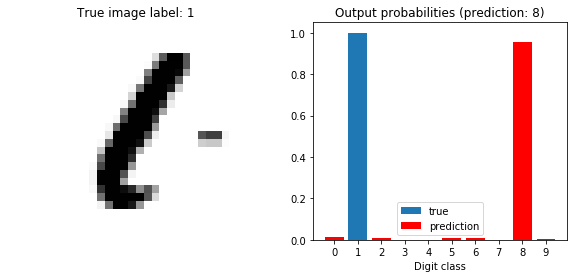


<center>
<p class="caption">
Figure 10: Worst prediction on the test set
</p>
</center>

**Hyper-parameters settings**

We will now change some hyper-parameters (learning rate, size of hidden layer, initialization scheme, ...) to see their influence on the training of the model.

Let's start with the modification of the learning rate, but we kept the other hyper-parameters as before.


```python
n_features = X_train.shape[1]
n_classes = len(np.unique(y_train))
n_hidden = 10

EPOCHS = 15
learning_rates = np.logspace(-5, 1, num=7)

for lr in learning_rates:
    model = NeuralNet(n_features, n_hidden, n_classes)
    for epoch in range(EPOCHS):
        for i, (x, y) in enumerate(zip(X_train, y_train)):
            model.train(x, y, lr)
```

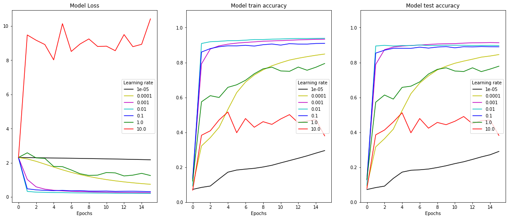
<center>
<p class="caption">
Figure 11: Training losses and accuracy for different learning rate
</p>
</center>


We will now change the size of the hidden layer. We fix the learning rate to $0.1$ as before.


```python
n_features = X_train.shape[1]
n_classes = len(np.unique(y_train))
n_hidden = np.array([5, 10, 25, 50, 100])

EPOCHS = 15
learning_rates = 0.1

for n in n_hidden:
    model = NeuralNet(n_features, n, n_classes)
    for epoch in range(EPOCHS):
        for i, (x, y) in enumerate(zip(X_train, y_train)):
            model.train(x, y, learning_rate)
```

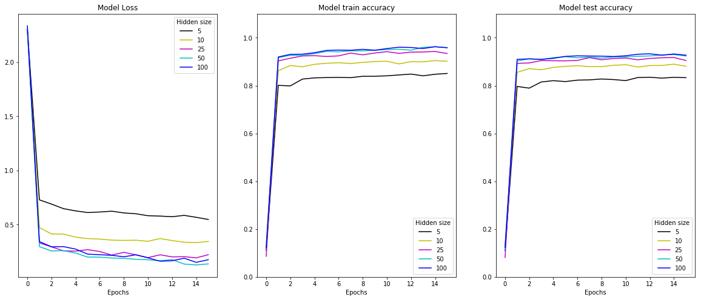
<center>
<p class="caption">
Figure 12: Training losses and accuracy for different size of hidden layer
</p>
</center>

Other initialization schemes are possible. However, it is not useful to test with $0$ initialization because zero is a saddle point: no gradient, no learning. 

Next hyper-parameter to test is the activation function of the hidden layer. So, we are going to try two other activation functions which are the `tanh` and `relu` functions.


```python
# Build a NeuralNet model and test its forward inference with tanh activation function
n_features = X_train.shape[1]
n_classes = len(np.unique(y_train))
n_hidden = 10
model = NeuralNet(n_features, n_hidden, n_classes, activation_function='tanh')
```

    Evaluation of the untrained model (recall that the weights are initialized as random):
        * train loss: 2.2958996830221983
        * train accuracy: 0.14417366946778712
        * test accuracy: 0.1434920634920635
        

```python
# Train the model for some epochs
EPOCHS = 15
learning_rate = 0.1

for epoch in range(EPOCHS):
    for i, (x, y) in enumerate(zip(X_train, y_train)):
        model.train(x, y, learning_rate)
```


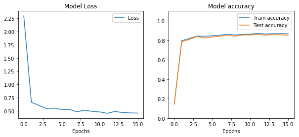
<center>
<p class="caption">
Figure 13: Training losses and accuracy with `tanh` as activation function
</p>
</center>


```python
# Build a NeuralNet model and test its forward inference with relu activation function
n_features = X_train.shape[1]
n_classes = len(np.unique(y_train))
n_hidden = 10
model = NeuralNet(n_features, n_hidden, n_classes, activation_function='relu')
```

    Evaluation of the untrained model (recall that the weights are initialized as random):
        * train loss: 2.355317777018975
        * train accuracy: 0.06473389355742297
        * test accuracy: 0.07095238095238095
        

```python
# Train the model for some epochs
EPOCHS = 15
learning_rate = 0.01

for epoch in range(EPOCHS):
    for i, (x, y) in enumerate(zip(X_train, y_train)):
        model.train(x, y, learning_rate)
```


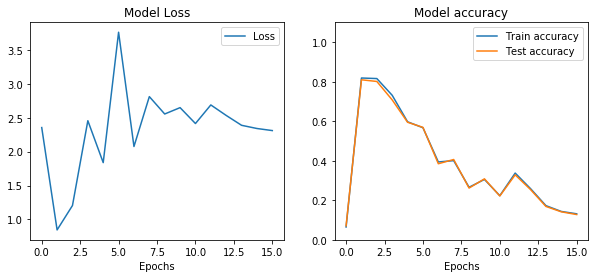
<center>
<p class="caption">
Figure 14: Training losses and accuracy with `relu` as activation function
</p>
</center>

The last hyper-parameter to tune is the number of hidden layers. So, we implemented the support for a second hidden layer and re-run the model with the `sigmoid` activation function and the same other hyper-parameters as before.


```python
# Build a NeuralNet model and test its forward inference with 2 hidden layers
n_features = X_train.shape[1]
n_classes = len(np.unique(y_train))
n_hidden = 20
n_hidden2 = 10
sizes = [n_features, n_hidden, n_hidden2, n_classes]
model = NeuralNet(sizes, activation_function='sigmoid')
```

    Evaluation of the untrained model (recall that the weights are initialized as random):
        * train loss: 2.306703145028008
        * train accuracy: 0.09184873949579832
        * test accuracy: 0.08190476190476191
        

```python
# Train the model for some epochs
EPOCHS = 15
learning_rate = 0.1

for epoch in range(EPOCHS):
    for i, (x, y) in enumerate(zip(X_train, y_train)):
        model.train(x[np.newaxis], y, learning_rate)
```


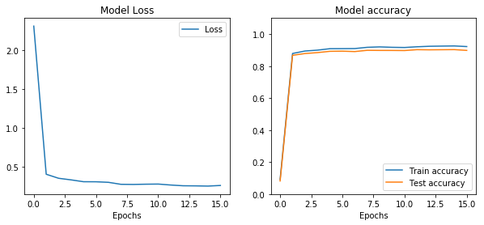
<center>
<p class="caption">
Figure 15: Training losses and accuracy with two hidden layers
</p>
</center>

**Mini-batches**

The current implementations of the functions `train` and `grad_loss` in the class `NeuralNet` only accept a single sample at a time. So, we will implement the support for training with a mini-batche of given size sample at a time instead of one.


```python
# Build a NeuralNet model and test its forward inference with 2 hidden layers
n_features = X_train.shape[1]
n_classes = len(np.unique(y_train))
n_hidden = 100
sizes = [n_features, n_hidden, n_classes]
model = NeuralNet(sizes, activation_function='sigmoid')
```

    Evaluation of the untrained model (recall that the weights are initialized as random):
        * train loss: 2.365239964628688
        * train accuracy: 0.08607843137254902
        * test accuracy: 0.08793650793650794
        

```python
# Train the model for some epochs
EPOCHS = 15
learning_rate = 0.1
mini_batch_size = 32

for epoch in range(EPOCHS):
    mini_batches = [(X_train[k:k + mini_batch_size], y_train[k:k + mini_batch_size]) 
                    for k in range(0, len(X_train), mini_batch_size)]
    for batch in mini_batches:
        model.train(batch[0], batch[1], learning_rate)
```

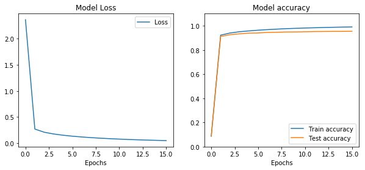
<center>
<p class="caption">
Figure 16: Training losses and accuracy with mini batches
</p>
</center>

# Back to Keras

We will implement the same network architecture with Keras.


```python
# Encoded the target vector as one-hot-encoding vector.
target = to_categorical(y_train)
target_val = to_categorical(y_val)
```


```python
# Define some parameters
N = X_train.shape[1]
H1 = 100 # Dimension of the first hidden layer
H2 = 20 # Dimension of the second hidden layer
K = 10 # Dimension of output layer (number of classes to predict)
lr = 0.1 # Learning rate for the loss function
epochs = 15 # Number of epochs for the NN
batch_size = 32 # Size of the batch

# Define the model
model = Sequential()
model.add(Dense(H1, input_dim=N, activation='sigmoid'))
model.add(Dense(H2, input_dim=H1, activation='sigmoid'))
model.add(Dense(K, input_dim=H2, activation='softmax'))

# Print the model
model.summary()
```

    _________________________________________________________________
    Layer (type)                 Output Shape              Param #   
    =================================================================
    dense_4 (Dense)              (None, 100)               78500     
    _________________________________________________________________
    dense_5 (Dense)              (None, 20)                2020      
    _________________________________________________________________
    dense_6 (Dense)              (None, 10)                210       
    =================================================================
    Total params: 80,730
    Trainable params: 80,730
    Non-trainable params: 0
    _________________________________________________________________


```python
# Define the loss function with the optimizer
model.compile(optimizer=optimizers.SGD(lr=lr),
             loss='categorical_crossentropy',
             metrics=['accuracy'])

# Fit the model
history = model.fit(X_train, target, epochs=epochs, batch_size=batch_size, verbose=0)
```

The Keras model shows very good performance (a little better than the Numpy one).


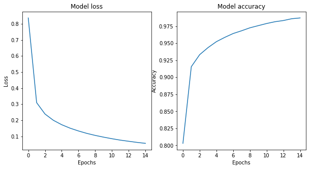
<center>
<p class="caption">
Figure 17: Training losses and accuracy
</p>
</center>

    The negative log-likelihood of a sample 42 in the test set is 0.03864751011133194.

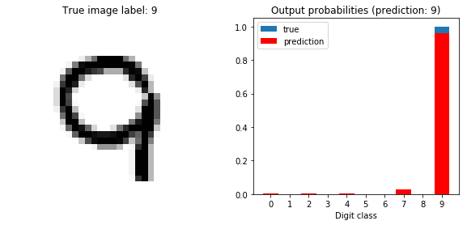
<center>
<p class="caption">
Figure 18: Prediction of the sample 42 after training
</p>
</center>

    The negative log-likelihood on the full test is 0.14100562036037445.

    The negative log-likelihood on the full train set is 0.048328716307878494.


The network seems to converge to a training loss very close to zero when given enough epochs. This model is therefore not underfitting: it has enough capacity to perfectly memorise the full training set.

On the test set the negative log-likelihood is aso close to zero but never as mush as on the training set even after increasing the maximum number of epochs. The model is therefore overfitting a little.
