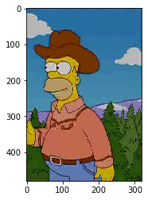
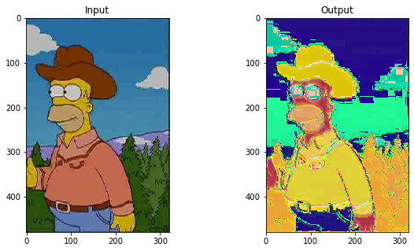
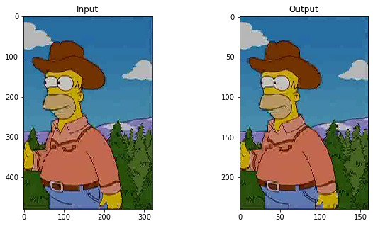
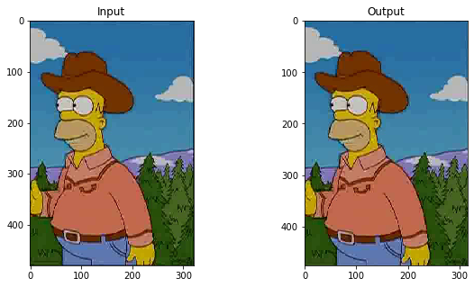
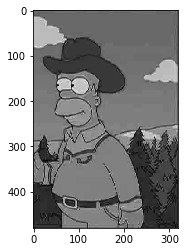
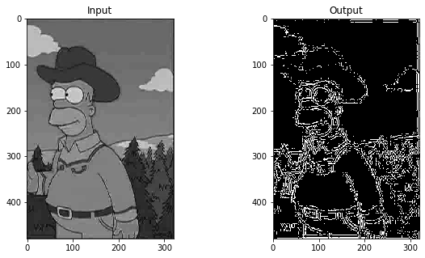
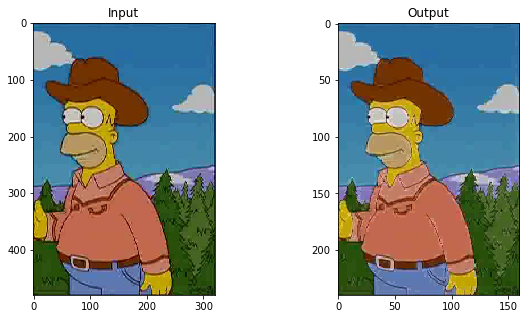
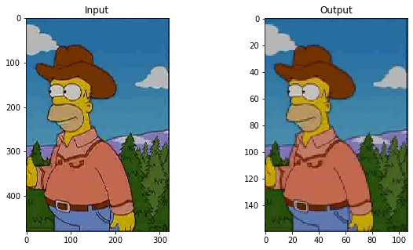
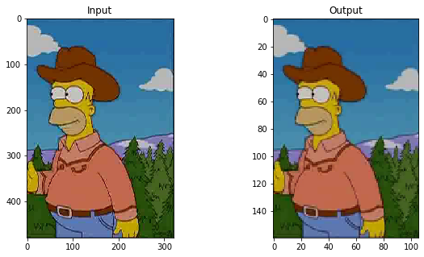

This notebook is based on the Deep Learning course from the Master Datascience Paris Saclay. Materials of the course can be found [here](https://github.com/m2dsupsdlclass/lectures-labs). The complete code can be found on a Kaggle [kernel](https://www.kaggle.com/stevengolo/convolutions).

**Goal**
* Appication of convolution on images

**Dataset used**
* Some images from The Simpsons Characters Data from Kaggle [link](https://www.kaggle.com/alexattia/the-simpsons-characters-dataset).


```python
# Load an image
DIR = '../input/the-simpsons-characters-dataset/simpsons_dataset/homer_simpson/'
sample_image = imread(f'{DIR}/pic_0042.jpg').astype('float32')
```

    The shape of the image is (480, 320, 3).



<center>
<p class="caption">
Figure 1: Example image
</p>
</center>

## A simple convolution filter

The goal of this section is to use `Tensorflow`/`Keras` to perform individual convolutions on images. We do not train any model yet.
In `Keras`, `None` is used as a marker for tensor dimensions with dynamic size. Here, `batch_size`, `width` and `height` are all dynamic: they can depend on the input. Only the number of input channels ($3$ colors) has been fixed.


```python
# Create 2D-convolutional layer
conv = Conv2D(filters=3, kernel_size=(5, 5), padding='same', input_shape=(None, None, 3))
```

We have to add a dimension in the image in order to take into account the `batch_size` used in `Keras`.


```python
# Expand dimensions of the image
img_in = np.expand_dims(sample_image, 0)
```

    The shape of the expanded image is (1, 480, 320, 3).


As we use `padding='same'` in the convolution layer, the shape of the output image, should be the same as the input image, because this parameter means that convolutions uses as much padding as necessarary so has to preserve the spatial dimension of the input maps or image. Moreover, by default, `Keras` convolutions have no strides.


```python
# Convolution on the image
img_out = conv(img_in)
```

    The type of the output image is <class 'tensorflow.python.framework.ops.EagerTensor'>. The shape of the output image is (1, 480, 320, 3).


The output of the `Conv2D` is a Tensorflow EagerTensor, which can be converted to a standard numpy array.


```python
# Convert to numpy
img_out_np = img_out[0].numpy()
```

    The type of the converted output image is <class 'numpy.ndarray'>.



<center>
<p class="caption">
Figure 2: Image after random convolution
</p>
</center>

The output image has $3$ channels, hence can also be interpreted as a RGB image with `matplotlib`. however, it is a result of a random convolutional filter applied to the original one.


Let's look at the number of trainable parameters.


    The number of trainable parameters is 228.


Let's compute this number of trainable parameters from the layer hyperparameters. The input image has $3$ colors and a single **convolution kernel** mixes information from all the three input channels to compute its output. A **convolutional layer** outputs many channels at once: each channel is the output of a distinct convolution operation (*aka* unit) of the layer. Finally, there are biases.


```python
weights = conv.get_weights()[0]
biases = conv.get_weights()[1]
```

    Shape of the weights: (5, 5, 3, 3) / Shape of the biases: (3,).


Each of the $3$ output channels is generated by a distinct convolution kernel. Each convolution kernel has a spatial size of $5 \times 5$ and operates across $3$ input channels. There is one bias per output channel.
Thus, the number of trainable parameters is:
$$5 \times 5 \times 3 \times 3 + 3 = 228.$$

We can instead build a kernel ourselves, by defining a function which will be passed to `Conv2D` layer. We will create an array with $1/25$ for filters, with each channel separated.


```python
def kernel_init(shape=(5, 5, 3, 3), dtype=None):
    array = np.zeros(shape=shape, dtype='float32')
    array[:, :, 0, 0] = 1 / 25
    array[:, :, 1, 1] = 1 / 25
    array[:, :, 2, 2] = 1 / 25
    return array
```

We can display the number filters by moving the spatial dimensions in the end, using `np.transpose(kernel_init(), (2, 3, 0, 1))`.


```python
# Create 2D-convolutional layer
conv = Conv2D(filters=3, kernel_size=(5, 5), padding='same', 
              input_shape=(None, None, 3), kernel_initializer=kernel_init)
```


<center>
<p class="caption">
Figure 3: Image after convolution with a particular kernel
</p>
</center>

Now, we will try `Conv2D` with different parameters:

* with $3$ filters ($5 \times 5$) that compute the identity function (preserve the input without mixing the colors)


```python
def kernel_init(shape=(5, 5, 3, 3), dtype=None):
    array = np.zeros(shape=shape, dtype='float32')
    # array[2, 2] select only the center of the kernel
    array[2, 2] = np.eye(3)
    return array
```


```python
# Create 2D-convolutional layer
conv = Conv2D(filters=3, kernel_size=(5, 5), padding='same', 
              input_shape=(None, None, 3), kernel_initializer=kernel_init)
```


<center>
<p class="caption">
Figure 4: Image after convolution with identity kernel
</p>
</center>

    The shape of the output image is (480, 320, 3).


* change the stride to $2$. The size of the image has been divided by $2$.


```python
# Create 2D-convolutional layer
conv = Conv2D(filters=3, kernel_size=(5, 5), padding='same', strides=2,
              input_shape=(None, None, 3), kernel_initializer=kernel_init)
```



<center>
<p class="caption">
Figure 5: Image after convolution with `strides=2`
</p>
</center>


    The shape of the output image is (240, 160, 3).


* change the padding to 'valid'. In this case, no padding is added, so the size of the output image is a bit less than the input image.


```python
# Create 2D-convolutional layer
conv = Conv2D(filters=3, kernel_size=(5, 5), padding='valid',
              input_shape=(None, None, 3), kernel_initializer=kernel_init)
```



<center>
<p class="caption">
Figure 6: Image after convolution with `pading='valid'`
</p>
</center>

    The shape of the output image is (476, 316, 3).


## Working on edge detection on grayscale image


```python
# Convert image to greyscale
sample_image_grey = sample_image.mean(axis=2)

# Add the channel dimension even if it's only one channel
# to be consistent with Keras expectations
sample_image_grey = sample_image_grey[:, :, np.newaxis]
```


<center>
<p class="caption">
Figure 7: Grey-level image
</p>
</center>

We would like to build an edge detector using `Conv2D` on greyscale image. We try one of the three **edge detectors** which are defined [here](https://en.wikipedia.org/wiki/Kernel_(image_processing)).


```python
def kernel_init(shape=(3, 3, 1, 1), dtype=None):
    array = np.zeros(shape=shape, dtype='float32')
    array[:, :, 0, 0] = np.array([[0, 1, 0], [1, -4, 1], [0, 1, 0]]) / 12
    return array
```


```python
img_grey_in = np.expand_dims(sample_image_grey, 0)
```


```python
# Create 2D-convolutional layer
conv = Conv2D(filters=1, kernel_size=(3, 3), padding='same',
              input_shape=(None, None, 1), kernel_initializer=kernel_init)
```


<center>
<p class="caption">
Figure 8: Edge detection using convolution
</p>
</center>

## Pooling and strides with convolutions

* Use of `MaxPool2D` to aply a $2\times 2$ max pool with strides 2 to the image. The shape of the image has been divided by $2$.


```python
max_conv = MaxPool2D(2, strides=2, input_shape=(None, None, 3))
```


<center>
<p class="caption">
Figure 9: Max pooling
</p>
</center>

It is not possible to builld a max pooling with a regular convolution.

* Use of `AvgPool2D` to apply an average pooling. The shape is also divided by $3$.


```python
avg_conv = AvgPool2D(3, strides=3, padding='same', input_shape=(None, None, 3))
```


<center>
<p class="caption">
Figure 10: Average pooling
</p>
</center>

Let's develop average pooling with a convolution.


```python
def kernel_init(shape=(3, 3, 3, 3), dtype=None):
    array = np.zeros(shape=shape, dtype='float32')
    array[:, :, 0, 0] = 1 / 9
    array[:, :, 1, 1] = 1 / 9
    array[:, :, 2, 2] = 1 / 9
    return array
```


```python
# Create 2D-convolutional layer
conv_avg = Conv2D(filters=3, kernel_size=(3, 3), padding='valid', strides=3,
              input_shape=(None, None, 3), kernel_initializer=kernel_init)
```



<center>
<p class="caption">
Figure 11: Average pooling with convolution
</p>
</center>
