This notebook is based on the Deep Learning course from the Master Datascience Paris Saclay. Materials of the course can be found [here](https://github.com/m2dsupsdlclass/lectures-labs). The complete code can be found on a Kaggle [kernel](https://www.kaggle.com/stevengolo/explicit-feedback-neural-recommender-systems).

**Goals**

* Understand recommender data
* Build different models architectures using Keras
* Retrieve Embeddings and visualize them
* Add some metadata information as input to the models

**Dataset used**

* Anime Recommendations Database from Kaggle [link](https://www.kaggle.com/CooperUnion/anime-recommendations-database).


## Load and preprocess the data

### Ratings file

After loading the data, each line of the dataframe contains:
 * user_id - non identifiable randomly generated user id.
 * anime_id - the anime that this user has rated.
 * rating - rating out of $10$ this user has assigned ($-1$ if the user watched it but did not assign a rating).


```python
# Load and preprocess rating files
df_raw = pd.read_csv('../input/anime-recommendations-database/rating.csv')
```

    Shape of the ratings data: (7813737, 3).


<div style="text-align:center;">
<style scoped>
    .dataframe {
        margin-left:auto; 
        margin-right:auto;
    }
    .dataframe tbody tr th:only-of-type {
        vertical-align: middle;
    }
    .dataframe tbody tr th {
        vertical-align: top;
    }
    .dataframe thead th {
        text-align: right;
    }
</style>
<table class="dataframe">
  <thead>
    <tr style="text-align: right;">
      <th></th>
      <th>user_id</th>
      <th>anime_id</th>
      <th>rating</th>
    </tr>
  </thead>
  <tbody>
    <tr>
      <th>0</th>
      <td>1</td>
      <td>20</td>
      <td>-1</td>
    </tr>
    <tr>
      <th>1</th>
      <td>1</td>
      <td>24</td>
      <td>-1</td>
    </tr>
    <tr>
      <th>2</th>
      <td>1</td>
      <td>79</td>
      <td>-1</td>
    </tr>
    <tr>
      <th>3</th>
      <td>1</td>
      <td>226</td>
      <td>-1</td>
    </tr>
    <tr>
      <th>4</th>
      <td>1</td>
      <td>241</td>
      <td>-1</td>
    </tr>
  </tbody>
</table>
</div>


### Anime metadata file

The anime metadata file contains the following metadata: 
 * anime_id - myanimelist.net's unique id identifying an anime.
 * name - full name of the anime.
 * genre - comma separated list of genres for this anime.
 * type - movie, TV, OVA, etc.
 * episodes - how many episodes in this show ($1$ if it's a movie).
 * rating - average rating out of $10$ for this anime.
 * members - number of community members that are in this anime's group.


```python
# Load metadata file
metadata = pd.read_csv('../input/anime-recommendations-database/anime.csv')
```

    Shape of the metadata: (12294, 7).


<div>
<style scoped>
    .dataframe tbody tr th:only-of-type {
        vertical-align: middle;
    }
    .dataframe tbody tr th {
        vertical-align: top;
    }
    .dataframe thead th {
        text-align: right;
    }
</style>
<table style="border:0px solid black;margin-left:auto;margin-right:auto;" class="dataframe">
  <thead>
    <tr style="text-align: right;">
      <th></th>
      <th>anime_id</th>
      <th>name</th>
      <th>genre</th>
      <th>type</th>
      <th>episodes</th>
      <th>rating</th>
      <th>members</th>
    </tr>
  </thead>
  <tbody>
    <tr>
      <th>0</th>
      <td>32281</td>
      <td>Kimi no Na wa.</td>
      <td>Drama, Romance, School, Supernatural</td>
      <td>Movie</td>
      <td>1</td>
      <td>9.37</td>
      <td>200630</td>
    </tr>
    <tr>
      <th>1</th>
      <td>5114</td>
      <td>Fullmetal Alchemist: Brotherhood</td>
      <td>Action, Adventure, Drama, Fantasy, Magic, Mili...</td>
      <td>TV</td>
      <td>64</td>
      <td>9.26</td>
      <td>793665</td>
    </tr>
    <tr>
      <th>2</th>
      <td>28977</td>
      <td>Gintama°</td>
      <td>Action, Comedy, Historical, Parody, Samurai, S...</td>
      <td>TV</td>
      <td>51</td>
      <td>9.25</td>
      <td>114262</td>
    </tr>
    <tr>
      <th>3</th>
      <td>9253</td>
      <td>Steins;Gate</td>
      <td>Sci-Fi, Thriller</td>
      <td>TV</td>
      <td>24</td>
      <td>9.17</td>
      <td>673572</td>
    </tr>
    <tr>
      <th>4</th>
      <td>9969</td>
      <td>Gintama&amp;#039;</td>
      <td>Action, Comedy, Historical, Parody, Samurai, S...</td>
      <td>TV</td>
      <td>51</td>
      <td>9.16</td>
      <td>151266</td>
    </tr>
  </tbody>
</table>
</div>


## Merge ratings and metadata

Let's enrich the raw ratings with the collected items metadata by merging the two dataframes on `anime_id`.


```python
ratings = df_raw.merge(metadata.loc[:, ['name', 'anime_id', 'type', 'episodes']], left_on='anime_id', right_on='anime_id')
```

    Shape of the complete data: (7813727, 6).


<div>
<style scoped>
    .dataframe tbody tr th:only-of-type {
        vertical-align: middle;
    }

    .dataframe tbody tr th {
        vertical-align: top;
    }

    .dataframe thead th {
        text-align: right;
    }
</style>
<table border="0" class="dataframe">
  <thead>
    <tr style="text-align: right;">
      <th></th>
      <th>user_id</th>
      <th>anime_id</th>
      <th>rating</th>
      <th>name</th>
      <th>type</th>
      <th>episodes</th>
    </tr>
  </thead>
  <tbody>
    <tr>
      <th>0</th>
      <td>1</td>
      <td>20</td>
      <td>-1</td>
      <td>Naruto</td>
      <td>TV</td>
      <td>220</td>
    </tr>
    <tr>
      <th>1</th>
      <td>3</td>
      <td>20</td>
      <td>8</td>
      <td>Naruto</td>
      <td>TV</td>
      <td>220</td>
    </tr>
    <tr>
      <th>2</th>
      <td>5</td>
      <td>20</td>
      <td>6</td>
      <td>Naruto</td>
      <td>TV</td>
      <td>220</td>
    </tr>
    <tr>
      <th>3</th>
      <td>6</td>
      <td>20</td>
      <td>-1</td>
      <td>Naruto</td>
      <td>TV</td>
      <td>220</td>
    </tr>
    <tr>
      <th>4</th>
      <td>10</td>
      <td>20</td>
      <td>-1</td>
      <td>Naruto</td>
      <td>TV</td>
      <td>220</td>
    </tr>
  </tbody>
</table>
</div>


### Data preprocessing

To understand well the distribution of the data, the following statistics are computed:
* the number of users
* the number of items
* the rating distribution
* the popularity of each anime


      Number of unique users: 73515.

      Number of unique animes: 11197.


<center>
<p class="caption">
Figure 1: Histogram of the ratings
</p>
</center>

Now, let's compute the popularity of each anime, defined as the number of ratings.


```python
# Count the number of ratings for each movie
popularity = ratings.groupby('anime_id').size().reset_index(name='popularity')
metadata = metadata.merge(popularity, left_on='anime_id', right_on='anime_id')
```

## Speed-up the computation

In order to speed up the computation, we will subset the dataset using three criteria:
* Remove the $-1$ ratings (people who watch the anime but without giving a rate).
* Get only TV shows (because I like TV show).
* Get the most popular ones (more than $5000$ ratings).


```python
# Get most popular anime id and TV shows
metadata_5000 = metadata.loc[(metadata['popularity'] > 5000) & (metadata['type'] == 'TV')]
# Remove -1 ratings and user id less than 10000
ratings = ratings[(ratings['rating'] > -1) & (ratings['user_id'] < 10000)]
```

## Clean id

Add a new column to metadata_5000 in order to clean up id of the anime.


```python
# Create a dataframe for anime_id
metadata_5000 = metadata_5000.assign(new_anime_id=pd.Series(np.arange(metadata_5000.shape[0])).values)
metadata_5000_indexed = metadata_5000.set_index('new_anime_id')

# Merge the dataframe
ratings = ratings.merge(metadata_5000.loc[:, ['anime_id', 'new_anime_id', 'popularity']], left_on='anime_id', right_on='anime_id')

# Create a dataframe for user_if
user = pd.DataFrame({'user_id': np.unique(ratings['user_id'])})
user = user.assign(new_user_id=pd.Series(np.arange(user.shape[0])).values)

# Merge the dataframe
ratings = ratings.merge(user, left_on='user_id', right_on='user_id')
```


<div>
<style scoped>
    .dataframe tbody tr th:only-of-type {
        vertical-align: middle;
    }

    .dataframe tbody tr th {
        vertical-align: top;
    }

    .dataframe thead th {
        text-align: right;
    }
</style>
<table border="0" class="dataframe">
  <thead>
    <tr style="text-align: right;">
      <th></th>
      <th>user_id</th>
      <th>anime_id</th>
      <th>rating</th>
      <th>name</th>
      <th>type</th>
      <th>episodes</th>
      <th>new_anime_id</th>
      <th>popularity</th>
      <th>new_user_id</th>
    </tr>
  </thead>
  <tbody>
    <tr>
      <th>0</th>
      <td>3</td>
      <td>20</td>
      <td>8</td>
      <td>Naruto</td>
      <td>TV</td>
      <td>220</td>
      <td>169</td>
      <td>25925</td>
      <td>2</td>
    </tr>
    <tr>
      <th>1</th>
      <td>3</td>
      <td>8074</td>
      <td>6</td>
      <td>Highschool of the Dead</td>
      <td>TV</td>
      <td>12</td>
      <td>245</td>
      <td>23065</td>
      <td>2</td>
    </tr>
    <tr>
      <th>2</th>
      <td>3</td>
      <td>9919</td>
      <td>8</td>
      <td>Ao no Exorcist</td>
      <td>TV</td>
      <td>25</td>
      <td>140</td>
      <td>21204</td>
      <td>2</td>
    </tr>
    <tr>
      <th>3</th>
      <td>3</td>
      <td>11757</td>
      <td>9</td>
      <td>Sword Art Online</td>
      <td>TV</td>
      <td>25</td>
      <td>165</td>
      <td>30583</td>
      <td>2</td>
    </tr>
    <tr>
      <th>4</th>
      <td>3</td>
      <td>11759</td>
      <td>7</td>
      <td>Accel World</td>
      <td>TV</td>
      <td>24</td>
      <td>210</td>
      <td>10722</td>
      <td>2</td>
    </tr>
  </tbody>
</table>
</div>


    Shape of the rating dataset: (331474, 9).


Later in the analysis, we will assume that this popularity does not come from the ratings themselves but from an external metadata, *e.g.* box office numbers in the month after the release in movie theaters.

### Split the dataset into train/test sets

Let's split the enriched data in a train/test split to make it possible to do predictive modeling.


```python
train, test = train_test_split(ratings, test_size=0.2, random_state=42)

user_id_train = np.array(train['new_user_id'])
anime_id_train = np.array(train['new_anime_id'])
ratings_train = np.array(train['rating'])

user_id_test = np.array(test['new_user_id'])
anime_id_test = np.array(test['new_anime_id'])
ratings_test = np.array(test['rating'])
```

## Explicit feedback: supervised ratings prediction

For each pair of (user, movie), we would like to predict the rating the user would give to the item.

This is the classical setup for building recommender systems from offline data with explicit supervision signal.

### Predictive ratings as a regression problem

The following code implements the following architecture:


Code [here](https://gist.githubusercontent.com/StevenGolovkine/b433e647791d4302fbc27235b1092131/raw/f3294f52650599a80e71ca5b55b52787e8bcd966/regression.py)

```python
# Define parameters
EMBEDDING_SIZE = 64
MAX_USER_ID = np.max(user_id_train)
MAX_ITEM_ID = np.max(anime_id_train)

# Define and run the model
model = RegressionModel(EMBEDDING_SIZE, MAX_USER_ID, MAX_ITEM_ID)
model.compile(optimizer='adam', loss='mae')
```


```python
# Initial prediction
initial_train_preds = model.predict([user_id_train, anime_id_train])
```

### Model error

Using `initial_train_preds`, compute the model errors:
* mean absolute error
* mean squared error


      Mean Absolute Error: 8.122450690862108.

      Mean Squared Error: 68.1011595117716.


### Monitoring runs

Keras enables to monitor various variables during training.

`history.history` returned by the `model.fit` function is a dictionary containing the `'loss'` and validation loss `'val_loss'` after each epoch.


```python
BATCH_SIZE = 64
EPOCHS = 10
VALIDATION_SPLIT = 0.1

# Train the model
history = model.fit(x=[user_id_train, anime_id_train], y=ratings_train,
                    batch_size=BATCH_SIZE, epochs=EPOCHS,
                    validation_split=VALIDATION_SPLIT, shuffle=True)
```


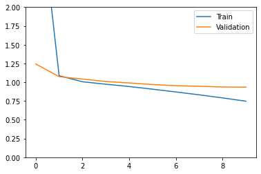
<center>
<p class="caption">
Figure 2: Loss on train/test set
</p>
</center>


The train loss is higher then the validation loss in the first few epochs because the training loss is not computed on the complete training set. Keras does not compute the train loss on the full training set at the end of each epoch to prevent overfitting.

Now that the model is trained, let's look back at the MSE and MAE.


* On the test set


```python
# Perform predition on the test set
test_preds = model.predict([user_id_test, anime_id_test])
```

    Mean Absolute Error: 0.9270835144142703.

    Mean Squared Error: 1.6709710976805119.


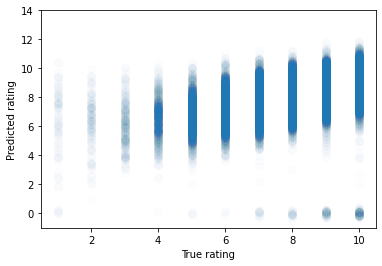
<center>
<p class="caption">
Figure 3: Plot of the predictions on the test set.
</p>
</center>

* On the train set


```python
# Perform predition on the train set
train_preds = model.predict([user_id_train, anime_id_train])
```

    Mean Absolute Error: 0.7124882554550168.

    Mean Squared Error: 0.994794042385835.


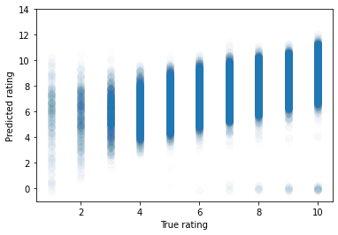
<center>
<p class="caption">
Figure 4: Plot of the predictions on the train set.
</p>
</center>

### Model Embeddings

* It is possible to retrieve the embeddings by simply using the Keras function `model.get_weights` which returns all the model learnable parameters.
* The weights are returned in the same order as they were build in the model.


```python
# Get the weights
weights = model.get_weights()
```

    The shape of the different weights matrices are: [(9220, 64), (303, 64)].


    Model: "regression_model"
    _________________________________________________________________
    Layer (type)                 Output Shape              Param #   
    =================================================================
    user_embedding (Embedding)   multiple                  590080    
    _________________________________________________________________
    item_embedding (Embedding)   multiple                  19392     
    _________________________________________________________________
    flatten (Flatten)            multiple                  0         
    _________________________________________________________________
    dot (Dot)                    multiple                  0         
    =================================================================
    Total params: 609,472
    Trainable params: 609,472
    Non-trainable params: 0
    _________________________________________________________________


    There are 609472 trainable parameters in the model.


```python
# Retrieve the different embeddings
user_embeddings = weights[0]
item_embeddings = weights[1]
```

    Title for ANIME_ID=8: One Punch Man.

    Embedding vector for ANIME_ID=8.
    [ 0.1594173  -0.60440356  0.355825   -0.8633073   0.7157622   0.7581718
      0.44381285  1.0053679   0.83575094  0.04821738 -0.85601246  0.14374653
     -0.36663508  0.7924265   0.5875196   0.8860671   0.8258554  -0.15137577
      0.5863088   0.54655975 -1.1967233   1.0129277   0.57818747 -0.3014434
      0.868408   -0.38485247  0.80863845  0.35706204  0.73452306 -0.51518816
     -0.85196286 -0.20468459 -0.6448079   0.60027117  0.46671775  0.9889989
      0.9937524  -0.8351439   0.91389894 -0.46636763 -0.10399101 -0.6020887
     -0.4861662   0.02848842 -0.54822135  0.5870457   0.51546437  0.8847389
      0.6536745  -0.739025    0.7839139   0.6428207  -0.89535177 -0.5063517
     -0.86991054 -0.718096    0.80048895 -1.0643162   0.21030873 -0.85870534
     -0.7084124  -1.035632    0.6645731   0.5663083 ]
    Shape of the embedding vector: (64,).


### Finding the most similar items

Finding the $k$ most similar items to a point in embedding space:
* Write a function to compute cosine similarity between two animes in embedding space.
* Test it on the following cells to check the similarities between popular animes.
* Try to generalize the function to compute similarities between one anime and all the others and return the most related animes.

Notes:
* We may use `np.linalg.norm` to compute norm of vectors, and we may specidy the `axis`.
* The numpy function `np.argsort(...)` enables to compute the sorted indices of a vector.
* `items["name"][idxs]` returns the `name` of the items indexed by array `idxs`.


      Cosine similarity between One Punch Man and Dragon Ball: 0.809.

      Cosine similarity between One Punch Man and Death Note: 0.794.

      Cosine similarity between One Punch Man and One Punch Man: 1.0.


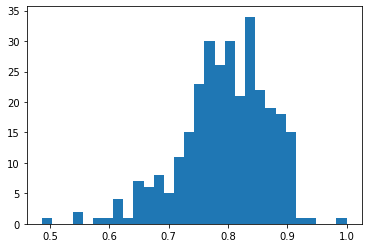
<center>
<p class="caption">
Figure 6: Histogram of the cosine similarities between the animes.
</p>
</center>

    The most similar animes to One Punch Man are:
    [(8, 'One Punch Man', 1.0000001),
     (19, 'Shokugeki no Souma', 0.9396077),
     (62, 'Boku no Hero Academia', 0.91552085),
     (20, 'Kiseijuu: Sei no Kakuritsu', 0.91214937),
     (74, 'Kami nomi zo Shiru Sekai: Megami-hen', 0.9105076),
     (11, 'Tengen Toppa Gurren Lagann', 0.9092214),
     (15, 'Haikyuu!!', 0.9085365),
     (38, 'Noragami Aragoto', 0.90833056),
     (12, 'Great Teacher Onizuka', 0.9051804),
     (45, 'Fate/stay night: Unlimited Blade Works 2nd Season', 0.905171)]


The similarities do not always make sense: the number of ratings is low and the embedding does not automatically capture semantic relationships in that context. Better representations arise with higher number of ratings, and less overfitting in models or maybe better loss function, such as those based on implicit feedback.

### Visualizing embeddings using t-SNE

We can use scikit-learn to visualize item embeddings via [t-SNE](https://lvdmaaten.github.io/tsne/).


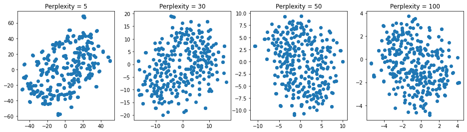
<center>
<p class="caption">
Figure 7: Plot of the $t$-SNE representation
</p>
</center>


We can do similar things with [Uniform Manifold Approximation and Projection (UMAP)](https://github.com/lmcinnes/umap).


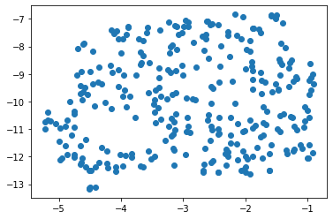
<center>
<p class="caption">
Figure 8: Plot of the UMAP representation
</p>
</center>

## A Deep Recommender Model

Using a similar framework as previously, the following deep model described in the course was built (with only two fully connected layers).


To build this model, we will need a new king of layer, namely `Concatenate`.

Code [here](https://gist.githubusercontent.com/StevenGolovkine/b433e647791d4302fbc27235b1092131/raw/1d325705f7b14129b0342b04e8b691e8dc0a3825/deep_regression.py)


```python
# Define parameters
EMBEDDING_SIZE = 64
MAX_USER_ID = np.max(user_id_train)
MAX_ITEM_ID = np.max(anime_id_train)
DROPOUT_SIZE = 0.2
LAYER_SIZE = 64

# Define and run the model
model = DeepRegressionModel(EMBEDDING_SIZE, MAX_USER_ID, MAX_ITEM_ID, DROPOUT_SIZE, LAYER_SIZE)
model.compile(optimizer='adam', loss='mae')
```


```python
# Initial prediction
initial_train_preds = model.predict([user_id_train, anime_id_train])
```


```python
BATCH_SIZE = 64
EPOCHS = 10
VALIDATION_SPLIT = 0.1

# Train the model
history = model.fit(x=[user_id_train, anime_id_train], y=ratings_train,
                    batch_size=BATCH_SIZE, epochs=EPOCHS,
                    validation_split=VALIDATION_SPLIT, shuffle=True)
```

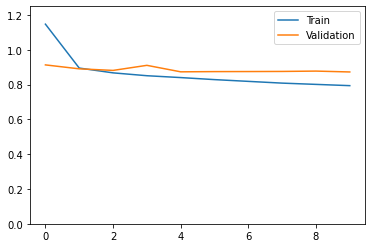
<center>
<p class="caption">
Figure 9: Loss on the train/test set.
</p>
</center>


```python
# Perform predition on the train set
train_preds = model.predict([user_id_train, anime_id_train])
```

    Mean Absolute Error: 0.765886114611278.

    Mean Squared Error: 1.1395923002040214.

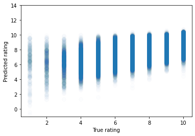
<center>
<p class="caption">
Figure 10: Plot of the predictions on the train set
</p>
</center>


```python
# Perform predition on the test set
test_preds = model.predict([user_id_test, anime_id_test])
```

    Mean Absolute Error: 0.8701957370659661.

    Mean Squared Error: 1.3725562633328945.

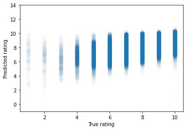
<center>
<p class="caption">
Figure 11: Plot of the predictions on the test set.
</p>
</center>

The performance of the model not necessarily significantly better than the previous model but you can notice that the gap between train and test is lower, probably thanks to the use of dropout.
Furthermore, this model is more flexible in the sense that we can extend it to include metadata for hybrid recommendation system as we will see in the following.

But before that, let's do some hyperparameters tuning. Manual tuning of so many hyperparameters is tedious. In practice, it is better to automate the design of the model using an hyperparameter search tool such as:
* https://keras-team.github.io/keras-tuner/ (Keras specific)
* https://optuna.org/ (any machine learning framework, Keras included)


```python
# Build a model to do hyperparameters tuning
EMBEDDING_SIZE = 64
MAX_USER_ID = np.max(user_id_train)
MAX_ITEM_ID = np.max(anime_id_train)

def build_model(hp):
    model = DeepRegressionModel(EMBEDDING_SIZE, MAX_USER_ID, MAX_ITEM_ID, 
                                dropout_size=hp.Float('dropout_size', min_value=0.1, max_value=0.5, step=0.1), 
                                layer_size=hp.Int('layer_size', min_value=32, max_value=64, step=32))

    model.compile(optimizer='adam', loss='mae')
    return model

# Instantiate a tuner
tuner = RandomSearch(build_model, 
                     objective='val_loss', 
                     max_trials=5, executions_per_trial=1, 
                     directory='.', project_name='Embedding')
```


```python
# Start the search for the best hyperparameter configuration
EPOCHS = 5

tuner.search(x=[user_id_train, anime_id_train], y=ratings_train,
             batch_size=BATCH_SIZE, epochs=EPOCHS,
             validation_split=VALIDATION_SPLIT, shuffle=True)
```

```python
model_best = tuner.get_best_models(1)[0]
```

```python
# Define parameters
BATCH_SIZE = 64
EPOCHS = 10
VALIDATION_SPLIT = 0.1

# Train the model
history = model_best.fit(x=[user_id_train, anime_id_train], y=ratings_train,
                         batch_size=BATCH_SIZE, epochs=EPOCHS,
                         validation_split=VALIDATION_SPLIT, shuffle=True)
```

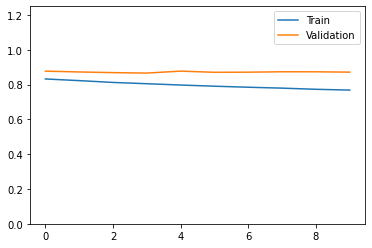
<center>
<p class="caption">
Figure 12: Loss of the train/test set
</p>
</center>


```python
# Perform predition on the test set
test_preds = model_best.predict([user_id_test, anime_id_test])
```

    Mean Absolute Error: 0.8689207654416863.

    Mean Squared Error: 1.3854584244400323.


<center>
<p class="caption">
Figure 13: Plot of the predictions on the test set.
</p>
</center>

## Using Item Metadata in the Model

Using a similar framework as previously, we will build another depp model that can also leverage additional metadata. The resulting system is therefor an **Hybrid Recommender System** that does both **Collaborative Filtering** and **Content-based recommendations**.


```python
# Define some metadata
meta_columns = ['episodes', 'popularity']

scaler = QuantileTransformer()
item_meta_train = scaler.fit_transform(train[meta_columns])
item_meta_test = scaler.transform(test[meta_columns])
```

Code [here](https://gist.githubusercontent.com/StevenGolovkine/b433e647791d4302fbc27235b1092131/raw/baef316f86a8e75ea178a291c9bfe19b8d077b0b/hybrid_model.py)

```python
# Define parameters
EMBEDDING_SIZE = 64
MAX_USER_ID = np.max(user_id_train)
MAX_ITEM_ID = np.max(anime_id_train)

# Define and run the model
model = HybridModel(EMBEDDING_SIZE, MAX_USER_ID, MAX_ITEM_ID)
model.compile(optimizer='adam', loss='mae')
```

```python
# Initial prediction
initial_train_preds = model.predict([user_id_train, anime_id_train, item_meta_train])
```

```python
# Define parameters
BATCH_SIZE = 64
EPOCHS = 10
VALIDATION_SPLIT = 0.1

# Train the model
history = model.fit(x=[user_id_train, anime_id_train, item_meta_train], y=ratings_train,
                         batch_size=BATCH_SIZE, epochs=EPOCHS,
                         validation_split=VALIDATION_SPLIT, shuffle=True)
```

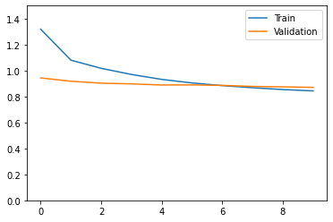
<center>
<p class="caption">
Figure 14: Loss on the train/test set.
</p>
</center>


```python
# Perform predition on the test set
test_preds = model.predict([user_id_test, anime_id_test, item_meta_test])
```

    Mean Absolute Error: 0.8661310402711724.

    Mean Squared Error: 1.3795224983547145.


<center>
<p class="caption">
Figure 15: Plot of the predictions on the test set.
</p>
</center>

The additional metadata seems to improve the predictive power of the model a bit but this should be re-run several times to see the impact of the random initialization of the model. However, the variance of the prediction seems to be improved.

## A recommendation function for a given user

Once the model is trained, the system can be used to recommend a few items for a user, that he/she has not already seen:
* We use the `model.predict` to compute the ratings a user would have given to all items.
* We build a recommendation function that sorts these items and exclude those the user has already seen.


      User 5 has seen 290 animes, including:
    	  Sword Art Online
    	  Mirai Nikki (TV)
    	  Guilty Crown
    	  Bleach
    	  Fairy Tail
    	  Shakugan no Shana
    	  Sakurasou no Pet na Kanojo
    	  Date A Live
    	  Kiss x Sis (TV)
    	  Ichiban Ushiro no Daimaou
    	  Hidan no Aria
      Computing ratings for 290 other animes:
    	  9.936466217041016: Hunter x Hunter (2011)
    	  9.877601623535156: Steins;Gate
    	  9.835147857666016: Fullmetal Alchemist: Brotherhood
    	  9.811235427856445: Clannad: After Story
    	  9.744715690612793: Mushishi
    	  9.72442626953125: Cowboy Bebop
    	  9.718212127685547: Monogatari Series: Second Season
    	  9.652753829956055: Code Geass: Hangyaku no Lelouch R2
    	  9.64716911315918: Tengen Toppa Gurren Lagann
    	  9.637310028076172: Shigatsu wa Kimi no Uso


## Predicting ratings a classification problem

In this dataset, the ratings all belong  to a finite set of possible values: $1$ to $10$.

Maybe, we can help the model by forcing it to predict those values by treating the problem as a multiclassification problem. The only required changes are:
* setting the final layer to output class membership probabilities using a softmax activation with $10$ outputs;
* optimize the categorical cross-entropy classification loss instead of a regression loss suwh as MSE or MAE.

Code [here](https://gist.githubusercontent.com/StevenGolovkine/b433e647791d4302fbc27235b1092131/raw/32695fff3a6409d877c7ecaa5595ba8f85ec789f/hybrid_classification.py)

```python
# Define parameters
EMBEDDING_SIZE = 64
MAX_USER_ID = np.max(user_id_train)
MAX_ITEM_ID = np.max(anime_id_train)

# Define and run the model
model = HybridClassificationModel(EMBEDDING_SIZE, MAX_USER_ID, MAX_ITEM_ID)
model.compile(optimizer='adam', loss='sparse_categorical_crossentropy')
```


```python
# Initial prediction
initial_train_preds = model.predict([user_id_train, anime_id_train, item_meta_train]).argmax(axis=1) + 1
```

    Mean Absolute Error: 5.086771576934825.

    Mean Squared Error: 28.005562280572747.


```python
# Define parameters
BATCH_SIZE = 64
EPOCHS = 10
VALIDATION_SPLIT = 0.1

# Train the model
history = model.fit(x=[user_id_train, anime_id_train, item_meta_train], y=ratings_train - 1,
                         batch_size=BATCH_SIZE, epochs=EPOCHS,
                         validation_split=VALIDATION_SPLIT, shuffle=True)
```

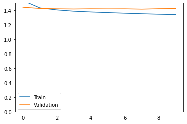
<center>
<p class="caption">
Figure 16: Loss on the train/test set.
</p>
</center>


```python
# Perform predition on the test set
test_preds = model.predict([user_id_test, anime_id_test, item_meta_test]).argmax(axis=1)
```

    Mean Absolute Error: 1.1549136435628629.

    Mean Squared Error: 2.15544158684667.

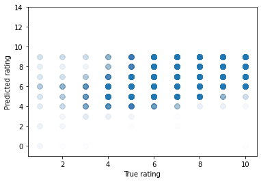
<center>
<p class="caption">
Figure 17: Plot of the predictions on the test set.
</p>
</center>
