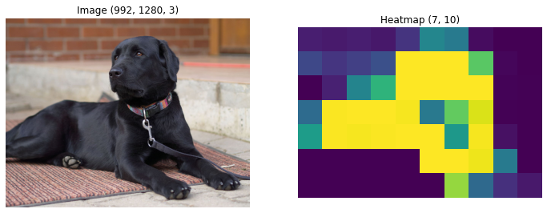
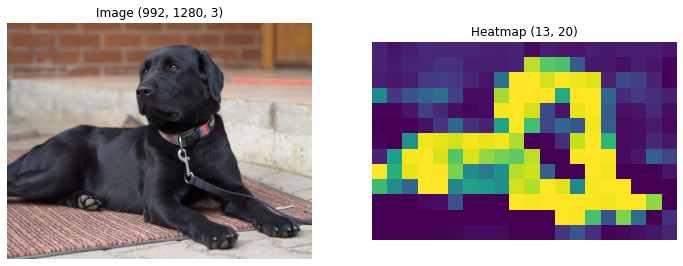
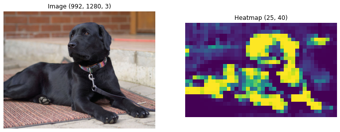
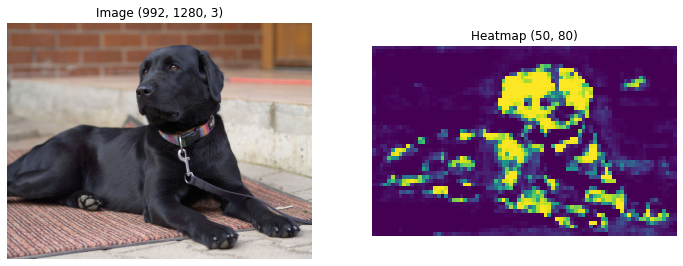
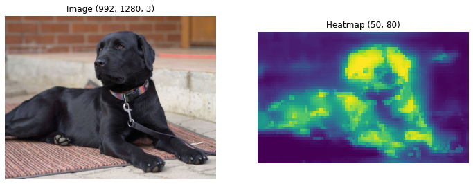
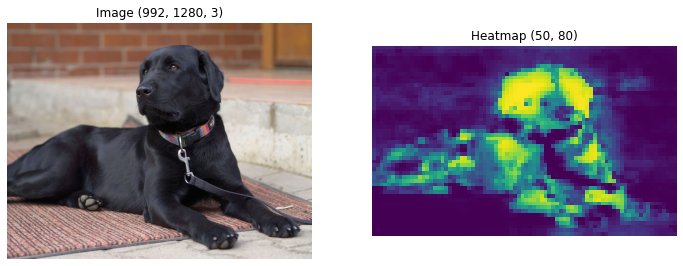

This notebook is based on the Deep Learning course from the Master Datascience Paris Saclay. Materials of the course can be found [here](https://github.com/m2dsupsdlclass/lectures-labs). The complete code can be found on a Kaggle [kernel](https://www.kaggle.com/stevengolo/fully-convolutional-neural-networks).

**Goals**
* Load a CNN model pre-trained on ImageNet
* Transform the network into a Fully Convolutional Network
* Apply the network to perform weak segmentation on images


```python
# Load a pre-trained ResNet50 model
# We use include_top=False for now
base_model = ResNet50(include_top=False)
```

    Shape of the output of the model: (None, None, None, 2048).


```python
# Get the last layer of the ResNet model
res5c = base_model.layers[-1]
```

    Type of res5c: <class 'tensorflow.python.keras.layers.core.Activation'>, Output shape of res5c: (None, None, None, 2048).


## Fully convolutional ResNet

* Out of the `res5c` residual block, the ResNet outputs a tensor of shape $W \times H \times 2048$.
* For the default ImageNet input, $224 \times 224$, the output size is $7 \times 7 \times 2048$.

### Regular ResNet layers

The regular ResNet head after the base model is as follows:
    
    x = base_model.output
    x = GlobalAveragePooling2D()(x)
    x = Dense(1000)(x)
    x = Softmax()(x)
   
The full definition of the ResNet50 model is [here](https://github.com/keras-team/keras-applications/blob/master/keras_applications/resnet50.py).

### Our version

* We want to retrieve the labels information, which is stored in the Dense layer. We will load these weights afterwards.
* We will change the Dense layer to a Convolution2D layer to keep spatial information, to output a $W \times H \times 1000$.
* We can use a kernel size of $(1, 1)$ for that new Convolution2D layer to pass the spatial organization of the previous layer unchanged, *pointwise convolution*.
* We want to apply a softmax only on the last dimension so as to preserve the $W \times H$ spatial information.

### A custom Softmax

We build the following custom Softmax layer to apply a softmax only on the last dimension of a tensor.


```python
# Define the custom Softmax layer
class SoftmaxMap(layers.Layer):
    def __init__(self, axis=-1, **kwargs):
        self.axis = axis
        super(SoftmaxMap, self).__init__(**kwargs)
        
    def build(self, input_shape):
        pass
    
    def call(self, x, mask=None):
        """This function is very similar to the regular Softmax but
        we accept x.shape == (batch_size, w, h, n_classes)
        which is not the case in Keras by default.
        Note also that we substract the logits by their maximum to
        make the softmax numerically stable.
        """
        e = tf.exp(x - tf.math.reduce_max(x, axis=self.axis, keepdims=True))
        s = tf.math.reduce_sum(e, axis=self.axis, keepdims=True)
        return e / s
    
    def get_output_shape_for(self, input_shape):
        return input_shape
```

Let's check that we can use this layer to normalize the classes probabilities of some random spatial predictions.


```python
n_samples, w, h, n_classes = 10, 3, 4, 5
random_data = np.random.randn(n_samples, w, h, n_classes).astype('float32')
```

    Shape of random_data: (10, 3, 4, 5).


Because those predictions are random, if we sum accross the classes dimensions, we get random values instead of class probabilities that would need to sum to 1.


```python
random_data[0].sum(axis=-1)
```


    array([[ 2.2950149 ,  2.1855965 , -4.325383  , -3.581199  ],
           [-0.66173023, -1.5567055 ,  1.0019084 , -4.102975  ],
           [-0.98543906, -1.5427827 ,  0.90475553,  1.0896587 ]],
          dtype=float32)


Let's create a `SoftmaxMap` function from the layer and process our test data.


```python
softmaxMap = SoftmaxMap()
softmax_mapped_data = softmaxMap(random_data).numpy()
```

    Shape of softmax_mapped_data: (10, 3, 4, 5).


The last dimension now approximately sum to one, we can therefore be used as class probabilities (or parameters for a multinouli distribution).


```python
softmax_mapped_data[0].sum(axis=-1)
```


    array([[1.        , 1.0000001 , 1.0000001 , 1.        ],
           [0.99999994, 1.        , 1.0000001 , 1.        ],
           [1.        , 0.99999994, 1.        , 1.        ]], dtype=float32)


Note that the highest activated channel for each spatial location is still the same before and after the softmax map. The ranking of the activations is preserved as softmax is a monotonic function (when considered element-wise).


```python
np.alltrue(random_data[0].argmax(axis=-1) == softmax_mapped_data[0].argmax(axis=-1))
```

    True


The shape of the convolution kernel, we want to apply to replace the Dense layer, should be $(1, 1)$. We want the output to preserve the spatial dimensions but ouput $1000$ channels (one channel perclass). And after applying SoftmaxMap, the results are normalize as per-class probabilities.


```python
# Define a Fully Convolutional ResNet
input_tensor = base_model.layers[0].input

# Take the output of the last layer of the ConvNet model
output_tensor = base_model.layers[-1].output

# A 1x1 convolution, with 1000 output channels, one per class
output_tensor = Convolution2D(1000, (1, 1), name='Conv1000')(output_tensor)

# Softmax on last axis of tensor to normalize the class predictions in each spatial area
output_tensor = SoftmaxMap(axis=-1)(output_tensor)

# Define model
fully_conv_resnet = Model(inputs=input_tensor, outputs=output_tensor)
```

A $1\times 1$ convolution applies a Dense layer to each spatial grid location. We can use random data to check that it's possible to run a forward pass on a random RGB image.


```python
prediction_maps = fully_conv_resnet(np.random.randn(1, 200, 300, 3)).numpy()
```

    Shape of the predictions: (1, 7, 10, 1000).


The output shape results to the region selected in the image. The class probabilities of each region/area of the output map should sum to one.


```python
prediction_maps.sum(axis=-1)
```


    array([[[1.        , 1.        , 1.0000001 , 1.        , 0.99999994,
             1.0000002 , 1.        , 1.        , 0.99999994, 1.        ],
            [1.        , 0.99999994, 1.        , 1.        , 1.        ,
             0.99999994, 0.99999994, 1.        , 1.        , 0.99999994],
            [0.9999999 , 0.9999999 , 0.9999998 , 1.        , 0.99999994,
             1.        , 1.        , 0.99999994, 1.        , 0.99999994],
            [0.9999998 , 1.        , 1.        , 1.0000001 , 1.        ,
             0.9999999 , 0.99999994, 1.0000001 , 0.9999999 , 1.        ],
            [1.0000001 , 1.        , 1.        , 1.        , 1.        ,
             1.        , 0.9999999 , 1.        , 1.        , 1.        ],
            [1.        , 1.0000001 , 0.99999994, 1.        , 1.        ,
             1.        , 0.99999994, 1.        , 0.99999994, 0.9999999 ],
            [1.        , 1.        , 1.        , 0.99999976, 1.        ,
             1.        , 1.        , 1.        , 1.        , 0.99999994]]],
          dtype=float32)


## Loading dense weights

The weights and bias of the last Dense layer of ResNet 50 are provided [here](https://www.kaggle.com/keras/resnet50?select=imagenet_class_index.json). Our last layer is norw a $1\times 1$ convolutional layer instead of a fully connected layer.


```python
# Load weights and biases
complete_model = ResNet50(include_top=True)
W = complete_model.layers[-1].get_weights()[0]
B = complete_model.layers[-1].get_weights()[1]

last_layer = fully_conv_resnet.layers[-2]
```

    Shape of the weights of the last layer from the ResNet50 model: (2048, 1000).
    Shape of the weights of the last convolutional layer: (1, 1, 2048, 1000).


```python
# Reshape the weights
W_reshaped = W.reshape((1, 1, 2048, 1000))

# Set the convolution layer weights
last_layer.set_weights([W_reshaped, B])
```

## A forward pass

The following function is used to test the network. It resizes the input to a given size, then uses `model.predict` to compute the output.


```python
def forward_pass_resize(img_path, img_size):
    img_raw = imread(img_path)
    img = resize(img_raw, img_size, mode='reflect', preserve_range=True)
    img = preprocess_input(img[np.newaxis])

    prediction_map = fully_conv_resnet(img).numpy()
    return prediction_map
```


```python
IMG_URL = 'https://upload.wikimedia.org/wikipedia/commons/thumb/1/16/Female_Black_Labrador_Retriever.jpg/1280px-Female_Black_Labrador_Retriever.jpg'
urllib.request.urlretrieve(IMG_URL, 'dog.jpg')
output = forward_pass_resize('dog.jpg', (800, 600))
```

    Shape of the raw image: (992, 1280, 3).
    Shape of the reshaped image: (1, 800, 600, 3).
    Shape of the prediction map: (1, 25, 19, 1000).


## Finding dog-related classes

ImageNet uses an ontology of concepts, from which classes are derived. A synset corresponds to a node in the ontology. For example, all species of dogs are children of the synset [n02084071](http://image-net.org/synset?wnid=n02084071) (dog, domestic dog, canis familiaris).


```python
# Get synset data
SYNSET_DAT = 'https://github.com/m2dsupsdlclass/lectures-labs/raw/master/labs/05_conv_nets_2/data/meta_clsloc.mat'
urllib.request.urlretrieve(SYNSET_DAT, 'synset_dat.mat')
```

```python
# Load synsets
synsets = loadmat('synset_dat.mat')['synsets'][0]
synsets_imagenet_sorted = sorted([(int(s[0]), str(s[1][0])) for s in synsets[:1000]], key=lambda v:v[1])

corr = {}
for j in range(1000):
    corr[synsets_imagenet_sorted[j][0]] = j

corr_inv = {}
for j in range(1, 1001):
    corr_inv[corr[j]] = j

def depthfirstsearch(id_, out=None):
    if out is None:
        out = []
    if isinstance(id_, int):
        pass
    else:
        id_ = next(int(s[0]) for s in synsets if s[1][0] == id_)
        
    out.append(id_)
    children = synsets[id_ - 1][5][0]
    for c in children:
        depthfirstsearch(int(c), out)
    return out

def synset_to_dfs_ids(synset):
    ids = [x for x in depthfirstsearch(synset) if x <= 1000]
    ids = [corr[x] for x in ids]
    return ids

def id_to_words(id_):
    return synsets[corr_inv[id_] - 1][2][0]
```


```python
synset_dog = 'n02084071'
idx = synset_to_dfs_ids(synset_dog)
```

    Number of dog classes ids: 118.


## Unsupervised heatmap of the class *dog*

The following function builds a heatmap from a forward pass. It sums the representation for all ids corresponding to a synset.


```python
def build_heatmap(img_path, synset, size):
    """Build a heatmap 
    :param img_path: path of the input image, str
    :param synset: synset to find in the image, str
    :param size: size of the reshaped image, tuple
    """
    prediction_map = forward_pass_resize(img_path, size)
    
    class_ids = synset_to_dfs_ids(synset)
    class_ids = np.array([id_ for id_ in class_ids if id_ is not None])
    
    each_dog_proba_map = prediction_map[0, :, :, class_ids]
    # This style of indexing a tensor by an other array has the following shape effect:
    # (H, W, 1000) indexed by (118) => (118, H, W)
    any_dog_proba_map = each_dog_proba_map.sum(axis=0)
    return any_dog_proba_map
```


```python
# (200, 320)
heatmap_200x320 = build_heatmap('dog.jpg', synset_dog, (200, 320))
```

    Shape of the raw image: (992, 1280, 3).
    Shape of the reshaped image: (1, 200, 320, 3).



<center>
<p class="caption">
Figure 1: Heatmap (size 200x320)
</p>
</center>


```python
# (400, 640)
heatmap_400x640 = build_heatmap('dog.jpg', synset_dog, (400, 640))
```

    Shape of the raw image: (992, 1280, 3).
    Shape of the reshaped image: (1, 400, 640, 3).



<center>
<p class="caption">
Figure 2: Heatmap (size 400x640)
</p>
</center>


```python
# (800, 1280)
heatmap_800x1280 = build_heatmap('dog.jpg', synset_dog, (800, 1280))
```

    Shape of the raw image: (992, 1280, 3).
    Shape of the reshaped image: (1, 800, 1280, 3).



<center>
<p class="caption">
Figure 3: Heatmap (size 800x1200)
</p>
</center>


```python
# (1600, 2560)
heatmap_1600x2560 = build_heatmap('dog.jpg', synset_dog, (1600, 2560))
```

    Shape of the raw image: (992, 1280, 3).
    Shape of the reshaped image: (1, 1600, 2560, 3).



<center>
<p class="caption">
Figure 4: Heatmap (size 1600x2560)
</p>
</center>


We observe that the two first heatmaps gave coarser segmentations than the other ones (make sense because of the different discretization). However, the two last heatmaps has small artifacts outside of the dog area. They encode more local, texture level information about the dog ,while lower resolutions will encode more semantic information about the full object. So, we may combine them to obtain a better result.

### Combining the heatmaps

By combining the heatmaps at different scales, we obtain a much better information about the location of the dog. The idea is to resize the heatmaps to a similar shape, and then average them.  We may look at different average computation.


```python
# We resize each of the heatmap to the larger one.
heatmap_200x320_r = resize(heatmap_200x320, (50, 80), mode='reflect',
                           preserve_range=True, anti_aliasing=True)
heatmap_400x640_r = resize(heatmap_400x640, (50, 80), mode='reflect',
                           preserve_range=True, anti_aliasing=True)
heatmap_800x1280_r = resize(heatmap_800x1280, (50, 80), mode='reflect',
                            preserve_range=True, anti_aliasing=True)
```


```python
# Arithmetic average
heatmap = (heatmap_200x320_r + heatmap_400x640_r + heatmap_800x1280_r + heatmap_1600x2560) / 4
```



<center>
<p class="caption">
Figure 5: Arithmetic average heatmap 
</p>
</center>


```python
# Geometric average
heatmap = np.power(heatmap_200x320_r * heatmap_400x640_r * heatmap_800x1280_r * heatmap_1600x2560, 0.25)
```



<center>
<p class="caption">
Figure 6: Geometric average heatmap
</p>
</center>
