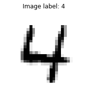
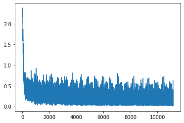
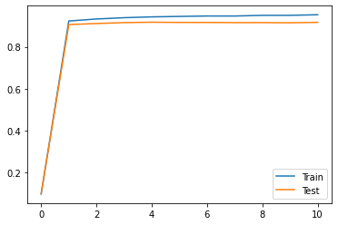
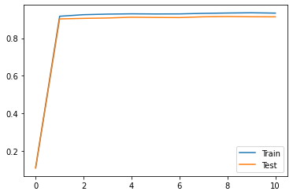
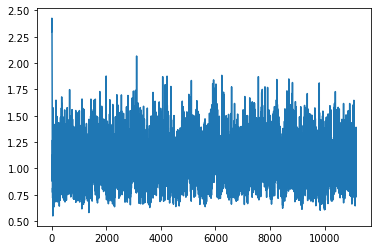
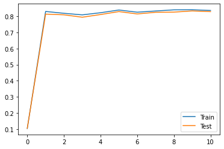

This post is based on the Deep Learning course from the Master Datascience Paris Saclay. Materials of the course can be found [here](https://github.com/m2dsupsdlclass/lectures-labs). The complete code can be found on a Kaggle [kernel](https://www.kaggle.com/stevengolo/multilayer-neural-network-in-tensorflow).

**Goal of the notebook**

* Introduce the basics of `Tensorflow`.
* Computation  of auto-differentiation with `Tensorflow`.
* Implement the digit classifier using the low level `Tensorflow` API without Keras abstraction.

# Introduction to Tensorflow

`Tensorflow` is a dynamic graph computation engine that allows differentiation of each node. This library is the default computational backend of the `Keras` library. It can also be used directly from Python to build deep learning models. Check out this link:
* https://www.tensorflow.org/
* https://www.tensorflow.org/tutorials/quickstart/advanced

It builds on nodes where nodes may be:
* **constant**: constants tensors, such as training data;
* **Variable**: any tensor tht is meant to be updated when training, such as parameters of the models.

**Note:** we are going to use the version 2.0 of `Tensorflow`. This version cleaned the old cluttered API and uses by default dynamic graph of operations to make it natural to design a model interactively in Jupyter. Previously, you defined the graph statically once, and then needed to evaluate it by feeding it some data. Now, it is dynamically defined when executing imperative Python instructions which means that you can `print` any tensor at any moment or even use `pdb.set_trace()` to inspect intermediary values.


```python
# Define a constant tensor
a = tf.constant(3)
```

    <tf.Tensor: shape=(), dtype=int32, numpy=3>

```python
# Define a Variable tensor
c = tf.Variable(0)

b = tf.constant(2)

# Sum of two tensors
c = a + b
```

    <tf.Tensor: shape=(), dtype=int32, numpy=5>

```python
# Define a constant tensor in 2 dimensions
A = tf.constant([[0, 1], [2, 3]], dtype=tf.float32)
```

    <tf.Tensor: shape=(2, 2), dtype=float32, numpy=
    array([[0., 1.],
           [2., 3.]], dtype=float32)>

```python
# Convert tf.Tensor as numpy array
A.numpy()
```

    array([[0., 1.],
           [2., 3.]], dtype=float32)

```python
# Define a Variable tensor
b = tf.Variable([1, 2], dtype=tf.float32)
```

    <tf.Variable 'Variable:0' shape=(2,) dtype=float32, numpy=array([1., 2.], dtype=float32)>

```python
# Reshape a Variable tensor
tf.reshape(b, (-1, 1))
```

    <tf.Tensor: shape=(2, 1), dtype=float32, numpy=
    array([[1.],
           [2.]], dtype=float32)>

```python
# Perform matrix multiplication
tf.matmul(A, tf.reshape(b, (-1, 1)))
```

    <tf.Tensor: shape=(2, 1), dtype=float32, numpy=
    array([[2.],
           [8.]], dtype=float32)>

Write a function that computes the squared Euclidean norm of an 1D tensor input `x`:
* Use element wise arithmetic operations `(+, -, *, /, **)`.
* Use `tf.reduce_sum` to compute the sum of the element of a Tensor.


```python
def squared_norm(x):
    return tf.reduce_sum(x ** 2)
```


```python
x = tf.Variable([1, -4], dtype=tf.float32)
```

    <tf.Variable 'Variable:0' shape=(2,) dtype=float32, numpy=array([ 1., -4.], dtype=float32)>

```python
squared_norm(x)
```

    <tf.Tensor: shape=(), dtype=float32, numpy=17.0>

```python
squared_norm(x).numpy()
```

    17.0

## Autodifferentiation and Gradient Descent


```python
with tf.GradientTape() as tape:
    result = squared_norm(x)
    
variables = [x]
gradients = tape.gradient(result, variables)
```

    [<tf.Tensor: shape=(2,), dtype=float32, numpy=array([ 2., -8.], dtype=float32)>]

We can apply a gradient step to modify `x` in place by taking one step of gradient descent.


```python
x.assign_sub(0.1 * gradients[0])
x.numpy()
```

    array([ 0.8, -3.2], dtype=float32)

Execute the following gradient descent step many times consecutively to watch the decrease of the objective function and the values of `x` converging to the minimum of the `squared_norm` function.


```python
with tf.GradientTape() as tape:
    objective = squared_norm(x)

x.assign_sub(0.1 * tape.gradient(objective, [x])[0])
```

    Objective = 1.088000e+01
    x = [ 0.64 -2.56]


## Device-aware Memory Allocation

To explicitely place tensors on a device, we use context managers.


```python
# On CPU
with tf.device("CPU:0"):
    x_cpu = tf.constant(3)
x_cpu.device

# On GPU
#with tf.device("GPU:0"):
#    x_gpu = tf.constant(3)
#x_gpu.device
```

    '/job:localhost/replica:0/task:0/device:CPU:0'


# Building a digits classifier in Tensorflow

**Dataset**

 * The MNIST dataset ([Kaggle link](https://www.kaggle.com/c/digit-recognizer/overview))


```python
# Load the data
digits_train = pd.read_csv('../input/digit-recognizer/train.csv')
digits_test = pd.read_csv('../input/digit-recognizer/test.csv')
```


```python
# Define some global parameters
HEIGHT = 28 # Height of an image
WIDTH = 28 # Width of an image
PIXEL_NUMBER = 784 # Number of pixels in an image
PIXEL_VALUE = 255 # Maximum pixel value in an image
```


<center>
<p class="caption">
Figure 1: An example of an image in the dataset.
</p>
</center>

## Preprocessing

* Normalization
* Train / Validation split


```python
# Extract and convert the pixel as numpy array with dtype='float32'
train = np.asarray(digits_train.iloc[:, 1:], dtype='float32')
test = np.asarray(digits_test, dtype='float32')

train_target = np.asarray(digits_train.loc[:, 'label'], dtype='int32')
```


```python
# Split and scale the data
X_train, X_val, y_train, y_val = train_test_split(
    train, train_target, test_size=0.15, random_state=42)

scaler = preprocessing.StandardScaler()
X_train = scaler.fit_transform(X_train)
X_val = scaler.transform(X_val)
X_test = scaler.transform(test)
```

`Tensorflow` provides dataset abstraction which makes possible to iterate over the data batch by batch.


```python
def gen_dataset(x, y, batch_size=128):
    dataset = tf.data.Dataset.from_tensor_slices((x, y)) # Create the dataset
    dataset = dataset.shuffle(buffer_size=10000, seed=42) # Shuffle the dataset
    dataset = dataset.batch(batch_size=batch_size) # Combine consecutive elements of dataset into batches.
    return dataset
```


```python
# Create the dataset
dataset = gen_dataset(X_train, y_train)
```

    <BatchDataset shapes: ((None, 784), (None,)), types: (tf.float32, tf.int32)>


```python
# Get the first batch
batch_x, batch_y = next(iter(dataset))
```

    Size batch_x: (128, 784) / Size batch_y: (128,)


## Build a model using Tensorflow

* Using `Tensorflow`, build a MLP with one hidden layer.
* The input will be a batch coming from `X_train`, and the output will be a batch of integer.
* The output do not need be normalized as probabilities, the softmax will be moved to the loss function.


```python
# Helper function
def init_weights(shape):
    return tf.Variable(tf.random.normal(shape, stddev=0.01))

def accuracy(y_pred, y):
    return np.mean(np.argmax(y_pred, axis=1) == y)

def test_model(model, x, y):
    dataset = gen_dataset(x, y)
    preds, targets = [], []
    
    for batch_x, batch_y in dataset:
        preds.append(model(batch_x).numpy())
        targets.append(batch_y.numpy())
        
    preds, targets = np.concatenate(preds), np.concatenate(targets)
    return accuracy(preds, targets)
```


```python
# Hyperparameters
BATCH_SIZE = 32
HIDDEN_SIZE = 15
LEARNING_RATE = 0.5
NUM_EPOCHS = 10
INPUT_SIZE = X_train.shape[1]
OUTPUT_SIZE = 10
LAMBDA = 10e-4
GAMMA = 0.9

# Build the model
class MyModel:
    def __init__(self, input_size, hidden_size, output_size):
        self.W_h = init_weights(shape=[input_size, hidden_size])
        self.b_h = init_weights([hidden_size])
        self.W_o = init_weights(shape=[hidden_size, output_size])
        self.b_o = init_weights([output_size])
        
    def __call__(self, inputs):
        h = tf.sigmoid(tf.matmul(inputs, self.W_h) + self.b_h)
        return tf.matmul(h, self.W_o) + self.b_o
```


```python
# Define the model
model = MyModel(INPUT_SIZE, HIDDEN_SIZE, OUTPUT_SIZE)
```


```python
# Run the model on the validation set
test_model(model, X_val, y_val)
```

    Accuracy on the validation set on the untrained model: 0.09984126984126984


The following implements a training loop in Python. Note the use of `tf.GradientTape` to automatically compute the gradients of the loss with respect to the different parameters of the model.


```python
losses = []
train_acc = [test_model(model, X_train, y_train)]
test_acc = [test_model(model, X_val, y_val)]
# Loop over the epochs
for e in range(NUM_EPOCHS):
    train_dataset = gen_dataset(X_train, y_train, batch_size=BATCH_SIZE)
    
    # Loop over the batches
    for batch_x, batch_y in train_dataset:
        # tf.GradientTape records the activation to compute the gradients.
        with tf.GradientTape() as tape:
            logits = model(batch_x)
            loss = tf.reduce_mean(tf.nn.sparse_softmax_cross_entropy_with_logits(batch_y, logits))
            losses.append(loss.numpy())
        
        # Compute the gradient of the loss with respect to W_h, b_h, W_o and b_o
        dW_h, db_h, dW_o, db_o = tape.gradient(
            loss, [model.W_h, model.b_h, model.W_o, model.b_o])
        
        # Update the weights as a SGB would do
        model.W_h.assign_sub(LEARNING_RATE * dW_h)
        model.b_h.assign_sub(LEARNING_RATE * db_h)
        model.W_o.assign_sub(LEARNING_RATE * dW_o)
        model.b_o.assign_sub(LEARNING_RATE * db_o)
    
    train_acc_e = test_model(model, X_train, y_train)
    test_acc_e = test_model(model, X_val, y_val)
    train_acc.append(train_acc_e)
    test_acc.append(test_acc_e)
```

    Epoch 0: train accuracy = 0.9229, test accuracy = 0.9059
    Epoch 1: train accuracy = 0.9325, test accuracy = 0.911
    Epoch 2: train accuracy = 0.9387, test accuracy = 0.9152
    Epoch 3: train accuracy = 0.9427, test accuracy = 0.9171
    Epoch 4: train accuracy = 0.9448, test accuracy = 0.9162
    Epoch 5: train accuracy = 0.9468, test accuracy = 0.916
    Epoch 6: train accuracy = 0.9467, test accuracy = 0.9152
    Epoch 7: train accuracy = 0.9499, test accuracy = 0.9152
    Epoch 8: train accuracy = 0.9499, test accuracy = 0.9144
    Epoch 9: train accuracy = 0.9528, test accuracy = 0.9165



<center>
<p class="caption">
Figure 2: Loss of the model
</p>
</center>



<center>
<p class="caption">
Figure 3: Train and test accuracy
</p>
</center>

## Add $L_2$ regularization with $\lambda = 10^{-4}$

With the regularization, the cost function is the negative likelihood of the model computed on the full training set (for i.i.d. samples):
$$L_S(\theta) = -\frac{1}{\lvert S \rvert}\sum_{s \in S}\log f(x^s; \theta)_{y^s} + \lambda\Omega(\theta)$$
where $\Omega(\theta) = \| W^h \|^2 + \| W^o \|^2$.


```python
# Define the model
model = MyModel(INPUT_SIZE, HIDDEN_SIZE, OUTPUT_SIZE)
```


```python
# Run the model on the validation set
test_model(model, X_val, y_val)
```

    Accuracy on the validation set on the untrained model: 0.10793650793650794


```python
losses = []
train_acc = [test_model(model, X_train, y_train)]
test_acc = [test_model(model, X_val, y_val)]
# Loop over the epochs
for e in range(NUM_EPOCHS):
    train_dataset = gen_dataset(X_train, y_train, batch_size=BATCH_SIZE)
    
    # Loop over the batches
    for batch_x, batch_y in train_dataset:
        # tf.GradientTape records the activation to compute the gradients.
        with tf.GradientTape() as tape:
            logits = model(batch_x)
            loss = tf.reduce_mean(tf.nn.sparse_softmax_cross_entropy_with_logits(batch_y, logits)) +\
                    LAMBDA * (tf.nn.l2_loss(model.W_h) + tf.nn.l2_loss(model.W_o))
            losses.append(loss.numpy())
        
        # Compute the gradient of the loss with respect to W_h, b_h, W_o and b_o
        dW_h, db_h, dW_o, db_o = tape.gradient(
            loss, [model.W_h, model.b_h, model.W_o, model.b_o])
        
        # Update the weights as a SGB would do
        model.W_h.assign_sub(LEARNING_RATE * dW_h)
        model.b_h.assign_sub(LEARNING_RATE * db_h)
        model.W_o.assign_sub(LEARNING_RATE * dW_o)
        model.b_o.assign_sub(LEARNING_RATE * db_o)
    
    train_acc_e = test_model(model, X_train, y_train)
    test_acc_e = test_model(model, X_val, y_val)
    train_acc.append(train_acc_e)
    test_acc.append(test_acc_e)
```

    Epoch 0: train accuracy = 0.9165, test accuracy = 0.9022
    Epoch 1: train accuracy = 0.9248, test accuracy = 0.9052
    Epoch 2: train accuracy = 0.9278, test accuracy = 0.9071
    Epoch 3: train accuracy = 0.9294, test accuracy = 0.9114
    Epoch 4: train accuracy = 0.9286, test accuracy = 0.9102
    Epoch 5: train accuracy = 0.929, test accuracy = 0.9095
    Epoch 6: train accuracy = 0.9318, test accuracy = 0.9137
    Epoch 7: train accuracy = 0.9337, test accuracy = 0.9149
    Epoch 8: train accuracy = 0.935, test accuracy = 0.9138
    Epoch 9: train accuracy = 0.9332, test accuracy = 0.9135


<center>
<p class="caption">
Figure 4: Loss of the model
</p>
</center>



<center>
<p class="caption">
Figure 5: Train and test accuracy
</p>
</center>


## Implementation of the momentum

This idea of the momentum is to accumulate gradients across successive updates:
$$m_t = \gamma m_{t-1} + \eta \nabla_{\theta}L_{B_t}(\theta_{t-1})$$
$$\theta_t = \theta_{t-1} - m_t$$
$\gamma$ is typically set to $0.9$.


```python
# Define the model
model = MyModel(INPUT_SIZE, HIDDEN_SIZE, OUTPUT_SIZE)
```


```python
# Run the model on the validation set
test_model(model, X_val, y_val)
```

    Accuracy on the validation set on the untrained model: 0.10571428571428572


```python
losses = []
train_acc = [test_model(model, X_train, y_train)]
test_acc = [test_model(model, X_val, y_val)]

# Define the momentum
m_W_h = np.zeros((INPUT_SIZE, HIDDEN_SIZE))
m_W_o = np.zeros((HIDDEN_SIZE, OUTPUT_SIZE))
# Loop over the epochs
for e in range(NUM_EPOCHS):
    train_dataset = gen_dataset(X_train, y_train, batch_size=BATCH_SIZE)

    # Loop over the batches
    for batch_x, batch_y in train_dataset:
        # tf.GradientTape records the activation to compute the gradients.
        with tf.GradientTape() as tape:
            logits = model(batch_x)
            loss = tf.reduce_mean(tf.nn.sparse_softmax_cross_entropy_with_logits(batch_y, logits)) +\
                    LAMBDA * (tf.nn.l2_loss(model.W_h) + tf.nn.l2_loss(model.W_o))
            losses.append(loss.numpy())
        
        # Compute the gradient of the loss with respect to W_h, b_h, W_o and b_o
        dW_h, db_h, dW_o, db_o = tape.gradient(
            loss, [model.W_h, model.b_h, model.W_o, model.b_o])
        
        # Update the momentum
        m_W_h = GAMMA * m_W_h + LEARNING_RATE * dW_h
        m_W_o = GAMMA * m_W_o + LEARNING_RATE * dW_o
        
        # Update the weights as a SGB would do
        model.W_h.assign_sub(m_W_h)
        model.b_h.assign_sub(LEARNING_RATE * db_h)
        model.W_o.assign_sub(m_W_o)
        model.b_o.assign_sub(LEARNING_RATE * db_o)
    
    train_acc_e = test_model(model, X_train, y_train)
    test_acc_e = test_model(model, X_val, y_val)
    train_acc.append(train_acc_e)
    test_acc.append(test_acc_e)
```

    Epoch 0: train accuracy = 0.8293, test accuracy = 0.8129
    Epoch 1: train accuracy = 0.818, test accuracy = 0.8086
    Epoch 2: train accuracy = 0.8083, test accuracy = 0.7937
    Epoch 3: train accuracy = 0.8215, test accuracy = 0.8103
    Epoch 4: train accuracy = 0.8383, test accuracy = 0.8286
    Epoch 5: train accuracy = 0.8248, test accuracy = 0.814
    Epoch 6: train accuracy = 0.8323, test accuracy = 0.8241
    Epoch 7: train accuracy = 0.8394, test accuracy = 0.8252
    Epoch 8: train accuracy = 0.8399, test accuracy = 0.8325
    Epoch 9: train accuracy = 0.8355, test accuracy = 0.8283



<center>
<p class="caption">
Figure 6: Loss of the model
</p>
</center>



<center>
<p class="caption">
Figure 7: Train and test accuracy
</p>
</center>
