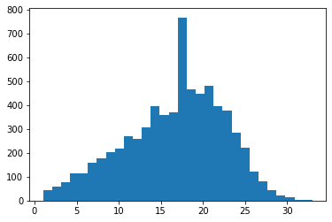
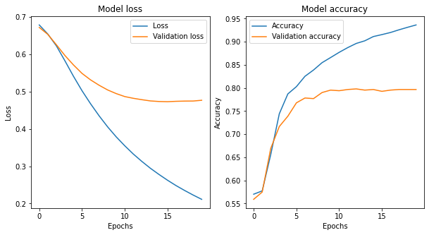
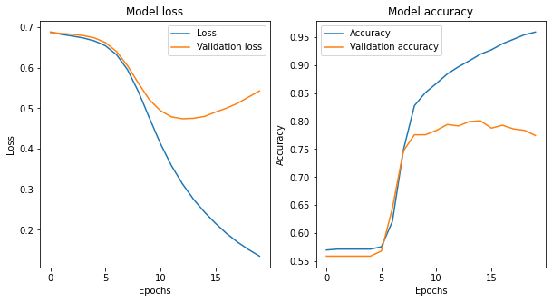
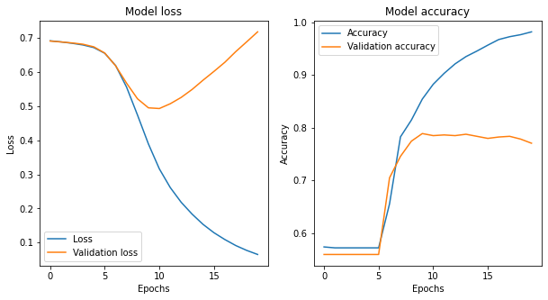
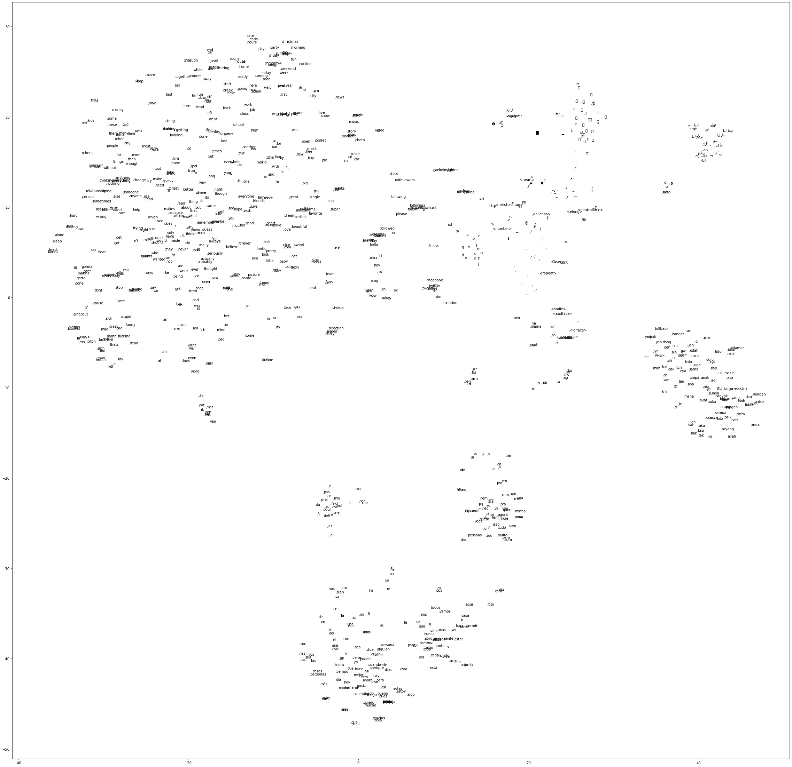
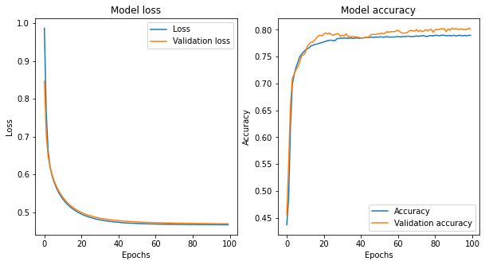

This notebook is based on the Deep Learning course from the Master Datascience Paris Saclay. Materials of the course can be found [here](https://github.com/m2dsupsdlclass/lectures-labs).The complete code can be found on a Kaggle [kernel](https://www.kaggle.com/stevengolo/text-classification-using-nn).

**Goals**
* Learn to use Neural Networks for text classification
* Train a shallow model with learning embeddings
* Download pre-trained embeddings from Glove
* Use these pre-trained embeddings

**Dataset**
* Tweets disasters from [Kaggle](https://www.kaggle.com/c/nlp-getting-started)
* Glove twitter data from [Kaggle](https://www.kaggle.com/joshkyh/glove-twitter)

However, please keep in mind:
* Deep Learning can be better on text classification than simpler Machine Learning techniques, but only on very large datasets and well designed/tuned models.
* We will not be using the most efficient (in terms of computing) techniques, as Keras is good for prototyping but rather inefficient for training small embedding models on text.
* The following projects can replicate similar word embedding models much more efficiently: [word2vec](https://github.com/dav/word2vec) and [gensim's word2vec](https://radimrehurek.com/gensim/models/word2vec.html) (self-supervised learning only), [fastText](https://github.com/facebookresearch/fastText) (both supervised and self-supervised learning), [Vowpal Wabbit](https://github.com/JohnLangford/vowpal_wabbit/wiki) (supervised learning).
* Plain shallow sparse TF-IDF bigrams features without any embedding and logistic regression or multinomial naive bayes is often competitive in small to medium datasets.


## The tweet disaster dataset

Kaggle provides some benchmark disaster classification dataset in English ([link](https://www.kaggle.com/c/nlp-getting-started)). The tweets are splitted into train/test sets. We will create a validation set to test the methods.


```python
df = pd.read_csv('../input/nlp-getting-started/train.csv')
df_test = pd.read_csv('../input/nlp-getting-started/test.csv')

text = df['text']
target = np.array(df['target'], dtype=np.int32)

text_test = df_test['text']
```


```python
target_train, target_val, text_train, text_val = train_test_split(
    target, text, test_size=0.1, random_state=42)
```

    Number of elements in the train set: 6851.
    Number of elements in the validation set: 762.
    Number of elements in the test set: 3263.


```python
# Convert train/validation text set to list.
text_train = [text for text in text_train]
text_val = [text for text in text_val]
text_test = [text for text in text_test]
```

## A first baseline model

For simple topic classification problems, one should always try a simple method first. In this case, a good baseline is extracting TF-IDF normalized bag of bigrams features and then use a simple linear classifier such as logistic regression. It's a very efficient method and should give us a strong baseline to compare our deep learning method against.


```python
# Define text classifier
text_classifier = make_pipeline(
    TfidfVectorizer(min_df=3, max_df=0.8, ngram_range=(1, 2)),
    LogisticRegression())
```


```python
%%time
_ = text_classifier.fit(text_train, target_train)
```

    CPU times: user 1.01 s, sys: 42.3 ms, total: 1.05 s
    Wall time: 976 ms

    Percentage of good classified on the train set: 0.876%.
    Percentage of good classified on the validation set: 0.791%.


```python
# Prediction the test set
subm = pd.read_csv('../input/nlp-getting-started/sample_submission.csv')
subm['target'] = text_classifier.predict(text_test)
subm.to_csv('model_logistic.csv', index=False)
```

An accuracy of $80\%$ on the validation set is pretty good for to lines of code and less than a second to fit. However, we can expect better results with a more complet deep learning based model. The F1 score is $0.78527$  after uploading the prediction of the Kaggle leaderboard using the Logistic regression model. 

## Preprocessing text for the (supervised) CBOW model

We will implement a simple classification model in Keras. Raw text requires (sometimes a lot of) preprocecessing. The following cells uses Keras to preprocess text:
* Using a tokenizer. We may use different tokenizers (from scikit-learn, NLTK, custom Python function, *etc*.). This converts the texts into sequences of indices representing the $N$ most frequent words.
* Sequences have different lengths, so we pad them (add $0$s at the end until the sequence is of length $M$).
* We convert the output classes as one-hot encodings.


```python
MAX_NB_WORDS = 20000

# Vectorize the text samples into a 2D integer tensor
tokenizer = Tokenizer(num_words=MAX_NB_WORDS, char_level=False)
tokenizer.fit_on_texts(text_train)

sequences = tokenizer.texts_to_sequences(text_train)
sequences_val = tokenizer.texts_to_sequences(text_val)
sequences_test = tokenizer.texts_to_sequences(text_test)

word_index = tokenizer.word_index
```

    There are 21115 unique tokens.


Tokenized sequences are converted to list of token ids (with an integer code). The tokenizer object stores a mapping (vocabulary) from word strings to token ids that can be inverted to reconstruct the original message (without formatting).


```python
index_to_word = dict((i, w) for w, i in tokenizer.word_index.items())
```

    "'mcfadden reportedly to test hamstring thursday' via teamstream http t co jwq4kvjh2j"


Let's have a closer look at the tokenized sequences.


```python
# Length of sequences
seq_len = [len(s) for s in sequences]
```

    Average length of the sequences: 16.649540213107574.
    Max length of the sequences: 33.



<center>
<p class="caption">
Figure 1: Histogram of sentence lengths
</p>
</center>

Let's pad all the sequences to the maximum of the length of the sequences to build the training, validation and test set. 


```python
MAX_SEQUENCE_LENGTH = np.max(seq_len)

# Pad sequences with 0s
x_train = pad_sequences(sequences, maxlen=MAX_SEQUENCE_LENGTH)
x_val = pad_sequences(sequences_val, maxlen=MAX_SEQUENCE_LENGTH)
x_test = pad_sequences(sequences_test, maxlen=MAX_SEQUENCE_LENGTH)
```

    Shape of train data tensor: (6851, 33)
    Shape of validation data tensor: (762, 33)
    Shape of test data tensor: (3263, 33)


```python
y_train = to_categorical(target_train)
y_val = to_categorical(target_val)
```

    Shape of train label tensor: (6851, 2)
    Shape of validation label tensor: (762, 2)


## A simple supervised CBOW model in Keras

The following computes a very simple model, as described in [fastText](https://github.com/facebookresearch/fastText).


* Build an embedding layer mapping each word to a vector representation.
* Compute the vector representation of all words in each sequence and average them.
* Add a dense layer to output $2$ classes (+ softmax)


```python
EMBEDDING_DIM = 20
N_CLASSES = 2

# Input a sequence of MAX_SEQUENCE_LENGTH integers
sequence_input = Input(shape=(MAX_SEQUENCE_LENGTH,), dtype='int32')

embedding_layer = Embedding(MAX_NB_WORDS, EMBEDDING_DIM,
                            input_length=MAX_SEQUENCE_LENGTH,
                            trainable=True)
embedded_sequences = embedding_layer(sequence_input)

average_layer = GlobalAveragePooling1D()
average_sequences = average_layer(embedded_sequences)

dense_layer = Dense(N_CLASSES, activation='softmax')
sequence_output = dense_layer(average_sequences)

model = Model(sequence_input, sequence_output)
model.compile(loss='categorical_crossentropy',
              optimizer=optimizers.Adam(lr=0.001),
              metrics=['accuracy'])
```


```python
history = model.fit(x_train, y_train,
                    validation_data=(x_val, y_val),
                    epochs=20, batch_size=128)
```


<center>
<p class="caption">
Figure 2: Train and validation loss and accuracy
</p>
</center>


```python
# Prediction the test set
subm = pd.read_csv('../input/nlp-getting-started/sample_submission.csv')
subm['target'] = np.argmax(model.predict(x_test), axis=1)
subm.to_csv('model_cbow.csv', index=False)
```

The F1 score is $0.80470$  after uploading the prediction of the Kaggle leaderboard using the CBOW model.

### Building more complex models

From the previous template, we will build two more complex models using:
1. **1D convolution** and **1D max-pooling**. Note that we will still need a `GlobalAveragePooling` or `Flatten` after the convolutions as the final `Dense` layer expects a fixed size input.


```python
# 1D convolution
EMBEDDING_DIM = 20
N_CLASSES = 2

# Input a sequence of MAX_SEQUENCE_LENGTH integers
sequence_input = Input(shape=(MAX_SEQUENCE_LENGTH,), dtype='int32')

embedding_layer = Embedding(MAX_NB_WORDS, EMBEDDING_DIM,
                            input_length=MAX_SEQUENCE_LENGTH,
                            trainable=True)
embedded_sequences = embedding_layer(sequence_input)

# A 1D convolution with 64 output channels
x = Conv1D(64, 4, activation='relu')(embedded_sequences)
# MaxPool divides the length of the sequence by 5
x = MaxPooling1D(5)(x)
# A 1D convolution with 32 output channels
x = Conv1D(32, 2, activation='relu')(x)
# MaxPool divides the length of the sequence by 5
x = MaxPooling1D(5)(x)
x = Flatten()(x)

dense_layer = Dense(N_CLASSES, activation='softmax')
sequence_output = dense_layer(x)

model = Model(sequence_input, sequence_output)
model.compile(loss='categorical_crossentropy',
              optimizer=optimizers.Adam(lr=0.0001),
              metrics=['accuracy'])
```


```python
history = model.fit(x_train, y_train,
                    validation_data=(x_val, y_val),
                    epochs=20, batch_size=128)
```



<center>
<p class="caption">
Figure 3: Train and validation loss and accuracy
</p>
</center>


```python
# Prediction the test set
subm = pd.read_csv('../input/nlp-getting-started/sample_submission.csv')
subm['target'] = np.argmax(model.predict(x_test), axis=1)
subm.to_csv('model_conv1d.csv', index=False)
```

The F1 score is $0.77914$  after uploading the prediction of the Kaggle leaderboard using the 1D-conv model.

2. **Recurrent neural networks through LSTM**. We will need to reduce sequence length before using the LSTM layer.


```python
# LSTM
EMBEDDING_DIM = 20
N_CLASSES = 2

# Input a sequence of MAX_SEQUENCE_LENGTH integers
sequence_input = Input(shape=(MAX_SEQUENCE_LENGTH,), dtype='int32')

embedding_layer = Embedding(MAX_NB_WORDS, EMBEDDING_DIM,
                            input_length=MAX_SEQUENCE_LENGTH,
                            trainable=True)
embedded_sequences = embedding_layer(sequence_input)

# A 1D convolution with 64 output channels
x = Conv1D(64, 4, activation='relu')(embedded_sequences)
# MaxPool divides the length of the sequence by 5
x = MaxPooling1D(5)(x)
# A 1D convolution with 32 output channels
x = Conv1D(32, 2, activation='relu')(x)
# MaxPool divides the length of the sequence by 5
x = MaxPooling1D(5)(x)
x = LSTM(32)(x)

dense_layer = Dense(N_CLASSES, activation='softmax')
sequence_output = dense_layer(x)

model = Model(sequence_input, sequence_output)
model.compile(loss='categorical_crossentropy',
              optimizer=optimizers.Adam(lr=0.0001),
              metrics=['accuracy'])
```


```python
history = model.fit(x_train, y_train,
                    validation_data=(x_val, y_val),
                    epochs=20, batch_size=128)
```


<center>
<p class="caption">
Figure 4: Train and validation loss and accuracy
</p>
</center>


```python
# Prediction the test set
subm = pd.read_csv('../input/nlp-getting-started/sample_submission.csv')
subm['target'] = np.argmax(model.predict(x_test), axis=1)
subm.to_csv('model_lstm.csv', index=False)
```

The F1 score is $0.76482$  after uploading the prediction of the Kaggle leaderboard using the LSTM model.

## Loading pre-trained embeddings

The file `glove.twitter.27B.25d.txt` is an extract of [Glove Vectors](https://nlp.stanford.edu/projects/glove/), that were trained on Twitter data (2B tweets, 27B tokens, 1.2M vocab, uncased, 25d).


```python
%%time
embeddings_index = {}
embeddings_vectors = []
with open('../input/glove-twitter/glove.twitter.27B.25d.txt', 'rb') as file:
    word_idx = 0
    for line in file:
        values = line.decode('utf-8').split()
        word = values[0]
        vector = np.asarray(values[1:], dtype='float32')
        embeddings_index[word] = word_idx
        embeddings_vectors.append(vector)
        word_idx = word_idx + 1
```

    CPU times: user 22 s, sys: 969 ms, total: 23 s
    Wall time: 23 s


```python
inv_idx = {v: k for k, v in embeddings_index.items()}
```

    Found 1193515 different words in the file.


```python
# Check that embedding elements have a common size
vec_list = [idx for (idx, vec) in enumerate(embeddings_vectors) if len(vec) != 25]
for idx in vec_list:
    print(idx)
    embeddings_vectors[idx] = np.append(embeddings_vectors[idx], 0)
```

```python
#Stack all embeddings in a large numpy array
glove_embeddings = np.vstack(embeddings_vectors)
glove_norms = np.linalg.norm(glove_embeddings, axis=-1, keepdims=True)
glove_embeddings_normed = glove_embeddings / glove_norms
```

    The shape of the Glove embeddings is: (1193515, 25).


```python
def get_embedding(word):
    idx = embeddings_index.get(word)
    if idx is None:
        return None
    else:
        return glove_embeddings[idx]
    
def get_normed_embedding(word):
    idx = embeddings_index.get(word)
    if idx is None:
        return None
    else:
        return glove_embeddings_normed[idx]
```


    The embeddings for the word `computer` is [ 0.64004999 -0.019514    0.70147997 -0.66123003  1.17229998 -0.58859003
      0.25917    -0.81541002  1.17079997  1.14129996 -0.15404999 -0.11369
     -3.84139991 -0.87233001  0.47488999  1.15409994  0.97678     1.11070001
     -0.14572001 -0.52012998 -0.52234    -0.92348999  0.34650999  0.061939
     -0.57375002].


## Finding most similar words

Let's build a function to find the most similar words, meaning given a word as query:
* lookup the vector for the query word in the Glove index;
* compute the cosine similarity between a word embedding and all other words;
* display the top `n` most similar words.


```python
def get_most_similar(words, top_n=5):
    query_emb = 0
    # If words is a list
    if type(words) == list:
        for word in words:
            query_emb += get_embedding(word)
        query_emb = query_emb / np.linalg.norm(query_emb)
    else:
        query_emb = get_normed_embedding(words)
        
    # Computation of cosine similarities
    cosines_sim = np.dot(glove_embeddings_normed, query_emb)
    
    # Top n most similar indexes corresponding to cosines
    idxs = np.argsort(cosines_sim)[::-1][:top_n]
    
    return [(inv_idx[idx], cosines_sim[idx]) for idx in idxs]
```


```python
# Get similar words
get_most_similar(['usa', 'france'], top_n=10)
```

    [('france', 0.9143999763733959),
     ('usa', 0.877272705475262),
     ('canada', 0.8763711330711943),
     ('europe', 0.8757308117296785),
     ('sport', 0.8729080986809372),
     ('paris', 0.8634662032860221),
     ('union', 0.8619851321103484),
     ('york', 0.8451367483692193),
     ('uk', 0.8423643620946288),
     ('race', 0.8259483628697403)]


## Displaying vectors with $t$-SNE


```python
# Compute t-SNE representation
word_emb_tsne = TSNE(perplexity=30).fit_transform(glove_embeddings_normed[:1000])
```



<center>
<p class="caption">
Figure 5: $t$-SNE representation of the embeddings
</p>
</center>

## Using pre-trained embeddings in our model

We want to use these pre-embeddings for transfer learning. This process is rather similar than transfer learning in image recognition: the features learnt on words might help us bootstrap the learning process, and increase performance if we don't have enough training data.

* We initialize an embedding matrix from the model with Glove embeddings:
    - take all unique words from our tweets dataset to build a vocabulary (`MAX_NB_WORDS = 20000`), and look up their Glove embedding;
    - place the Glove embedding at the corresponding index in the matrix;
    - if the words is not in the Glove vocabulary, we only place zeris in the matrix.
* We may fix these embeddings or fine-tune them.


```python
EMBEDDING_DIM = 25

# Prepare embedding matrix
nb_words_in_matrix = 0
nb_words = min(MAX_NB_WORDS, len(word_index))
embedding_matrix = np.zeros((nb_words, EMBEDDING_DIM))
for word, i in word_index.items():
    if i >= MAX_NB_WORDS:
        continue
    embedding_vector = get_embedding(word)
    if embedding_vector is not None:
        # Words not found in embedding index will be all-zeros
        embedding_matrix[i] = embedding_vector
        nb_words_in_matrix = nb_words_in_matrix + 1
```


    There are 11380 non-null words in the embedding matrix.


```python
# Build a layer with pre-trained embeddings
pretrained_embedding_layer = Embedding(MAX_NB_WORDS, EMBEDDING_DIM,
                                       weights=[embedding_matrix],
                                       input_length=MAX_SEQUENCE_LENGTH)
```

## A model with pre-trained embeddings

Average word embeddings pre-trained with Glove / word2vec usually works surprisingly well. However, when averaging more than $10$-$15$ words, the resulting vector becomes too noisy and classification performance is degraded.


```python
# Define model
sequence_input = Input(shape=(MAX_SEQUENCE_LENGTH,), dtype='int32')
embedded_sequences = pretrained_embedding_layer(sequence_input)
average = GlobalAveragePooling1D()(embedded_sequences)
predictions = Dense(N_CLASSES, activation='softmax')(average)

model = Model(sequence_input, predictions)

# We do not want to fine-tune embeddings
model.layers[1].trainable = False

model.compile(loss='categorical_crossentropy',
              optimizer=optimizers.Adam(lr=0.001),
              metrics=['accuracy'])
```


```python
history = model.fit(x_train, y_train,
                    validation_data=(x_val, y_val),
                    epochs=100, batch_size=64)
```



<center>
<p class="caption">
Figure 6: Tain and validation loss and accuracy
</p>
</center>


```python
# Prediction the test set
subm = pd.read_csv('../input/nlp-getting-started/sample_submission.csv')
subm['target'] = np.argmax(model.predict(x_test), axis=1)
subm.to_csv('model_glove.csv', index=False)
```

The F1 score is $0.76482$  after uploading the prediction of the Kaggle leaderboard using transfer learning with Glove.

**Remarks**
* On this type of task, using pre-trained embeddings can degrade results as we train much less parameters and we average a large number of pre-trained embeddings.
* Pre-trained embeddings followed by global averaging prevent overfitting but can also cause some underfitting.
* Using convolutions or LSTM should help counter the underfitting effect.
* It is also advisable to treat separately pre-trained embeddings and words out of the vocabulary.

Pre-trained embeddings can be very useful when the training set is small and the inidividual text documents to classify are short: in this case, there might be a single very important word in a test document that drives the label. If that word has never been seen in the training set but some synonyms were seen, the semantic similarity captured by the embedding will allow the model to generalized out of the restricted training set vocabulary.
