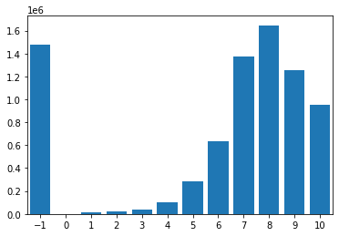

This notebook is based on the Deep Learning course from the Master Datascience Paris Saclay. Materials of the course can be found [here](https://github.com/m2dsupsdlclass/lectures-labs). The complete code can be found on a Kaggle [kernel](https://www.kaggle.com/stevengolo/triplet-loss-for-neural-recommender-systems).

**Goals**

* Demonstrate how it is possible to build a bi-linear recommender system only using positive feedback data.
* Train deeper architectures following the same design principles.

This notebook is inspired by Maciej Kula's [Recommendations in Keras using triplet loss](https://github.com/maciejkula/triplet_recommendations_keras). Contrary to the Maciej Kula's work, we won't use the [Bayesian Personalized Ranking](https://arxiv.org/ftp/arxiv/papers/1205/1205.2618.pdf) loss but instead will introduce the more common margin-based comparator.

**Dataset used**

* Anime Recommendations Database from Kaggle [link](https://www.kaggle.com/CooperUnion/anime-recommendations-database).


## Load and preprocess the data

### Ratings file

After loading the data, each line of the dataframe contains:
 * user_id - non identifiable randomly generated user id.
 * anime_id - the anime that this user has rated.
 * rating - rating out of $10$ this user has assigned ($-1$ if the user watched it but did not assign a rating).


```python
# Load and preprocess rating files
df_raw = pd.read_csv('../input/anime-recommendations-database/rating.csv')
```

    Shape of the ratings data: (7813737, 3).


<div style="text-align:center;">
<style scoped>
    .dataframe {
        margin-left:auto; 
        margin-right:auto;
    }
    .dataframe tbody tr th:only-of-type {
        vertical-align: middle;
    }
    .dataframe tbody tr th {
        vertical-align: top;
    }
    .dataframe thead th {
        text-align: right;
    }
</style>
<table class="dataframe">
  <thead>
    <tr style="text-align: right;">
      <th></th>
      <th>user_id</th>
      <th>anime_id</th>
      <th>rating</th>
    </tr>
  </thead>
  <tbody>
    <tr>
      <th>0</th>
      <td>1</td>
      <td>20</td>
      <td>-1</td>
    </tr>
    <tr>
      <th>1</th>
      <td>1</td>
      <td>24</td>
      <td>-1</td>
    </tr>
    <tr>
      <th>2</th>
      <td>1</td>
      <td>79</td>
      <td>-1</td>
    </tr>
    <tr>
      <th>3</th>
      <td>1</td>
      <td>226</td>
      <td>-1</td>
    </tr>
    <tr>
      <th>4</th>
      <td>1</td>
      <td>241</td>
      <td>-1</td>
    </tr>
  </tbody>
</table>
</div>


### Anime metadata file

The anime metadata file contains the following metadata: 
 * anime_id - myanimelist.net's unique id identifying an anime.
 * name - full name of the anime.
 * genre - comma separated list of genres for this anime.
 * type - movie, TV, OVA, etc.
 * episodes - how many episodes in this show ($1$ if it's a movie).
 * rating - average rating out of $10$ for this anime.
 * members - number of community members that are in this anime's group.


```python
# Load metadata file
metadata = pd.read_csv('../input/anime-recommendations-database/anime.csv')
```

    Shape of the metadata: (12294, 7).


<div>
<style scoped>
    .dataframe tbody tr th:only-of-type {
        vertical-align: middle;
    }

    .dataframe tbody tr th {
        vertical-align: top;
    }

    .dataframe thead th {
        text-align: right;
    }
</style>
<table border="0" class="dataframe">
  <thead>
    <tr style="text-align: right;">
      <th></th>
      <th>anime_id</th>
      <th>name</th>
      <th>genre</th>
      <th>type</th>
      <th>episodes</th>
      <th>rating</th>
      <th>members</th>
    </tr>
  </thead>
  <tbody>
    <tr>
      <th>0</th>
      <td>32281</td>
      <td>Kimi no Na wa.</td>
      <td>Drama, Romance, School, Supernatural</td>
      <td>Movie</td>
      <td>1</td>
      <td>9.37</td>
      <td>200630</td>
    </tr>
    <tr>
      <th>1</th>
      <td>5114</td>
      <td>Fullmetal Alchemist: Brotherhood</td>
      <td>Action, Adventure, Drama, Fantasy, Magic, Mili...</td>
      <td>TV</td>
      <td>64</td>
      <td>9.26</td>
      <td>793665</td>
    </tr>
    <tr>
      <th>2</th>
      <td>28977</td>
      <td>Gintama°</td>
      <td>Action, Comedy, Historical, Parody, Samurai, S...</td>
      <td>TV</td>
      <td>51</td>
      <td>9.25</td>
      <td>114262</td>
    </tr>
    <tr>
      <th>3</th>
      <td>9253</td>
      <td>Steins;Gate</td>
      <td>Sci-Fi, Thriller</td>
      <td>TV</td>
      <td>24</td>
      <td>9.17</td>
      <td>673572</td>
    </tr>
    <tr>
      <th>4</th>
      <td>9969</td>
      <td>Gintama&amp;#039;</td>
      <td>Action, Comedy, Historical, Parody, Samurai, S...</td>
      <td>TV</td>
      <td>51</td>
      <td>9.16</td>
      <td>151266</td>
    </tr>
  </tbody>
</table>
</div>


## Merge ratings and metadata

Let's enrich the raw ratings with the collected items metadata by merging the two dataframes on `anime_id`.


```python
ratings = df_raw.merge(metadata.loc[:, ['name', 'anime_id', 'type', 'episodes']], left_on='anime_id', right_on='anime_id')
```

    Shape of the complete data: (7813727, 6).


<div>
<style scoped>
    .dataframe tbody tr th:only-of-type {
        vertical-align: middle;
    }

    .dataframe tbody tr th {
        vertical-align: top;
    }

    .dataframe thead th {
        text-align: right;
    }
</style>
<table border="0" class="dataframe">
  <thead>
    <tr style="text-align: right;">
      <th></th>
      <th>user_id</th>
      <th>anime_id</th>
      <th>rating</th>
      <th>name</th>
      <th>type</th>
      <th>episodes</th>
    </tr>
  </thead>
  <tbody>
    <tr>
      <th>0</th>
      <td>1</td>
      <td>20</td>
      <td>-1</td>
      <td>Naruto</td>
      <td>TV</td>
      <td>220</td>
    </tr>
    <tr>
      <th>1</th>
      <td>3</td>
      <td>20</td>
      <td>8</td>
      <td>Naruto</td>
      <td>TV</td>
      <td>220</td>
    </tr>
    <tr>
      <th>2</th>
      <td>5</td>
      <td>20</td>
      <td>6</td>
      <td>Naruto</td>
      <td>TV</td>
      <td>220</td>
    </tr>
    <tr>
      <th>3</th>
      <td>6</td>
      <td>20</td>
      <td>-1</td>
      <td>Naruto</td>
      <td>TV</td>
      <td>220</td>
    </tr>
    <tr>
      <th>4</th>
      <td>10</td>
      <td>20</td>
      <td>-1</td>
      <td>Naruto</td>
      <td>TV</td>
      <td>220</td>
    </tr>
  </tbody>
</table>
</div>


### Data preprocessing

To understand well the distribution of the data, the following statistics are computed:
* the number of users
* the number of items
* the rating distribution
* the popularity of each anime


      Number of unique users: 73515.

      Number of unique animes: 11197.



<center>
<p class="caption">
Figure 1: Histogram of the ratings
</p>
</center>

Now, let's compute the popularity of each anime, defined as the number of ratings.


```python
# Count the number of ratings for each movie
popularity = ratings.groupby('anime_id').size().reset_index(name='popularity')
metadata = metadata.merge(popularity, left_on='anime_id', right_on='anime_id')
```

## Speed-up the computation

In order to speed up the computation, we will subset the dataset using three criteria:
* Remove the $-1$ ratings (people who watch the anime but without giving a rate).
* Get only TV shows (because I like TV show).
* Get the most popular ones (more than $5000$ ratings).


```python
# Get most popular anime id and TV shows
metadata_5000 = metadata.loc[(metadata['popularity'] > 5000) & (metadata['type'] == 'TV')]
# Remove -1 ratings and user id less than 10000
ratings = ratings[(ratings['rating'] > -1) & (ratings['user_id'] < 10000)]
```

## Clean id

Add a new column to metadata_5000 in order to clean up id of the anime.


```python
# Create a dataframe for anime_id
metadata_5000 = metadata_5000.assign(new_anime_id=pd.Series(np.arange(metadata_5000.shape[0])).values)
metadata_5000_indexed = metadata_5000.set_index('new_anime_id')
```


```python
# Merge the dataframe
ratings = ratings.merge(metadata_5000.loc[:, ['anime_id', 'new_anime_id', 'popularity']], left_on='anime_id', right_on='anime_id')
```


```python
# Create a dataframe for user_id
user = pd.DataFrame({'user_id': np.unique(ratings['user_id'])})
user = user.assign(new_user_id=pd.Series(np.arange(user.shape[0])).values)
```


```python
# Merge the dataframe
ratings = ratings.merge(user, left_on='user_id', right_on='user_id')
```


<div>
<style scoped>
    .dataframe tbody tr th:only-of-type {
        vertical-align: middle;
    }

    .dataframe tbody tr th {
        vertical-align: top;
    }

    .dataframe thead th {
        text-align: right;
    }
</style>
<table border="0" class="dataframe">
  <thead>
    <tr style="text-align: right;">
      <th></th>
      <th>user_id</th>
      <th>anime_id</th>
      <th>rating</th>
      <th>name</th>
      <th>type</th>
      <th>episodes</th>
      <th>new_anime_id</th>
      <th>popularity</th>
      <th>new_user_id</th>
    </tr>
  </thead>
  <tbody>
    <tr>
      <th>0</th>
      <td>3</td>
      <td>20</td>
      <td>8</td>
      <td>Naruto</td>
      <td>TV</td>
      <td>220</td>
      <td>169</td>
      <td>25925</td>
      <td>2</td>
    </tr>
    <tr>
      <th>1</th>
      <td>3</td>
      <td>8074</td>
      <td>6</td>
      <td>Highschool of the Dead</td>
      <td>TV</td>
      <td>12</td>
      <td>245</td>
      <td>23065</td>
      <td>2</td>
    </tr>
    <tr>
      <th>2</th>
      <td>3</td>
      <td>9919</td>
      <td>8</td>
      <td>Ao no Exorcist</td>
      <td>TV</td>
      <td>25</td>
      <td>140</td>
      <td>21204</td>
      <td>2</td>
    </tr>
    <tr>
      <th>3</th>
      <td>3</td>
      <td>11757</td>
      <td>9</td>
      <td>Sword Art Online</td>
      <td>TV</td>
      <td>25</td>
      <td>165</td>
      <td>30583</td>
      <td>2</td>
    </tr>
    <tr>
      <th>4</th>
      <td>3</td>
      <td>11759</td>
      <td>7</td>
      <td>Accel World</td>
      <td>TV</td>
      <td>24</td>
      <td>210</td>
      <td>10722</td>
      <td>2</td>
    </tr>
  </tbody>
</table>
</div>


    Shape of the rating dataset: (331474, 9).


```python
MAX_USER_ID = ratings['new_user_id'].max()
MAX_ITEM_ID = ratings['new_anime_id'].max()

N_USERS = MAX_USER_ID + 1
N_ITEMS = MAX_ITEM_ID + 1
```

    Number of users: 9220 / Number of animes: 303


Later in the analysis, we will assume that this popularity does not come from the ratings themselves but from an external metadata, *e.g.* box office numbers in the month after the release in movie theaters.

### Split the dataset into train/test sets

Let's split the enriched data in a train/test split to make it possible to do predictive modeling.


```python
train, test = train_test_split(ratings, test_size=0.2, random_state=42)

user_id_train = np.array(train['new_user_id'])
anime_id_train = np.array(train['new_anime_id'])
ratings_train = np.array(train['rating'])

user_id_test = np.array(test['new_user_id'])
anime_id_test = np.array(test['new_anime_id'])
ratings_test = np.array(test['rating'])
```

### Implicit feedback data

Consider the ratings greater or equal than 8 as positive feedback and ignore the rest.


```python
train_pos = train.query('rating > 7')
test_pos = test.query('rating > 7')
```

Because the median rating is around $8$, this cut will remove approximately half of the ratings from the datasets.

## The Triplet Loss

The following section demonstrates how to build a low-rank quadratic interaction model between users and anime. The similarity score between a user and an anime is defined by the unormlized dot products of their respective embeddings. The matching scores can be used to rank items to recommend to a specific user. 

Training of the model parameters is achieved by randomly sampling negative animes not seen by a pre-selected anchor user. We want the model embedding matrices to be such that the similarity between the user vector and the negative vector is smaller than the similarity between the user vector and the positive item vector. Furthermore, we use a margin to turther move appart the negative from the anchor user.

Here is the architecture of such a triplet architecture. The triplet name comes from the fact that the loss to optimize is defined for the triple `(anchor_user, positive_item, negative_item)`:


We call this model a triplet model with bi-linear interactions because the similarity between a user and an anime is captured by a dot product of the first level embedding vectors. This is therefore not a deep architecture.

Code for the [Margin Loss](https://gist.githubusercontent.com/StevenGolovkine/395a93a034ef501b942d51f1b6491f46/raw/3d922f38cea28c76494c79dfbfc39f7a9a73c73b/loss.py).
Here is the actual code that builds the model(s) with shared weights. Note that here we use the cosine similarity instead of unormalized dot products (both seems to yield comparable results).
The triplet model is used to train the weights of the companion similarity model. The triplet model takes one user, one positive anime (relative to the selected user) and one negative item and is trained with comparator loss. The similarity model takes one user and one anime as input and return compatibility score (*aka* the match score).

Code for the [Triplet Model](https://gist.githubusercontent.com/StevenGolovkine/395a93a034ef501b942d51f1b6491f46/raw/8d9d1cae3ddd5d67858fca635583caeb03467608/triplet_model.py).
```python
# Define parameters
EMBEDDING_SIZE = 64
L2_REG = 1e-6

# Define a triplet model
triplet_model = TripletModel(N_USERS, N_ITEMS, EMBEDDING_SIZE, L2_REG)
```

Code for the [Match Model](https://gist.githubusercontent.com/StevenGolovkine/395a93a034ef501b942d51f1b6491f46/raw/669cf7ac3627628a1963b39bc0884c862d833088/match_model.py)
```python
# Define a match model
match_model = MatchModel(triplet_model.user_embedding, triplet_model.item_embedding)
```

Note the `triplet_model` and `match_model` have as much parameters, they share both user and anime embeddings. Their only difference is that the latter doesn't compute the negative similarity.

### Quality of ranked recommendations

Now that we have a randomly initialized model, we can start computing random recommendations. To assess their quality, we do the following for each user:
* compute matching scores for animes (except the ones that the user has already seen in the training set);
* compare to the positive feedback actually collected on the test set using the ROC AUC ranking metric;
* average ROC AUC scores accross users to get the average performance of the recommender model on the test set.

Code for [AUC ROC score](https://gist.githubusercontent.com/StevenGolovkine/395a93a034ef501b942d51f1b6491f46/raw/9f0050a6463f5d27a6e77bc45c02ad23d093cd84/average_roc_auc.py).

By default, the model should make predictions to rank the items in random order. The **ROC AUC score** is a ranking score that represents the **expected value of correctly ordering uniformly sampled pairs of recommendations**. A random (untrained) model should yield $0.50$ ROC AUC on average.


* Average ROC AUC on the untrained model: 0.4976471614582777.


### Training the Triplet Model

Let's now fit the parameters of the model by sampling triplets: for each user, select a anime in the positive feedback set of that user and randomly sample another anime to serve as negative item. 

Note that this sampling scheme could be improved by removing items that are marked as postive in the data to remove some label noise. In practice, this does not seem to be a problem though.


```python
def sample_triplets(pos_data, max_item_id, random_seed=42):
    """Sample negative items ar random
    
    Parameters
    ----------
    pos_data: pd.DataFrame
        Dataframe of positive items
    max_item_id: integer
        Number of items in the complete dataframe
    random_seed: integer, default=42
        Random number generation
    
    Return
    ------
    A list with entries user_ids, pos_items_ids and neg_items_ids
    """
    rng = np.random.RandomState(random_seed)
    
    user_ids = pos_data['new_user_id'].values.astype('int64')
    pos_item_ids = pos_data['new_anime_id'].values.astype('int64')
    neg_item_ids = rng.randint(low=1, 
                               high=max_item_id + 1, 
                               size=len(user_ids), dtype='int64')
    return [user_ids, pos_item_ids, neg_item_ids]
```


```python
# Define parameters
N_EPOCHS = 10
BATCH_SIZE = 64

# We plug the identity loss and a fake target variable ignored by 
# the model to be able to use the Keras API to train the model.
fake_y = np.ones_like(train_pos["new_user_id"], dtype='int64')
    
triplet_model.compile(loss=identity_loss, optimizer='adam')
    
for i in range(N_EPOCHS):
    # Sample new negative items to build different triplets at each epoch
    triplet_inputs = sample_triplets(train_pos, MAX_ITEM_ID, random_seed=i)
        
    # Fit the model incrementally by doing a single pass over the sampled triplets
    triplet_model.fit(x=triplet_inputs, y=fake_y,
                      shuffle=True, batch_size=BATCH_SIZE, epochs=1)
```

    Train on 185353 samples
    185353/185353 [==============================] - 12s 64us/sample - loss: 0.8795
    Train on 185353 samples
    185353/185353 [==============================] - 11s 62us/sample - loss: 0.6585
    Train on 185353 samples
    185353/185353 [==============================] - 12s 62us/sample - loss: 0.6276
    Train on 185353 samples
    185353/185353 [==============================] - 11s 61us/sample - loss: 0.6170
    Train on 185353 samples
    185353/185353 [==============================] - 11s 61us/sample - loss: 0.6083
    Train on 185353 samples
    185353/185353 [==============================] - 11s 59us/sample - loss: 0.6059
    Train on 185353 samples
    185353/185353 [==============================] - 11s 62us/sample - loss: 0.6022
    Train on 185353 samples
    185353/185353 [==============================] - 12s 63us/sample - loss: 0.5987
    Train on 185353 samples
    185353/185353 [==============================] - 12s 63us/sample - loss: 0.5978
    Train on 185353 samples
    185353/185353 [==============================] - 12s 62us/sample - loss: 0.5952


* Average ROC AUC on the trained model: 0.8198516403545272.


Model: "TripletModel"
    
    _________________________________________________________________
    Layer (type)                 Output Shape              Param #   
    =================================================================
    user_embedding (Embedding)   multiple                  590080    
    _________________________________________________________________
    item_embedding (Embedding)   multiple                  19392     
    _________________________________________________________________
    flatten (Flatten)            multiple                  0         
    _________________________________________________________________
    dot (Dot)                    multiple                  0         
    _________________________________________________________________
    margin_loss (MarginLoss)     multiple                  0         
    =================================================================
    Total params: 609,472
    Trainable params: 609,472
    Non-trainable params: 0
    _________________________________________________________________


Model: "MatchModel"
    
    _________________________________________________________________
    Layer (type)                 Output Shape              Param #   
    =================================================================
    user_embedding (Embedding)   multiple                  590080    
    _________________________________________________________________
    item_embedding (Embedding)   multiple                  19392     
    _________________________________________________________________
    flatten_1 (Flatten)          multiple                  0         
    _________________________________________________________________
    dot_1 (Dot)                  multiple                  0         
    =================================================================
    Total params: 609,472
    Trainable params: 609,472
    Non-trainable params: 0
    _________________________________________________________________


Both models have exactly the same number of parameters, namely the parameters of the two embeddings:
* user embedding: $n_{users} \times embedding_{dim}$
* item embedding: $n_{items} \times embedding_{dim}$

The triplet model uses the same item embedding twice, once to compute the positive similarity and the other time to compute the negative similarity. However, because two nodes in the computation graph share the same instance of the item embedding layer, the item embedding weight matrix is shared by the two branches of the graph and therefore the total number of parameters for each model is in both cases:
$$n_{users} \times embedding_{dim} + n_{items} \times embedding_{dim}$$

## Training a Deep Matching Model on Implicit Feedback

Instead of using hard-coded cosine to predict the match of a `(user_id, item_id)` pair, we can instead specify a deep neural network based on parametrisation of the similarity. The parameters of that matching model are also trained with the margin comparator loss.


**Goals**
* Implement a `(deep_match_model, deep_triplet_model)` pair of models for the architecture described in the schema. The last layer of the embedded Multi Layer Perceptron outputs a single scalar that encoded the similarity between a user and a candidate item.
* Evaluate the resulting model by computing the per-usage average ROC AUC score on the test feedback data:
    * Check that the AUC ROC score is close to $0.5$ for a randomly initialized model.
   
**Hints**
* It is possible to reuse the code to create embeddings from the previous model definition.
* The concatenation between user and the positive item embedding can be obtained with the `Concatenate` layer:
        
        
        concat = Concatenate()
        positive_embeddings_pair = concat([user_embedding, positive_item_embedding])
        negative_embeddings_pair = concat([user_embedding, negative_item_embedding])
        
        
* Those embedding pairs should be fed to a shared MLP instance to compute the similarity scores.

Code for [MLP layer](https://gist.githubusercontent.com/StevenGolovkine/395a93a034ef501b942d51f1b6491f46/raw/32ef7d3f1526c74b69ce9b6e6b7cb6e64ac86606/mlp.py). Code for [Deep Triplet Model](https://gist.githubusercontent.com/StevenGolovkine/395a93a034ef501b942d51f1b6491f46/raw/613d79da7f575834678340b23e4d86029644cbce/deep_triplet_model.py). Code for [Deep Match Model](https://gist.githubusercontent.com/StevenGolovkine/395a93a034ef501b942d51f1b6491f46/raw/5eba4cadc20e13c3aac6c857a12b9e86b5665a6b/deep_match_model.py).


```python
# Define and train the model
HYPER_PARAM = dict( 
    embedding_size_user=32, 
    embedding_size_item=64, 
    n_hidden=1, 
    hidden_size=[128], 
    l2_reg=0., 
    margin=0.5, 
    p_dropout=0.1)

deep_triplet_model = DeepTripletModel(N_USERS, N_ITEMS, **HYPER_PARAM)
deep_match_model = DeepMatchModel(deep_triplet_model.user_embedding, 
                                  deep_triplet_model.item_embedding, 
                                  deep_triplet_model.mlp)
```

* Average ROC AUC on the untrained model: 0.4813207056084938.


```python
# Define parameters
N_EPOCHS = 20

# We plug the identity loss and a fake target variable ignored by 
# the model to be able to use the Keras API to train the model.
fake_y = np.ones_like(train_pos["new_user_id"], dtype='int64')
    
deep_triplet_model.compile(loss=identity_loss, optimizer='adam')
    
for i in range(N_EPOCHS):
    # Sample new negative items to build different triplets at each epoch
    triplet_inputs = sample_triplets(train_pos, MAX_ITEM_ID, random_seed=i)
        
    # Fit the model incrementally by doing a single pass over the sampled triplets
    deep_triplet_model.fit(x=triplet_inputs, y=fake_y,
                      shuffle=True, batch_size=BATCH_SIZE, epochs=1)
```

    Train on 185353 samples
    185353/185353 [==============================] - 12s 64us/sample - loss: 0.3795
    Train on 185353 samples
    185353/185353 [==============================] - 11s 62us/sample - loss: 0.3416
    Train on 185353 samples
    185353/185353 [==============================] - 12s 62us/sample - loss: 0.3051
    Train on 185353 samples
    185353/185353 [==============================] - 12s 63us/sample - loss: 0.2918
    Train on 185353 samples
    185353/185353 [==============================] - 12s 63us/sample - loss: 0.2793
    Train on 185353 samples
    185353/185353 [==============================] - 11s 62us/sample - loss: 0.2730
    Train on 185353 samples
    185353/185353 [==============================] - 11s 62us/sample - loss: 0.2665
    Train on 185353 samples
    185353/185353 [==============================] - 12s 62us/sample - loss: 0.2603
    Train on 185353 samples
    185353/185353 [==============================] - 12s 64us/sample - loss: 0.2557
    Train on 185353 samples
    185353/185353 [==============================] - 11s 62us/sample - loss: 0.2507
    Train on 185353 samples
    185353/185353 [==============================] - 11s 59us/sample - loss: 0.2471
    Train on 185353 samples
    185353/185353 [==============================] - 11s 61us/sample - loss: 0.2437
    Train on 185353 samples
    185353/185353 [==============================] - 12s 66us/sample - loss: 0.2429
    Train on 185353 samples
    185353/185353 [==============================] - 12s 64us/sample - loss: 0.2394
    Train on 185353 samples
    185353/185353 [==============================] - 12s 65us/sample - loss: 0.2371
    Train on 185353 samples
    185353/185353 [==============================] - 12s 63us/sample - loss: 0.2350
    Train on 185353 samples
    185353/185353 [==============================] - 12s 62us/sample - loss: 0.2353
    Train on 185353 samples
    185353/185353 [==============================] - 12s 65us/sample - loss: 0.2318
    Train on 185353 samples
    185353/185353 [==============================] - 12s 65us/sample - loss: 0.2294
    Train on 185353 samples
    185353/185353 [==============================] - 12s 66us/sample - loss: 0.2278


* Average ROC AUC on the trained model: 0.8447603510370133.


Model: "TripletModel"
    
    _________________________________________________________________
    Layer (type)                 Output Shape              Param #   
    =================================================================
    user_embedding (Embedding)   multiple                  295040    
    _________________________________________________________________
    item_embedding (Embedding)   multiple                  19392     
    _________________________________________________________________
    flatten_2 (Flatten)          multiple                  0         
    _________________________________________________________________
    concatenate (Concatenate)    multiple                  0         
    _________________________________________________________________
    mlp (MLP)                    multiple                  12545     
    _________________________________________________________________
    margin_loss_1 (MarginLoss)   multiple                  0         
    =================================================================
    Total params: 326,977
    Trainable params: 326,977
    Non-trainable params: 0
    _________________________________________________________________


Model: "MatchModel"
    
    _________________________________________________________________
    Layer (type)                 Output Shape              Param #   
    =================================================================
    user_embedding (Embedding)   multiple                  295040    
    _________________________________________________________________
    item_embedding (Embedding)   multiple                  19392     
    _________________________________________________________________
    mlp (MLP)                    multiple                  12545     
    _________________________________________________________________
    flatten_3 (Flatten)          multiple                  0         
    _________________________________________________________________
    concatenate_1 (Concatenate)  multiple                  0         
    =================================================================
    Total params: 326,977
    Trainable params: 326,977
    Non-trainable params: 0
    _________________________________________________________________


Both models have again exactly the same number of parameters, namely the parameters of the two embeddings:
- user embedding: $n_{users} \times user_{dim}$
- item embedding: $n_{items} \times item_{dim}$

and the parameters of the MLP model used to compute the similarity score of an `(user, item)` pair:
- first hidden layer weights: $(user_{dim} + item_{dim}) \times hidden_{size}$
- first hidden biases: $hidden_{size}$
- extra hidden layers weights: $hidden_{size} \times hidden_{size}$
- extra hidden layers biases: $hidden_{size}$
- output layer weights: $hidden_{size} \times 1$
- output layer biases: $1$

The triplet model uses the same item embedding layer twice and the same MLP instance twice: once to compute the positive similarity and the other time to compute the negative similarity. However because those two lanes in the computation graph share the same instances for the item embedding layer and for the MLP, their parameters are shared.

## Possible Extensions

We may implement any of the following ideas.

### Leverage User and Item metadata

As we did for the Explicit Feedback model, it's also possible to extend our models to take additional user and item metadata as side information when computing the match score.

### Better Ranking Metrics

In this notebook, we evaluated the quality of the ranked recommendations using the ROC AUC metric. This score reflect the ability of the model to correctly rank any pair of items (sampled uniformly at random among all possible items).

In practice, recommender systems will only display a few recommendations to the user (typically 1 to 10). It is typically more informative to use an evaluation metric that characterize the quality of the top ranked items and attribute less or no importance to items that are not good recommendations for a specific users. Popular ranking metrics therefore include the *Precision at k* and the *Mean Average Precision*.

### Hard Negatives Sampling

In this experiment, we sampled negative items uniformly at random. However, after training the model for a while, it is possible that the vast majority of sampled negatives have a similarity already much lower than the positive pair and that the margin comparator loss sets the majority of the gradients to zero effectively wasting a lot of computation.

Given the current state of the recsys model we could sample harder negatives with a larger likelihood to train the model better closer to its decision boundary. This strategy is implemented in the WARP loss [1].

The main drawback of hard negative sampling is increasing the risk of sever overfitting if a significant fraction of the labels are noisy.

### Factorization Machines

A very popular recommender systems model is called Factorization Machines [2][3]. They two use low rank vector representations of the inputs but they do not use a cosine similarity or a neural network to model user/item compatibility.

It is be possible to adapt our previous code written with Keras to replace the cosine sims / MLP with the low rank FM quadratic interactions by reading through [this gentle introduction](http://tech.nextroll.com/blog/data-science/2015/08/25/factorization-machines.html).

If you choose to do so, you can compare the quality of the predictions with those obtained by the [pywFM project](https://github.com/jfloff/pywFM) which provides a Python wrapper for the [official libFM C++ implementation](http://www.libfm.org/). Maciej Kula also maintains a lighfm that implements an efficient and well documented variant in Cython and Python.

### References:

[1] Wsabie: Scaling Up To Large Vocabulary Image Annotation
Jason Weston, Samy Bengio, Nicolas Usunier, 2011
https://research.google.com/pubs/pub37180.html

[2] Factorization Machines, Steffen Rendle, 2010
https://www.ismll.uni-hildesheim.de/pub/pdfs/Rendle2010FM.pdf

[3] Factorization Machines with libFM, Steffen Rendle, 2012
in ACM Trans. Intell. Syst. Technol., 3(3), May.
http://doi.acm.org/10.1145/2168752.2168771


