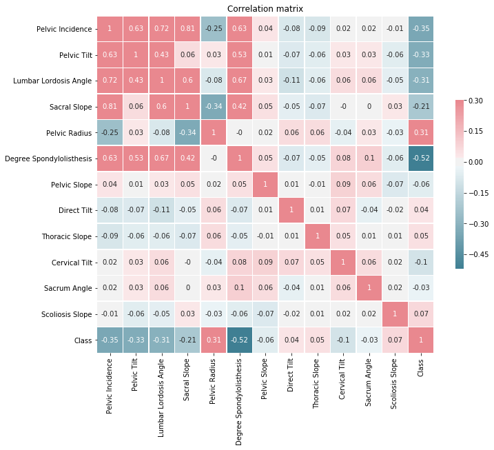
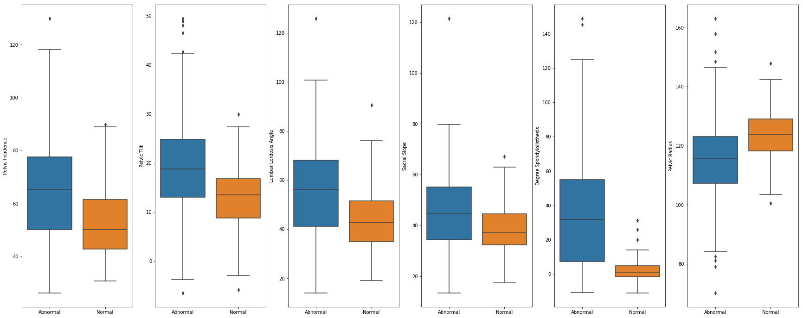
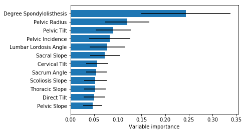
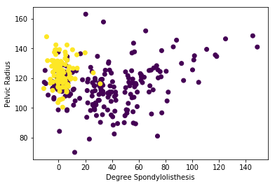

This dataset is provided by sammy123 on [Kaggle](https://www.kaggle.com/sammy123/lower-back-pain-symptoms-dataset). My study and the complete code are on a Kaggle [kernel](https://www.kaggle.com/stevengolo/lower-back-pain-syndrom).

# Context

Lower back pain can be caused by a variety of problems with any parts of the complex, interconnected network of spinal muscles, nerves, bones, discs or tendons in the lumbar spines. Typical sources of low back pain include:

* The large nerve roots in the low back that go to the legs may be irritated.
* The smaller nerves that supply the low back may be irritated.
* The large paired lower back muscles (erector spinae) may be strained.
* The bones, ligaments or joints may be damaged.
* An intervertebral disc may be degenerating.

An irritation or problem with any of these structures can cause lower back pain and/or pain that radiates or is referred to other parts of the body. Many lower back problems can also cause back muscle spasms, which do not sound like much but can cause severe pain and disability.

While lower back pain is extremely common, the symptoms and severity of lower back pain vary greatly. A simple lower back muscle strain might be excruciating enough to necessitate an emergency room visit, while a degenerating disc might cause only mild, intermittent discomfort.

# Question

How identify an abnormal or normal person using collected physical spine details and data?

```python
# Import the data
data = pd.read_csv("Dataset_spine.csv", decimal='.', sep=',', header=0)
data = data.drop('Unnamed: 13', 1)
data.columns = ['pelvic_incidence', 'pelvic_tilt',
                'lumbar_lordosis_angle', 'sacral_slope',
                'pelvic_radius', 'degree_spondylolisthesis',
                'pelvic_slope', 'direct_tilt',
                'thoracic_slope', 'cervical_tilt',
                'sacrum_angle', 'scoliosis_slope',
                'class']

data.head()
```

<div style="overflow-x:auto;">
<style scoped>
    .dataframe tbody tr th:only-of-type {
        vertical-align: middle;
    }

    .dataframe tbody tr th {
        vertical-align: top;
    }

    .dataframe thead th {
        text-align: right;
    }
</style>
<table class="dataframe">
  <thead>
    <tr style="text-align: right;">
      <th>Pelvic Incidence</th>
      <th>Pelvic Tilt</th>
      <th>Lumbar Lordosis Angle</th>
      <th>Sacral Slope</th>
      <th>Pelvic Radius</th>
      <th>Degree Spondylolisthesis</th>
      <th>Pelvic Slope</th>
      <th>Direct Tilt</th>
      <th>Thoracic Slope</th>
      <th>Cervical Tilt</th>
      <th>Sacrum Angle</th>
      <th>Scoliosis Slope</th>
      <th>Class</th>
    </tr>
  </thead>
  <tbody>
    <tr>
      <td>63.027818</td>
      <td>22.552586</td>
      <td>39.609117</td>
      <td>40.475232</td>
      <td>98.672917</td>
      <td>-0.254400</td>
      <td>0.744503</td>
      <td>12.5661</td>
      <td>14.5386</td>
      <td>15.30468</td>
      <td>-28.658501</td>
      <td>43.5123</td>
      <td>Abnormal</td>
    </tr>
    <tr>
      <td>39.056951</td>
      <td>10.060991</td>
      <td>25.015378</td>
      <td>28.995960</td>
      <td>114.405425</td>
      <td>4.564259</td>
      <td>0.415186</td>
      <td>12.8874</td>
      <td>17.5323</td>
      <td>16.78486</td>
      <td>-25.530607</td>
      <td>16.1102</td>
      <td>Abnormal</td>
    </tr>
    <tr>
      <td>68.832021</td>
      <td>22.218482</td>
      <td>50.092194</td>
      <td>46.613539</td>
      <td>105.985135</td>
      <td>-3.530317</td>
      <td>0.474889</td>
      <td>26.8343</td>
      <td>17.4861</td>
      <td>16.65897</td>
      <td>-29.031888</td>
      <td>19.2221</td>
      <td>Abnormal</td>
    </tr>
    <tr>
      <td>69.297008</td>
      <td>24.652878</td>
      <td>44.311238</td>
      <td>44.644130</td>
      <td>101.868495</td>
      <td>11.211523</td>
      <td>0.369345</td>
      <td>23.5603</td>
      <td>12.7074</td>
      <td>11.42447</td>
      <td>-30.470246</td>
      <td>18.8329</td>
      <td>Abnormal</td>
    </tr>
    <tr>
      <td>49.712859</td>
      <td>9.652075</td>
      <td>28.317406</td>
      <td>40.060784</td>
      <td>108.168725</td>
      <td>7.918501</td>
      <td>0.543360</td>
      <td>35.4940</td>
      <td>15.9546</td>
      <td>8.87237</td>
      <td>-16.378376</td>
      <td>24.9171</td>
      <td>Abnormal</td>
    </tr>
  </tbody>
</table>
</div>


# Exploration of the data

* Let's check if there are some missing values in this dataset.

```python
data.info()
```

```
    <class 'pandas.core.frame.DataFrame'>
    RangeIndex: 310 entries, 0 to 309
    Data columns (total 13 columns):
    pelvic_incidence            310 non-null float64
    pelvic_tilt                 310 non-null float64
    lumbar_lordosis_angle       310 non-null float64
    sacral_slope                310 non-null float64
    pelvic_radius               310 non-null float64
    degree_spondylolisthesis    310 non-null float64
    pelvic_slope                310 non-null float64
    direct_tilt                 310 non-null float64
    thoracic_slope              310 non-null float64
    cervical_tilt               310 non-null float64
    sacrum_angle                310 non-null float64
    scoliosis_slope             310 non-null float64
    class                       310 non-null object
    dtypes: float64(12), object(1)
    memory usage: 31.6+ KB
```


* Compute some basic statistics about the data.

```python
data.describe()
```

<div style="overflow-x:auto;">
<style scoped>
    .dataframe tbody tr th:only-of-type {
        vertical-align: middle;
    }

    .dataframe tbody tr th {
        vertical-align: top;
    }

    .dataframe thead th {
        text-align: right;
    }
</style>
<table class="dataframe">
  <thead>
    <tr style="text-align: right;">
      <th></th>
      <th>Pelvic Incidence</th>
      <th>Pelvic Tilt</th>
      <th>Lumbar Lordosis Angle</th>
      <th>Sacral Slope</th>
      <th>Pelvic Radius</th>
      <th>Degree Spondylolisthesis</th>
      <th>Pelvic Slope</th>
      <th>Direct Tilt</th>
      <th>Thoracic Slope</th>
      <th>Cervical Tilt</th>
      <th>Sacrum Angle</th>
      <th>Scoliosis Slope</th>
    </tr>
  </thead>
  <tbody>
    <tr>
      <th>Count</th>
      <td>310.000000</td>
      <td>310.000000</td>
      <td>310.000000</td>
      <td>310.000000</td>
      <td>310.000000</td>
      <td>310.000000</td>
      <td>310.000000</td>
      <td>310.000000</td>
      <td>310.000000</td>
      <td>310.000000</td>
      <td>310.000000</td>
      <td>310.000000</td>
    </tr>
    <tr>
      <th>Mean</th>
      <td>60.496653</td>
      <td>17.542822</td>
      <td>51.930930</td>
      <td>42.953831</td>
      <td>117.920655</td>
      <td>26.296694</td>
      <td>0.472979</td>
      <td>21.321526</td>
      <td>13.064511</td>
      <td>11.933317</td>
      <td>-14.053139</td>
      <td>25.645981</td>
    </tr>
    <tr>
      <th>Std</th>
      <td>17.236520</td>
      <td>10.008330</td>
      <td>18.554064</td>
      <td>13.423102</td>
      <td>13.317377</td>
      <td>37.559027</td>
      <td>0.285787</td>
      <td>8.639423</td>
      <td>3.399713</td>
      <td>2.893265</td>
      <td>12.225582</td>
      <td>10.450558</td>
    </tr>
    <tr>
      <th>Min</th>
      <td>26.147921</td>
      <td>-6.554948</td>
      <td>14.000000</td>
      <td>13.366931</td>
      <td>70.082575</td>
      <td>-11.058179</td>
      <td>0.003220</td>
      <td>7.027000</td>
      <td>7.037800</td>
      <td>7.030600</td>
      <td>-35.287375</td>
      <td>7.007900</td>
    </tr>
    <tr>
      <th>25%</th>
      <td>46.430294</td>
      <td>10.667069</td>
      <td>37.000000</td>
      <td>33.347122</td>
      <td>110.709196</td>
      <td>1.603727</td>
      <td>0.224367</td>
      <td>13.054400</td>
      <td>10.417800</td>
      <td>9.541140</td>
      <td>-24.289522</td>
      <td>17.189075</td>
    </tr>
    <tr>
      <th>50%</th>
      <td>58.691038</td>
      <td>16.357689</td>
      <td>49.562398</td>
      <td>42.404912</td>
      <td>118.268178</td>
      <td>11.767934</td>
      <td>0.475989</td>
      <td>21.907150</td>
      <td>12.938450</td>
      <td>11.953835</td>
      <td>-14.622856</td>
      <td>24.931950</td>
    </tr>
    <tr>
      <th>75%</th>
      <td>72.877696</td>
      <td>22.120395</td>
      <td>63.000000</td>
      <td>52.695888</td>
      <td>125.467674</td>
      <td>41.287352</td>
      <td>0.704846</td>
      <td>28.954075</td>
      <td>15.889525</td>
      <td>14.371810</td>
      <td>-3.497094</td>
      <td>33.979600</td>
    </tr>
    <tr>
      <th>Max</th>
      <td>129.834041</td>
      <td>49.431864</td>
      <td>125.742385</td>
      <td>121.429566</td>
      <td>163.071041</td>
      <td>418.543082</td>
      <td>0.998827</td>
      <td>36.743900</td>
      <td>19.324000</td>
      <td>16.821080</td>
      <td>6.972071</td>
      <td>44.341200</td>
    </tr>
  </tbody>
</table>
</div>

No results seem to be unusual, except for the maximum of the _Degree Spondylolisthesis_. Usually, a degree is between -180° and 180° (or 0° and 360°). If we look at the other data, it seems that the coding of the angle is between -180° and 180° (with a very few negative angle). Let's look at all the values out of the usual range of the degrees (it concerns only the variable _Degree Spondylolisthesis_).

```python
data[data.degree_spondylolisthesis > 180]
```

<div style="overflow-x:auto;">
<style scoped>
    .dataframe tbody tr th:only-of-type {
        vertical-align: middle;
    }

    .dataframe tbody tr th {
        vertical-align: top;
    }

    .dataframe thead th {
        text-align: right;
    }
</style>
<table class="dataframe">
  <thead>
    <tr style="text-align: right;">
      <th></th>
      <th>Pelvic Incidence</th>
      <th>Pelvic Tilt</th>
      <th>Lumbar Lordosis Angle</th>
      <th>Sacral Slope</th>
      <th>Pelvic Radius</th>
      <th>Degree Spondylolisthesis</th>
      <th>Pelvic Slope</th>
      <th>Direct Tilt</th>
      <th>Thoracic Slope</th>
      <th>Cervical Tilt</th>
      <th>Sacrum Angle</th>
      <th>Scoliosis Slope</th>
      <th>Class</th>
    </tr>
  </thead>
  <tbody>
    <tr>
      <th>115</th>
      <td>129.834041</td>
      <td>8.404475</td>
      <td>48.384057</td>
      <td>121.429566</td>
      <td>107.690466</td>
      <td>418.543082</td>
      <td>0.860223</td>
      <td>18.5943</td>
      <td>11.1514</td>
      <td>11.36543</td>
      <td>-34.202073</td>
      <td>27.5144</td>
      <td>Abnormal</td>
    </tr>
  </tbody>
</table>
</div>

Only one observation has a _Degree Spondylolisthesis_ larger than 180. We can consider a typo in the decimal of this value. So, we replace the value 418.543082 by 41.8543082.

```python
data.loc[115, 'degree_spondylolisthesis'] = 41.8543082
```

* Recode the variable _class_ into a dummy variable (0: Abnormal, 1: Normal).

```python
data['class'] = pd.get_dummies(data['class'], prefix='class', drop_first=True)
```

* Then, we look at the correlation between the different variables.

```python
# Compute the correlation matrix.
corr_data = round(data.corr(),2)
```

<center>

</center>

So, it appears that the class {Abnormal, Normal} is negatively correlated with the _Pelvic Incidence_, the _Pelvic Tilt_, the _Lumbar Lordosis Angle_, the _Sacral Slope_ and the _Degree Spondylolisthesis_ and positively correlated with the _Pelvic Radius_. The class has a very small correlation with the other variables.

* Let's look at some boxplot for these variables.

<center>

</center>

# Subset features selection

```python
model = ExtraTreesClassifier(n_estimators=200, random_state=0)
model.fit(data.drop('class', axis=1, inplace=False), data['class'])

importances = model.feature_importances_
importances_std = np.std([model_tree.feature_importances_ for model_tree in model.estimators_], axis=0)
```

<center>

</center>

So, we have an importance score for each attribute where the larger score the more important the attribute. As we see on the correlation plot, the variable _degree spondylolisthesis_ and _pelvic radius_/_pelvic tilt_/_pelvic incidence_/_lumbar lordosis angle_ are strongly correlated. We will consider only the variables _Degree Spondylolisthesis_, _Pelvic Radius_, _Pelvic Tilt_ and _Pelvic Incidence_ for building the model (the four with the strongest importance).

* Let's plot these variables with the class.

<center>

</center>

# Model construction

* Split the dataset into train and test set.

```python
X_train, X_test, Y_train, Y_test = train_test_split(data[['degree_spondylolisthesis', 'pelvic_radius', 'pelvic_tilt', 'pelvic_incidence']], data['class'], test_size=1/3, random_state=42)

scaler = StandardScaler().fit(X_train)
X_train_transformed = scaler.transform(X_train)
X_test_transformed = scaler.transform(X_test)
```

* Let's construct the baseline by setting the most frequent response in the training set to compare our model.

```python
dummy = DummyClassifier(strategy='most_frequent', random_state=42)
dummy.fit(X_train_transformed, Y_train)
Y_pred_dummy = dummy.predict(X_test_transformed)

Y_pred_proba_dummy = dummy.predict_proba(X_test_transformed)[:, 1]
[fpr_dummy, tpr_dummy, thr_dummy] = metrics.roc_curve(Y_test, Y_pred_proba_dummy)
```
> The accuracy for the dummy classifier is 72%. 


* Use the Logistic Regression method to predict the class (by Cross-Validation and GridSearch).

```python
param_log_reg = {'tol': np.logspace(-5, 1, 7),
                 'C': np.logspace(-3, 3, 7),
                 'penalty': ['l2']}

log_reg = GridSearchCV(LogisticRegression(solver='lbfgs'), param_log_reg, cv=10, iid=False)
log_reg.fit(X_train_transformed, Y_train)
```
> Best parameters set found on development set: {'C': 1.0, 'penalty': 'l2', 'tol': 1.0}


```python
Y_pred_log_reg = log_reg.predict(X_test_transformed)

Y_pred_proba_log_reg = log_reg.predict_proba(X_test_transformed)[:, 1]
[fpr_log_reg, tpr_log_reg, thr_log_reg] = metrics.roc_curve(Y_test, Y_pred_proba_log_reg)
```
> The accuracy for the Logistic Regression classifier is 85%. 

* Plot the ROC curves for each models

<center>

</center>

