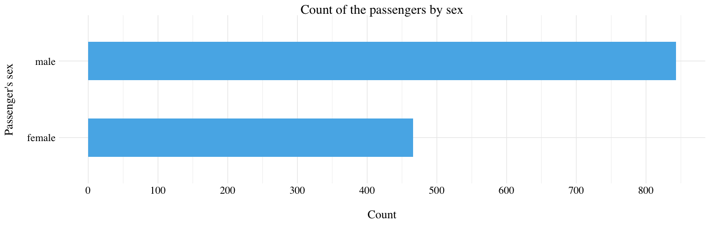
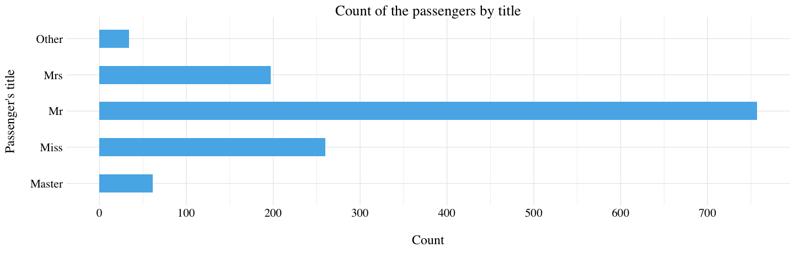
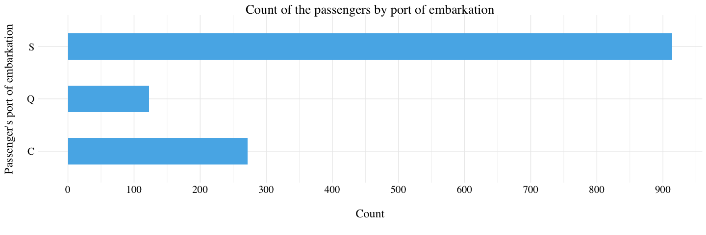
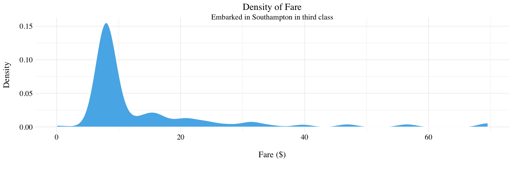
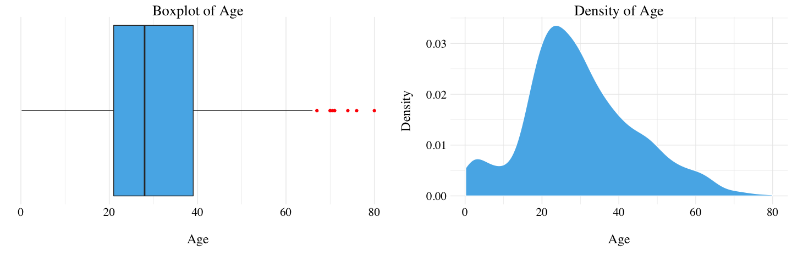

Context
-------

The sinking of the RMS Titanic is one of the most infamous shipwrecks in
history. On April 15, 1912, during her maiden voyage, the Titanic sank
after colliding with an iceberg, killing 1502 out of 2224 passengers and
crew. This sensational tragedy shocked the international community and
led to better safety regulations for ships.

One of the reasons that the shipwreck led to such loss of life was that
there were not enough lifeboats for the passengers and crew. Although
there was some element of luck involved in surviving the sinking, some
groups of people were more likely to survive than others, such as women,
children, and the upper-class.

------------------------------------------------------------------------

Variables description
---------------------

| Variable Name | Description                                                          |
|---------------|----------------------------------------------------------------------|
| PassengerId   | Passenger’s Id                                                       |
| Survived      | Survived (1) or died (0)                                             |
| Pclass        | Passenger’s class                                                    |
| Name          | Passenger’s name                                                     |
| Sex           | Passenger’s sex                                                      |
| Age           | Passenger’s age                                                      |
| SibSp         | Number of siblings/spouses aboard                                    |
| Parch         | Number of parents/children aboard                                    |
| Ticket        | Ticket number                                                        |
| Fare          | Passenger Fare                                                       |
| Cabin         | Cabin                                                                |
| Embarked      | Port of embarkation (C = Cherbourg; Q = Queenstown; S = Southampton) |

**SPECIAL NOTES**:

*Pclass* is a proxy for socio-economic status (SES): 1st \~ Upper; 2nd
\~ Middle; 3rd \~ Lower.

*Age* is in Years; fractional if *Age* is less than One (1). If the
*Age* is estimated, it is in the form xx.5.

With respect to the family relation variables (i.e. *sibsp* and *parch*)
some relations were ignored. The following are the definitions used for
*sibsp* and *parch*:

-   Sibling: Brother, Sister, Stepbrother, or Stepsister of Passenger
    Aboard Titanic;
-   Spouse: Husband or Wife of Passenger Aboard Titanic (Mistresses and
    Fiances Ignored);
-   Parent: Mother or Father of Passenger Aboard Titanic;
-   Child: Son, Daughter, Stepson, or Stepdaughter of Passenger Aboard
    Titanic.

Other family relatives excluded from this study include cousins,
nephews/nieces, aunts/uncles, and in-laws. Some children travelled only
with a nanny, therefore *parch* = 0 for them. As well, some travelled
with very close friends or neighbors in a village, however, the
definitions do not support such relations.

Load the data
-------------

``` r
train <- read_csv('train.csv')
test <- read_csv('test.csv')

titanic <- train %>% 
            bind_rows(test) %>%
            select(-PassengerId) %>%
            mutate_at(vars(Pclass, Sex, Embarked), funs(factor(.)))
```

The train dataset has 891 observations and 12 variables. The test
dataset has 418 observations and 11 variables. We want to use the
`train` dataset to learn if a passenger survived given the different
variables, and then predict the fate of the passenger into the `test`
dataset.

Exploratory Data Analysis
-------------------------

### Passenger’s class

There is no missing values into the *PClass* variable. Half of the
passenger are in the third class.


### Passenger’s sex

There is almost twice men than women.



### Passenger’s name

This variable, obviously, confirm the high number of men compare to the
number of women. But it carry another piece of information: more than
the half of the women on the Titanic are not married (the `Miss`
factor). It is probably due to the children.

``` r
# Extract the title from the Passenger's name.
Title <- "^.*, (.*?)\\..*$" %>% 
          gsub("\\1", titanic$Name)
# Create another factors for low represented title.
title_high <- c('Mr', 'Miss', 'Mrs', 'Master')
Title <- Title %in% title_high %>%
          if_else(Title, 'Other')
# Add titlecolumn to the dataframe
titanic <- titanic %>% 
            add_column(Title) %>%
            mutate_at(vars(Title), funs(factor(.)))
```



### Passenger’s port of embarkation

1 % of the passengers embarked in Southampton. We do not known the port
of embarkation for only 2 persons. So, we will try to infer these
missing values.

First, let’s take a look at the 2 passengers with missing port of
embarkation.

<table class="table table-striped table-hover table-condensed" style="margin-left: auto; margin-right: auto;">
<thead>
<tr>
<th style="text-align:right;">
Survived
</th>
<th style="text-align:left;">
Pclass
</th>
<th style="text-align:left;">
Name
</th>
<th style="text-align:left;">
Sex
</th>
<th style="text-align:right;">
Age
</th>
<th style="text-align:right;">
SibSp
</th>
<th style="text-align:right;">
Parch
</th>
<th style="text-align:left;">
Ticket
</th>
<th style="text-align:right;">
Fare
</th>
<th style="text-align:left;">
Cabin
</th>
<th style="text-align:left;">
Embarked
</th>
<th style="text-align:left;">
Title
</th>
</tr>
</thead>
<tbody>
<tr>
<td style="text-align:right;">
1
</td>
<td style="text-align:left;">
1
</td>
<td style="text-align:left;">
Icard, Miss. Amelie
</td>
<td style="text-align:left;">
female
</td>
<td style="text-align:right;">
38
</td>
<td style="text-align:right;">
0
</td>
<td style="text-align:right;">
0
</td>
<td style="text-align:left;">
113572
</td>
<td style="text-align:right;">
80
</td>
<td style="text-align:left;">
B28
</td>
<td style="text-align:left;">
NA
</td>
<td style="text-align:left;">
Miss
</td>
</tr>
<tr>
<td style="text-align:right;">
1
</td>
<td style="text-align:left;">
1
</td>
<td style="text-align:left;">
Stone, Mrs. George Nelson (Martha Evelyn)
</td>
<td style="text-align:left;">
female
</td>
<td style="text-align:right;">
62
</td>
<td style="text-align:right;">
0
</td>
<td style="text-align:right;">
0
</td>
<td style="text-align:left;">
113572
</td>
<td style="text-align:right;">
80
</td>
<td style="text-align:left;">
B28
</td>
<td style="text-align:left;">
NA
</td>
<td style="text-align:left;">
Mrs
</td>
</tr>
</tbody>
</table>

Miss. Icard and Mrs. Stone paid 80$ and was in first class. Let’s plot a
boxplot to determine the median fare depending on the port of
embarkation for the first class.


There are only 3 passengers that embarked in Queenstown in first class.
There fare was 90$. Moreover, they were part of the same family. So,
considering the boxplot, we might think that the port of embarkation of
Miss. Icard and Mrs. Stone were Cherbourg.

``` r
titanic[62, "Embarked"] <- "C"
titanic[830, "Embarked"] <- "C"
```



### Passenger’s fare

There is only 1 person with a missing in the all dataset. The mean fare
is 33$ and the median fare 14$ for a ticket on the Titanic. Let’s look
at the person with a missing fare.

<table class="table table-striped table-hover table-condensed" style="margin-left: auto; margin-right: auto;">
<thead>
<tr>
<th style="text-align:right;">
Survived
</th>
<th style="text-align:left;">
Pclass
</th>
<th style="text-align:left;">
Name
</th>
<th style="text-align:left;">
Sex
</th>
<th style="text-align:right;">
Age
</th>
<th style="text-align:right;">
SibSp
</th>
<th style="text-align:right;">
Parch
</th>
<th style="text-align:left;">
Ticket
</th>
<th style="text-align:right;">
Fare
</th>
<th style="text-align:left;">
Cabin
</th>
<th style="text-align:left;">
Embarked
</th>
<th style="text-align:left;">
Title
</th>
</tr>
</thead>
<tbody>
<tr>
<td style="text-align:right;">
NA
</td>
<td style="text-align:left;">
3
</td>
<td style="text-align:left;">
Storey, Mr. Thomas
</td>
<td style="text-align:left;">
male
</td>
<td style="text-align:right;">
60.5
</td>
<td style="text-align:right;">
0
</td>
<td style="text-align:right;">
0
</td>
<td style="text-align:left;">
3701
</td>
<td style="text-align:right;">
NA
</td>
<td style="text-align:left;">
NA
</td>
<td style="text-align:left;">
S
</td>
<td style="text-align:left;">
Mr
</td>
</tr>
</tbody>
</table>

Let’s plot a kernel density estimator of the fare for the person with
the same characteristics than Mr. Storey (embarked in Southampton in
third class).



The median for the third class and the embarkment in Southampton is 8$.
So, we might think that Mr. Storey has paid the median fare of the
people from the third class who embarked in Southampton.

``` r
titanic[1044, "Fare"] <- titanic %>% filter(Embarked == 'S', Pclass == 3) %>% pull(Fare) %>% median(na.rm = TRUE)
```

### Passenger’s age

There are 263 persons without *Age* in the dataset. The mean age is 29.9
years old.



Since there are a lot of missing values, we are going to input these
ones using a ridge regression ([glmnet\_
package](https://cran.r-project.org/web/packages/glmnet/glmnet.pdf)).

``` r
# Split the dataset into the ones with Age and the ones without Age.
titanic.with.age <- titanic %>% 
  filter(!is.na(Age)) %>%
  select(-c(Survived, Name, Ticket, Cabin))
titanic.without.age <- titanic %>%
  filter(is.na(Age)) %>%
  select(-c(Survived, Name, Ticket, Cabin)) %>%
  mutate(Age = 0)

# Build a model matrix of the data
titanic.lm <- lm(Age ~ ., data = titanic.with.age)
titanic.with.age.model.matrix <- model.matrix(titanic.lm, data = titanic.with.age)[,-1]
# Perform the Ridge Regression (alpha = 0)
titanic.age.model <- glmnet(titanic.with.age.model.matrix, titanic.with.age$Age, alpha = 0)

# Prediction of the Age 
titanic.without.age$Age <- predict(titanic.age.model, 
  newx = model.matrix(titanic.lm, data = titanic.without.age)[, -1],
  s = cv.glmnet(titanic.with.age.model.matrix, titanic.with.age$Age, alpha = 0)$lambda.min,
  type = 'link')

# Replace the missing Age into the all dataset
titanic[is.na(titanic$Age), "Age"] <- titanic.without.age$Age
```

Let’s check the new density estimator for the *Age* to ensure that
things still look good. (Careful, one person with a predicted negative
age!)


### Number of siblings/spouses aboard

There is no missing value for the variable *SipSp* in the dataset. A
majority if the passengers does not have siblings or spouses aboard.


### Number of parents/children aboard

There is no missing value for the variable *Parch* in the dataset. A
majority if the passengers does not have parents or children aboard.


### Passenger’s cabin

There are 1014 missing values for the *Cabin* variable. So, 77% of the
observations are missing. We decided to delete this features from the
dataset.

``` r
titanic <- titanic %>% select(-Cabin)
```

### Passenger’s ticket

There are 0 missing values for the *Ticket* variable. But, there are 929
different values. Thus, we also delete this feature from the dataset
because almost every passenger has a different Ticket.

``` r
titanic <- titanic %>% select(-Ticket)
```

Prediction of the survivors
---------------------------

``` r
train <- titanic %>% select(-Name) %>% filter(!is.na(Survived))
test <- titanic %>% select(-Name) %>% filter(is.na(Survived))

# Split the train set into two dataset (for validation)
set.seed(42)
sample <- sample(c(TRUE, FALSE), nrow(train), replace = TRUE, prob = c(2/3, 1/3))
train.val <- train[sample, ]
test.val <- train[!sample, ]

# Perform Ridge regression
train.lm <- lm(Survived ~ ., data = train.val)
X <- model.matrix(train.lm, data = train.val)[ , -1]
Y <- train.val$Survived
train.ridge.model <- glmnet(X, Y, alpha = 0, family = 'binomial')

# Prediction on the test.val set
test.val.predict <- predict(train.ridge.model, 
                            s = cv.glmnet(X, Y, alpha = 0)$lambda.min,
                            newx = model.matrix(train.lm, data = test.val)[ , -1],
                            type = 'class')
```

On the validation set, there are 0.14% of missclassified passengers.

``` r
# Prediction of the test set
test$Survived <- 0
test.predict <- predict(train.ridge.model, 
                        s = cv.glmnet(X, Y, alpha = 0)$lambda.min,
                        newx = model.matrix(train.lm, data = test)[ , -1],
                        type = 'class') 

# Construt the dataframe
result <- data.frame(PassengerID = row.names(test.predict),
                     Survived = test.predict[ , 1])

# Export as CSV
write.csv(result, 'results.csv', row.names = FALSE)
```
