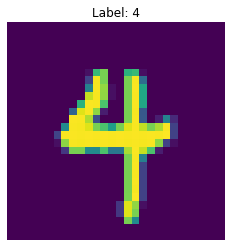

This notebook is based on the Deep Learning course from the Master Datascience Paris Saclay. Materials of the course can be found [here](https://github.com/m2dsupsdlclass/lectures-labs). The complete code can be found on a Kaggle [kernel](https://www.kaggle.com/stevengolo/convnet-design).

**Goals**
* Design our own ConvNet and see some existing applications
* Define Keras model with different methods: Sequential, Functional and Object-Oriented
* Compare model architecture

**Dataset used**
* MNIST dataset from tf.keras.datasets [link](https://www.tensorflow.org/api_docs/python/tf/keras/datasets/mnist)


```python
# Dataset loading
(X_train, y_train), (X_test, y_test) = datasets.mnist.load_data()

# Get shape 
n_train, h, w = X_train.shape
n_test, _, _ = X_test.shape

# Reshape data
X_train = X_train[:, :, :, np.newaxis]
X_test = X_test[:, :, :, np.newaxis]

# Convert data
X_train = X_train.astype('float32')
X_test = X_test.astype('float32')
X_train /= 255
X_test /= 255

# Split data
X_train, X_val, y_train, y_val = train_test_split(X_train, y_train,
                                                  test_size=10000,
                                                  random_state=42)

INPUT_SHAPE = (h, w, 1)
```


    Shape of the train set: (50000, 28, 28, 1).
    Shape of the validation set: (10000, 28, 28, 1).
    Shape of the test set: (10000, 28, 28, 1).



<center>
<p class="caption">
Figure 1: Example image
</p>
</center>


    There are 10 unique labels.


## LeNet model

Let's define a (slightly modified) LeNet model, introduced by Yann Le Cun in 1998 ([paper link](http://yann.lecun.com/exdb/publis/pdf/lecun-01a.pdf)). The model is very simple and can be defined with the **Sequential** API.


```python
# Define LeNet model
lenet = Sequential(name='LeNet-5')

lenet.add(Conv2D(6, (5, 5), padding='same', activation='tanh', input_shape=INPUT_SHAPE, name='C1'))
lenet.add(MaxPool2D(pool_size=(2, 2), name='S2'))
lenet.add(Conv2D(16, (5, 5), activation='tanh', name='C3'))
lenet.add(MaxPool2D(pool_size=(2, 2), name='S4'))
lenet.add(Conv2D(120, (5, 5), activation='tanh', name='C5'))
lenet.add(Flatten())
lenet.add(Dense(84, activation='tanh', name='F6'))
lenet.add(Dense(10, activation='softmax'))
```

Representation of the LeNet model [here](/img/lenet.png).

```python
# Compile model
N_EPOCHS = 5
BATCH_SIZE = 256

lenet.compile(optimizer=optimizers.SGD(lr=0.1),
              loss='sparse_categorical_crossentropy',
              metrics=['accuracy'])
```

```python
# Fit model
history = lenet.fit(X_train, y_train,
                    epochs=N_EPOCHS,
                    batch_size=BATCH_SIZE,
                    validation_data=(X_val,y_val))
```


```python
# Evaluate model on the test set
results_lenet = lenet.evaluate(X_test, y_test)
```

    On test set: loss = 0.05869263708740473, accuracy = 0.9818999767303467.


Note that while LeNet was first defined using either `tanh` or `sigmoid`, those activations are now rarely used, because both activations saturate on very small and large values, making their gradient almost null. Now most network use `ReLU` as hidden activation function or one of its derivative ([link](https://keras.io/api/layers/activation_layers/)).

## Inception layers

Inception models were introduced in 2014 by Szegedy et al. ([paper link](https://arxiv.org/abs/1409.4842)). Convolutions have an effective receptive field: the bigger the kernels, the deeper the model. A features pixel will *see* more image pixels ([link](https://medium.com/mlreview/a-guide-to-receptive-field-arithmetic-for-convolutional-neural-networks-e0f514068807)).

In Inception layers, convolution kernels of different sizes are combined. Small kernels see small clusters of features while big kernels see big clusters of features (an eye compare to a face). 


Here, we will use the **Functional** API to define a single Inception layer. The layer is first instancied (first pair of parenthesis) then called on a tensor (second set of parenthesis).


```python
# Define Inception layer
def Inception(tensor, n_filters):
    """Define an Inception layer
    
    :param tensor: Instanciation of the layer
    :param n_filters: 
    :return: 
    """
    # Define the 4 branches
    branch1x1 = Conv2D(n_filters, kernel_size=(1, 1), activation='relu', padding='same')(tensor)
    branch3x3 = Conv2D(n_filters, kernel_size=(3, 3), activation='relu', padding='same')(tensor)
    branch5x5 = Conv2D(n_filters, kernel_size=(5, 5), activation='relu', padding='same')(tensor)
    branch_pool = MaxPool2D(pool_size=(3, 3), strides=(1, 1), padding='same')(tensor)
    
    # Merge the branches using Concatenate layer
    output = Concatenate(axis=-1)([branch1x1, branch3x3, branch5x5, branch_pool])
    return output
```


```python
# Define the model
input_tensor = Input(shape=INPUT_SHAPE)
x = Conv2D(16, kernel_size=(5, 5), padding='same')(input_tensor)
x = Inception(x, 32)
x = Flatten()(x)
output_tensor = Dense(10, activation='softmax')(x)
inception_model = Model(inputs=input_tensor, outputs=output_tensor)
```


Representation of the Inception model [here](/img/inception.png).


```python
# Compile model
N_EPOCHS = 5
BATCH_SIZE = 256

inception_model.compile(optimizer=optimizers.SGD(lr=0.1),
                        loss='sparse_categorical_crossentropy',
                        metrics=['accuracy'])
```


```python
# Fit model
history = inception_model.fit(X_train, y_train,
                              epochs=N_EPOCHS,
                              batch_size=BATCH_SIZE,
                              validation_data=(X_val,y_val))
```


```python
# Evaluate model on the test set
results_inception = inception_model.evaluate(X_test, y_test)
```

    On test set: loss = 0.06190033204900101, accuracy = 0.9790999889373779.


## ResNet model

ResNet (*Residual Networks*) models were introduced by He et al. in 2015 ([paper link](https://arxiv.org/abs/1512.03385)). They found that more layers improved the performance but unfortunatly it was hard to backpropagate the gradients up to the first layers.

A trick to let the gradients *flow* easily is to use shortcut connection that let the forward tensor untouched (*i.e* the residual).


We will use the **Oriented-Object** API to implement the ResNet model.


```python
# Define Residual block
class ResidualBlock(Layer):
    def __init__(self, n_filters):
        super().__init__(name='ResidualBlock')
        
        self.conv1 = Conv2D(n_filters, kernel_size=(3, 3), activation='relu', padding='same')
        self.conv2 = Conv2D(n_filters, kernel_size=(3, 3), padding='same')
        self.add = Add()
        self.last_relu = Activation('relu')
        
    def call(self, inputs):
        x = self.conv1(inputs)
        x = self.conv2(x)
        
        y = self.add([x, inputs])
        return self.last_relu(y)
    
# Define ResNet model
class MiniResNet(Model):
    def __init__(self, n_filters):
        super().__init__()
        
        self.conv = Conv2D(n_filters, kernel_size=(5, 5), padding='same')
        self.block = ResidualBlock(n_filters)
        self.flatten = Flatten()
        self.classifier = Dense(10, activation='softmax')
        
    def call(self, inputs):
        x = self.conv(inputs)
        x = self.block(x)
        x = self.flatten(x)

        return self.classifier(x)
```


```python
# Define model
resnet_model = MiniResNet(32)
resnet_model.build((None, *INPUT_SHAPE))
```


    Model: "mini_res_net"
    _________________________________________________________________
    Layer (type)                 Output Shape              Param #   
    =================================================================
    conv2d_4 (Conv2D)            multiple                  832       
    _________________________________________________________________
    ResidualBlock (ResidualBlock multiple                  18496     
    _________________________________________________________________
    flatten_2 (Flatten)          multiple                  0         
    _________________________________________________________________
    dense_2 (Dense)              multiple                  250890    
    =================================================================
    Total params: 270,218
    Trainable params: 270,218
    Non-trainable params: 0
    _________________________________________________________________


```python
# Compile model
N_EPOCHS = 5
BATCH_SIZE = 256

resnet_model.compile(optimizer=optimizers.SGD(lr=0.1),
                     loss='sparse_categorical_crossentropy',
                     metrics=['accuracy'])
```


```python
# Fit model
history = resnet_model.fit(X_train, y_train,
                           epochs=N_EPOCHS,
                           batch_size=BATCH_SIZE,
                           validation_data=(X_val,y_val))
```

```python
# Evaluate model on the test set
results_resnet = resnet_model.evaluate(X_test, y_test)
```

    On test set: loss = 0.04692998557183892, accuracy = 0.984499990940094.


## Batch normalization

Batch normalization is not an architecture but a layer introduced by Ioffe et al. in 2015 ([paper link](https://arxiv.org/abs/1502.03167)). Here is an extract from their abstract:
    
    Training Deep Neural Networks is complicated by the fact that the distribution of each layer's inputs changes during training, as the parameters of the previous layers change. This slows down the training by requiring lower learning rates and careful parameter initialization, ad makes it notoriously hard to train models with saturating non linearities. We refer to this phenomenon as internal covariate shift, and address the problem by normalizing layer inputs.

The results are that ConvNet trained with BatchNorm converge faster and with better results. Nowadays all (or almost all) networks are use it or one of its variants ([link](https://arthurdouillard.com/post/normalization/)).


```python
# Define Convolution block with BatchNorm
class ConvBlock(Layer):
    def __init__(self, n_filters, kernel_size, padding):
        super().__init__(name='ConvBlock')
        
        self.conv = Conv2D(n_filters, kernel_size=kernel_size, padding=padding, use_bias=False)
        self.bn = BatchNormalization(axis=3)
        self.activation = Activation('relu')
        
    def call(self, inputs):
        return self.activation(self.bn(self.conv(inputs)))

# Redefine Residual block with BatchNorm
class ResidualNormBlock(Layer):
    def __init__(self, n_filters):
        super().__init__(name='ResidualNormBlock')

        self.conv1 = ConvBlock(n_filters, kernel_size=(3, 3), padding='same')
        self.conv2 = ConvBlock(n_filters, kernel_size=(3, 3), padding='same')
        self.add = Add()
        self.last_relu = Activation('relu')
        
    def call(self, inputs):
        x = self.conv1(inputs)
        x = self.conv2(x)
        
        y = self.add([x, inputs])
        return self.last_relu(y)
```


```python
# Define the model
input_tensor = Input(shape=INPUT_SHAPE)
x = Conv2D(32, kernel_size=(5, 5), padding='same')(input_tensor)
x = ResidualNormBlock(32)(x)
x = Flatten()(x)
output_tensor = Dense(10, activation='softmax')(x)
resnet_norm_model = Model(inputs=input_tensor, outputs=output_tensor)
```


Representation of the ResNetNorm model [here](/img/resnetnorm.png).

```python
# Compile model
N_EPOCHS = 5
BATCH_SIZE = 256

resnet_norm_model.compile(optimizer=optimizers.SGD(lr=0.1),
                          loss='sparse_categorical_crossentropy',
                          metrics=['accuracy'])
```


```python
# Fit model
history = resnet_norm_model.fit(X_train, y_train,
                                epochs=N_EPOCHS,
                                batch_size=BATCH_SIZE,
                                validation_data=(X_val,y_val))
```

```python
# Evaluate model on the test set
results_resnet_norm = resnet_norm_model.evaluate(X_test, y_test)
```

    On test set: loss = 0.09947471798080951, accuracy = 0.9690999984741211.


## Separable convolutions

ConvNet usually have a lot of parameters because of their large depth. A trick to trim the number of parameters with minimal performance loss is to use **separable convolution**. The standard convolution has quite a lot of parameters (but still much less than a fully connected layer).


```python
# Define Convolution model
conv_model = Sequential(name='ConvModel')
conv_model.add(Conv2D(8, kernel_size=(3, 3), use_bias=False))
```


```python
# Build model
conv_model.build((None, *INPUT_SHAPE))
conv_model.summary()
```

    Model: "ConvModel"
    _________________________________________________________________
    Layer (type)                 Output Shape              Param #   
    =================================================================
    conv2d_10 (Conv2D)           multiple                  72        
    =================================================================
    Total params: 72
    Trainable params: 72
    Non-trainable params: 0
    _________________________________________________________________


This Convolution model has $72$ trainable parameters.

Separable convolutions are made of two convolutions:
* One **depthwise convolution**, a single kernel is created per input channels, spatial information is affected, but channels information is not shared.


* One **pointwise convolution**, a usual convolution with a kernel of size $(1, 1)$, spatial information is not affected, but channels information is shared.


```python
# Define Separable Convolution model
separable_model = Sequential(name='SeparableModel')
separable_model.add(DepthwiseConv2D(kernel_size=(3, 3), use_bias=False))
separable_model.add(Conv2D(8, kernel_size=(1, 1), use_bias=False))
```


```python
# Build model
separable_model.build((None, *INPUT_SHAPE))
separable_model.summary()
```

    Model: "SeparableModel"
    _________________________________________________________________
    Layer (type)                 Output Shape              Param #   
    =================================================================
    depthwise_conv2d (DepthwiseC multiple                  9         
    _________________________________________________________________
    conv2d_11 (Conv2D)           multiple                  8         
    =================================================================
    Total params: 17
    Trainable params: 17
    Non-trainable params: 0
    _________________________________________________________________


The Depthwise Convolution layer has $9$ trainable parameters and the Pointwise Convolution layer has $8$ trainable parameters. So, the number of parameters for this model is $17$, which is a lot less than the classic Convolution model.

The different model available in Keras are [here](https://keras.io/api/applications/).
