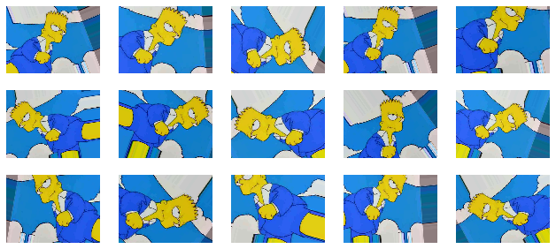
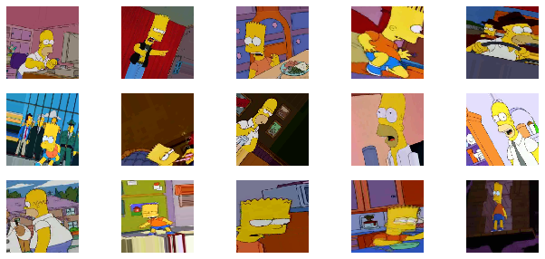
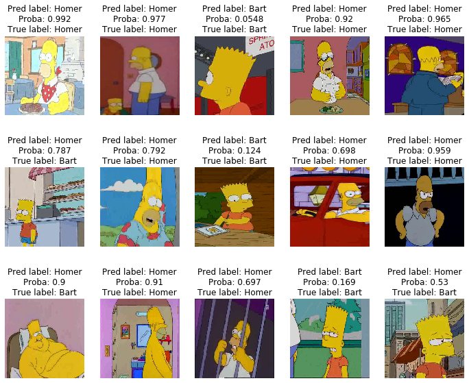
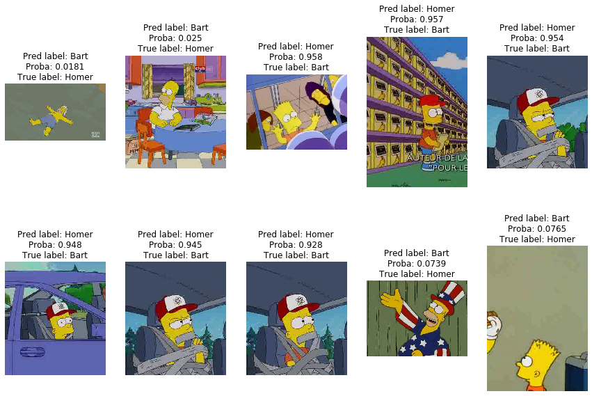
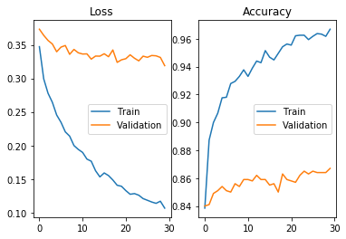

This notebook is based on the Deep Learning course from the Master Datascience Paris Saclay. Materials of the course can be found [here](https://github.com/m2dsupsdlclass/lectures-labs).
Morover, this session is inspired by [a blog post](https://blog.keras.io/building-powerful-image-classification-models-using-very-little-data.html) by François Chollet, the creator of the `Keras` library. The complete code can be found on a Kaggle [kernel](https://www.kaggle.com/stevengolo/fine-tuning-a-pre-trained-deep-cnn).

**Goal**
* Fine tuned a pre-trained deep CNN on a new dataset.

**Dataset used**
* Some images from The Simpsons Characters Data from Kaggle [link](https://www.kaggle.com/alexattia/the-simpsons-characters-dataset).


The `Keras` image data helpers want images for different classes (*homer* and *bart*) to live in distinct subfolders.

    data/
        train/
            homer/
                homer001.jpg
                homer002.jpg
                ...
             bart/
                 bart001.jpg
                 bart002.jpg
                 ...
        validation/
            homer/
                homer001.jpg
                homer002.jpg
                ...
             bart/
                 bart001.jpg
                 bart002.jpg
                 ...

We build a validation dataset by taking $500$ images of Homer and $500$ of Bart out of the data. The remaining data constitute the training dataset.

## Data loading and data augmentation

We use the `Keras` utilities to manually load the first image file of the Bart folder. Make sure to have the `PIL` library.


```python
train_bart = os.listdir(os.path.join(TRAIN_DIR, 'bart_simpson'))
img = load_img(os.path.join(TRAIN_DIR, 'bart_simpson', train_bart[0]))

# Convert image to array
X = img_to_array(img)
```

    Shape of the image array: (416, 576, 3).


<center>
<p class="caption">
Figure 1: Example image
</p>
</center>

`Keras` provides tools to generate many variations from a single image: this is useful to augment the dataset with variants that should not affect the image label: a rotated image of Bart is an image of Bart. Doing data augmentation at train time make neural networks ignore such label-preserving transformations and therefore help reduce overfitting.


```python
# Define ImageDataGenerator
augmenting_data_gen = ImageDataGenerator(
    rescale=1. / 255,
    rotation_range=40,
    width_shift_range=0.2,
    height_shift_range=0.2,
    shear_range=0.2,
    zoom_range=0.2,
    horizontal_flip=True,
    channel_shift_range=9,
    fill_mode='nearest'
)
```


```python
flow = augmenting_data_gen.flow(X[np.newaxis, :, :, :])
```



<center>
<p class="caption">
Figure 2: Augmented example images
</p>
</center>

The `ImageDataGenerator` object can be pointed to the dataset folder and both load the images and augment them on the fly and resize/crop them to fit the input dimensions of the classification neural network.


```python
flow = augmenting_data_gen.flow_from_directory(TRAIN_DIR,
                                               batch_size=1,
                                               target_size=(224, 224))
```

    Found 2588 images belonging to 2 classes.



<center>
<p class="caption">
Figure 3: Augmented multiple example image
</p>
</center>


## Loading a pre-trained computer vision model

Let us load a state of the art model with a good trade-off between prediction speed, model size and predictive accuracy, namely as Residual Network with $54$ parameterized layers ($53$ convolutional and one fully connected for the softmax).


```python
# Load the model
full_imagenet_model = ResNet50(weights='imagenet')
```

```python
# Visualization of the model
plot_model(full_imagenet_model, show_layer_names=False, show_shapes=True)
```

[Link](/img/resnet50.png) of a representation of the ResNet50 model.

## Transfert learning

Let's remove the last dense classificaiton layer that is specific to the image net classes and use the previous later (after flatening) as a feature extractor.


```python
# Define a model based on the previous one
output = full_imagenet_model.layers[-2].output
base_model = Model(full_imagenet_model.input, output)
```

When using this model, we need to be careful to apply the same image processing as was used during the training, otherwise the marginal distribution of the input pixels might not be on the right scale.


```python
def preprocess_function(x):
    """Preprocess x to be used in ResNet50
    :param x: Input image
    """
    if x.ndim == 3:
        x = x[np.newaxis, :, :, :]
    return preprocess_input(x)
```


```python
BATCH_SIZE = 50

data_gen = ImageDataGenerator(preprocessing_function=preprocess_function)

train_flow = data_gen.flow_from_directory(TRAIN_DIR, 
                                          batch_size=BATCH_SIZE,
                                          target_size=(224, 224),
                                          class_mode='binary',
                                          shuffle=True)

X, y = next(train_flow)
```

    Found 2588 images belonging to 2 classes.
    Shape of the input batch images: (50, 224, 224, 3), and shape of the output batch images: (50,).


We would like to write a function that iterate over $n$ images in the training set (batch after batch), extracts the activations of the last layer of `base_model` (by calling the `predicts` function) and collect the results in a big numpy array with dimensions $(n, 2048)$ for the features and $(n,)$ for the matching image labels.


```python
%%time

features = []
labels = []

for X, y in train_flow:
    labels.append(y)
    features.append(base_model.predict(X))
```

    CPU times: user 26.1 s, sys: 2.69 s, total: 28.8 s
    Wall time: 30.4 s


```python
# Concatenate the results
labels_train = np.concatenate(labels)
features_train = np.vstack(features)
```

Let's train a simple linear model on those features.


```python
# Define the classification model
n_samples, n_features = features_train.shape

top_model = Sequential()
top_model.add(Dense(1, input_dim=n_features, 
                    activation='sigmoid'))
top_model.compile(optimizer=Adam(lr=1e-4),
                  loss='binary_crossentropy',
                  metrics=['accuracy'])

history = top_model.fit(features_train, labels_train,
                        validation_split=0.1,
                        verbose=2,
                        epochs=15)
```

    Train on 2250 samples, validate on 250 samples
    Epoch 1/15
    2250/2250 - 1s - loss: 0.6039 - accuracy: 0.6844 - val_loss: 0.5947 - val_accuracy: 0.6800
    ...
    Epoch 15/15
    2250/2250 - 0s - loss: 0.2200 - accuracy: 0.9307 - val_loss: 0.2564 - val_accuracy: 0.9160


Alright, so the transfer learning is around 0.9 accuracy. This is quite a good classification model as the Bart and Homer classes are not part of the ImageNet label set. As the validation set has $500$ images, an accuracy of $0.9$ means $50$ classification errors (which is not bad, I think).

Let's plug this on top of the base model to be able to use it to make some classifications on our held out validation image folder.


```python
# Define the complete model
model = Model(base_model.input, top_model(base_model.output))
```


```python
flow = ImageDataGenerator().flow_from_directory(VAL_DIR,
                                                batch_size=1,
                                                target_size=(224, 224))
```

    Found 1000 images belonging to 2 classes.



<center>
<p class="caption">
Figure 4: Some of the predictions
</p>
</center>

Let's compute the validation score on the full validation set.


```python
val_gen = ImageDataGenerator(preprocessing_function=preprocess_function)
val_flow = val_gen.flow_from_directory(VAL_DIR, batch_size=BATCH_SIZE,
                                       target_size=(224, 224),
                                       shuffle=False,class_mode='binary')

predicted_batches = []
all_correct = []
label_batches = []
for i, (X, y) in zip(range(val_flow.n // BATCH_SIZE), val_flow):
    pred = model.predict(X).ravel()
    predicted_batches.append(pred)
    correct = list((pred > 0.5) == y)
    all_correct.extend(correct)
    label_batches.append(y)
```

    Accuracy on the validation set: 88.3%.


Let's display the examples where the model makes the most confident mistakes. The filenames of items sampled by a flow (without random shuffling) can be accesses via: `val_flow.filenames`.


```python
predictions = np.concatenate(predicted_batches)
true_labels = np.concatenate(label_batches)
```


```python
N_MISTAKES = 10
top_mistakes = np.abs(true_labels - predictions).argsort()[::-1][:N_MISTAKES]

images_names = np.array(val_flow.filenames, dtype=np.object)[top_mistakes]
```



<center>
<p class="caption">
Figure 5: Most confident prediction mistakes
</p>
</center>

The most important mistake appears to be Bart that is misclassified, it is probably because of the 1/3 Bart - 2/3 Homer ratio of images in the dataset. Another explication might be the croping of the image for the training.

## Fine tuning

Let's identify the location of the residual blocks (merge by addition in a residual architecture).


```python
[(i, l.output_shape) for (i, l) in enumerate(model.layers) if isinstance(l, Add)]
```

    [(17, (None, 56, 56, 256)),
     (27, (None, 56, 56, 256)),
     (37, (None, 56, 56, 256)),
     (49, (None, 28, 28, 512)),
     (59, (None, 28, 28, 512)),
     (69, (None, 28, 28, 512)),
     (79, (None, 28, 28, 512)),
     (91, (None, 14, 14, 1024)),
     (101, (None, 14, 14, 1024)),
     (111, (None, 14, 14, 1024)),
     (121, (None, 14, 14, 1024)),
     (131, (None, 14, 14, 1024)),
     (141, (None, 14, 14, 1024)),
     (153, (None, 7, 7, 2048)),
     (163, (None, 7, 7, 2048)),
     (173, (None, 7, 7, 2048))]


Let's fix the wieghts of the low level layers and fine tune the top level layers.


```python
for i, layer in enumerate(model.layers):
    layer.trainable = i >= 151
```

Let's fine tune a bit the top level layers to see if we can further improve the accuracy of the model.


```python
augmenting_data_gen = ImageDataGenerator(
    rotation_range=20,
    width_shift_range=0.2,
    height_shift_range=0.2,
    shear_range=0.2,
    zoom_range=0.2,
    horizontal_flip=True,
    fill_mode='nearest',
    preprocessing_function=preprocess_function
)

train_flow = augmenting_data_gen.flow_from_directory(TRAIN_DIR,
                                                     target_size=(224, 224),
                                                     batch_size=BATCH_SIZE,
                                                     class_mode='binary',
                                                     shuffle=True,
                                                     seed=42)

opt = SGD(lr=1e-4, momentum=0.9)
model.compile(optimizer=opt, loss='binary_crossentropy', metrics=['accuracy'])
```

    Found 2588 images belonging to 2 classes.


```python
history = model.fit(train_flow,
                    epochs=30,
                    steps_per_epoch=train_flow.n // BATCH_SIZE,
                    validation_data=val_flow,
                    validation_steps=val_flow.n // BATCH_SIZE)
```

    Train for 51 steps, validate for 20 steps
    Epoch 1/30
    51/51 [==============================] - 57s 1s/step - loss: 0.3466 - accuracy: 0.8385 - val_loss: 0.3734 - val_accuracy: 0.8400
    ...
    Epoch 30/30
    51/51 [==============================] - 52s 1s/step - loss: 0.1063 - accuracy: 0.9669 - val_loss: 0.3190 - val_accuracy: 0.8670



<center>
<p class="caption">
Figure 6: Loss and accuracy through the epochs
</p>
</center>


```python
val_gen = ImageDataGenerator(preprocessing_function=preprocess_function)
val_flow = val_gen.flow_from_directory(VAL_DIR, batch_size=BATCH_SIZE,
                                       target_size=(224, 224),
                                       shuffle=False,class_mode='binary')

predicted_batches = []
all_correct = []
label_batches = []
for i, (X, y) in zip(range(val_flow.n // BATCH_SIZE), val_flow):
    pred = model.predict(X).ravel()
    predicted_batches.append(pred)
    correct = list((pred > 0.5) == y)
    all_correct.extend(correct)
    label_batches.append(y)
```

    Accuracy on the validation set: 86.7%.


So, we have a bit of improvement with fine tuning.
