This post is based on the Deep Learning course from the Master Datascience Paris Saclay. Materials of the course can be found [here](https://github.com/m2dsupsdlclass/lectures-labs). The complete code can be found on a Kaggle [kernel](https://www.kaggle.com/stevengolo/introduction-to-deep-learning-with-keras).


**Goal of the post**

   * Train a simple neural network (Multi-Layer Perceptron) with the high level framework `Keras`.
   
**Dataset used**

   * The MNIST dataset ([Kaggle link](https://www.kaggle.com/c/digit-recognizer/overview)).


<center>
<p class="caption">
Figure 1: An example of an image in the dataset.
</p>
</center>

# Preprocessing

  * During this step, we will do some normalization on both the training and testing dataset.


```python
# Extract and convert the pixel as numpy array with dtype='float32'
train = np.asarray(digits_train.iloc[:, 1:], dtype='float32')
test = np.asarray(digits_test, dtype='float32')

train_target = np.asarray(digits_train.loc[:, 'label'], dtype='int32')
```

```python
# Scale the data
scaler = preprocessing.StandardScaler()
train_scale = scaler.fit_transform(train)
test_scale = scaler.transform(test)
```


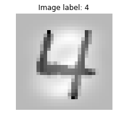
<center>
<p class="caption">
Figure 2: An example of a scaled image in the dataset.
</p>
</center>

# A Feed Forward Neural Network with Keras

## Objectives

 * Build and train a first feedforward network using Keras. Guide to [Sequential model](https://keras.io/getting-started/sequential-model-guide/) in Keras.
 * Experiment with different optimizers, activations, size of layers or initializations.
 
## How Keras works?

 * In order to build a neural network, we need to turn the target variable into a "one-hot-encoding" vector representation. There are multiple to do so. One may use the function `OneHotEncoder` from `sklearn.preprocessing`, but as we want to work with Keras, we should use the utility function provided by him.

```python
# Encoded the target vector as one-hot-encoding vector.
target = to_categorical(train_target)
```

* The high level API of Keras needs some objects to build a feed forward neural network:
    
  1. A model by stacking layers with the right dimensions;
  2. A loss function with an optimizer;
  3. Some training data.

Let's build a first model with only one hidden layer with a `tanh` activation function.

```python
# Define some parameters
N = train.shape[1] # Length of one data
H = 100 # Dimension of the hidden layer
K = 10 # Dimension of the output layer (number of classes to predict)
lr = 0.1 # Learning rate for the loss function
epochs = 15 # Number of epochs for the NN
batch_size = 32 # Size of the batch

# Define the model
model = Sequential()
model.add(Dense(H, input_dim=N, activation='tanh'))
model.add(Dense(K, activation='softmax'))

# Print the model
model.summary()
```

    _________________________________________________________________
      Layer (type)                 Output Shape              Param #   
    =================================================================
      dense_1 (Dense)              (None, 100)               78500     
    _________________________________________________________________
      dense_2 (Dense)              (None, 10)                1010      
    =================================================================
      Total params: 79,510
      Trainable params: 79,510
      Non-trainable params: 0
    _________________________________________________________________


```python
# Define the loss function with the SGD optimizer
model.compile(optimizer=optimizers.SGD(lr=lr),
             loss='categorical_crossentropy',
             metrics=['accuracy'])

# Fit the model
history = model.fit(train_scale, target, epochs=epochs, batch_size=batch_size, verbose=0)
```


<center>
<p class="caption">
Figure 3: Accuracy and loss of the model through the epochs using the SGD optimizer.
</p>
</center>


## Influence of the learning rate

  * Let's look at the influence of the learning rate on the training loss and accuracy. We consider a learning rate from 0.001 to 10. 

```python
lrs = np.logspace(-3, 1, num=5)
history = dict()
for lr in lrs :
  model = Sequential()
  model.add(Dense(H, input_dim=N, activation='tanh'))
  model.add(Dense(K, activation='softmax'))
  model.compile(optimizer=optimizers.SGD(lr=lr), loss='categorical_crossentropy', metrics=['accuracy'])
  history[lr] = model.fit(train_scale, target, epochs=epochs, batch_size=batch_size, verbose=0).history
  
```

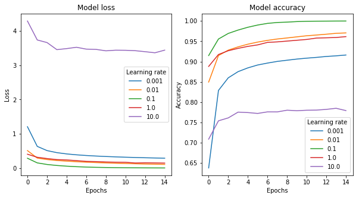
<center>
<p class="caption">
Figure 4: Accuracy and loss of the model through the epochs for different learning rates.
</p>
</center>

As we see on the graphs, the learning rate has an influence of the speed of convergence and even on the possible divergence. So, for this dataset, when the learning rate is 10, the model does not converge. However, for the learning rate equals to 0.001, 0.01 and 1, the model still converges but it is slower than for the learning rate of 0.1.


  * Let's modify the [SGD](https://www.jstor.org/stable/2236626?seq=1#page_scan_tab_contents) optimizer to enable a Nesterov momentum of 0.9. The momentum is used to mitigate the small learning rate or slow training problem a little. However, here, it seems that is not working.

```python
model = Sequential()
model.add(Dense(H, input_dim=N, activation='tanh'))
model.add(Dense(K, activation='softmax'))
model.compile(optimizer=optimizers.SGD(lr=0.1, momentum=0.9, nesterov=True),
             loss='categorical_crossentropy',
             metrics=['accuracy'])
history = model.fit(train_scale, target, epochs=epochs, batch_size=batch_size, verbose=0)
```

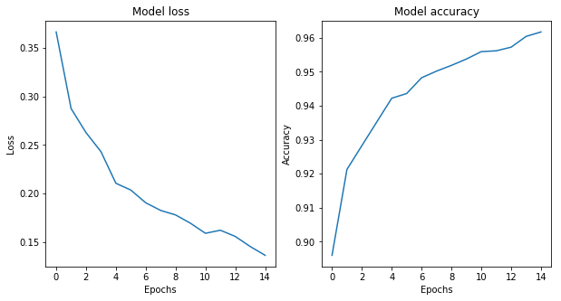
<center>
<p class="caption">
Figure 5: Accuracy and loss of the model through the epochs using the Nesterov momentum.
</p>
</center>


## Influence of the optimizer

* Now, let's try the [Adam](https://arxiv.org/abs/1412.6980) optimizer.


```python
model = Sequential()
model.add(Dense(H, input_dim=N, activation='tanh'))
model.add(Dense(K, activation='softmax'))
model.compile(optimizer=optimizers.Adam(),
             loss='categorical_crossentropy',
             metrics=['accuracy'])
history = model.fit(train_scale, target, epochs=epochs, batch_size=batch_size, verbose=0)
```


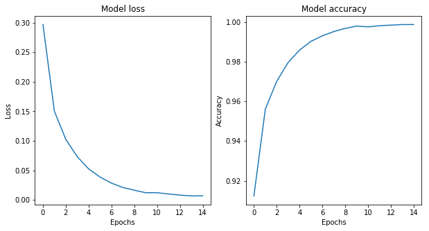
<center>
<p class="caption">
Figure 6: Accuracy and loss of the model through the epochs using the Adam optimizer.
</p>
</center>

The Adam optimizer with default parameters performs quite well on this model. In fact, the results are comparable with the SGD optimizer with learning rate 0.1 whereas the default learning rate of the Adam optimizer is 0.001. 

* Let's add another hidden layer to the model with the `relu` activation function.

```python
model = Sequential()
model.add(Dense(H, input_dim=N, activation='relu'))
model.add(Dense(H, activation='relu'))
model.add(Dense(K, activation='softmax'))
model.compile(optimizer=optimizers.Adam(),
             loss='categorical_crossentropy',
             metrics=['accuracy'])
history = model.fit(train_scale, target, epochs=epochs, batch_size=batch_size, verbose=0)
```


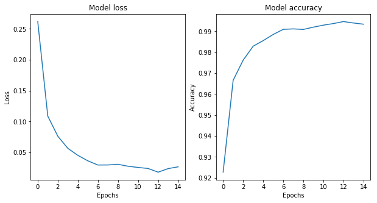
<center>
<p class="caption">
Figure 7: Accuracy and loss of the model through the epochs with another hidden layers.
</p>
</center>


When we add another hidden layer and change the activation function, the results with default parameters are in some sense less good than before. However, it does seem to be a problem to train the model with Adam default parameters.

* Let's try a last one optimizer, the [Adadelta](https://arxiv.org/abs/1212.5701) optimizer (no learning rate to set). 


```python
model = Sequential()
model.add(Dense(H, input_dim=N, activation='tanh'))
model.add(Dense(K, activation='softmax'))
model.compile(optimizer=optimizers.Adadelta(),
             loss='categorical_crossentropy',
             metrics=['accuracy'])
history = model.fit(train_scale, target, epochs=epochs, batch_size=batch_size, verbose=0)
```


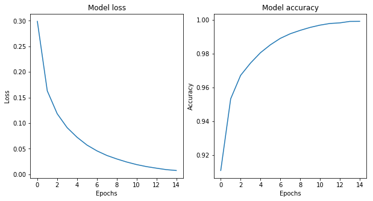
<center>
<p class="caption">
Figure 8: Accuracy and loss of the model through the epochs using the Adadelta optimizer.
</p>
</center>


The Adadelta seems to give very good results on this dataset. No learning rate are required for this optimizer, in fact, it adapts the learning rate over time.

## Forward pass and generalization

* Now, we are gonna use the last model we fit to make prediction on the test set.

```python
prediction = model.predict_classes(test)
```

<center>
<p float="left">
  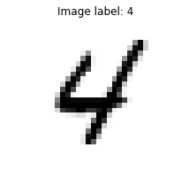
  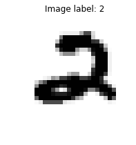 
</p>
<p class="caption">
Figure 9: Examples of prediction.
</p>
</center>


Submitting this very simple model, with only one hidden layer, leads to a 88% accuracy.


## Impact of initialization

Let us now study the impact of initialization when training a deep feed forward network. By default, Keras dense layers use the *Glorot Uniform* initialization strategy to initialize the weigth matrices:

* each weight coefficient is randomly sampled from $[-scale, scale]$;
* scale is proportional to $1 / \sqrt{n_{in} + n_{out}}$.

This strategy is known to work well to initialize deep neural networks with `tanh` or `relu` activation functions and then trained with standard SGD. To assess the impact of initialization, let us plug an alternative init scheme into a two hidden layers networks with `tanh` activation functions. For the sake of the example, let's use normal distributed weights with a manually adjustable scale (standard deviation) and see the impact of the scale value.


```python
# Define a random normal initializers.
normal_init = initializers.RandomNormal(stddev=0.01)

model = Sequential()
model.add(Dense(H, input_dim=N, activation='tanh', kernel_initializer=normal_init))
model.add(Dense(K, activation='tanh', kernel_initializer=normal_init))
model.add(Dense(K, activation='softmax', kernel_initializer=normal_init))

model.compile(optimizer=optimizers.SGD(lr=lr),
             loss='categorical_crossentropy',
             metrics=['accuracy'])

model.summary()
```

    _________________________________________________________________
    Layer (type)                 Output Shape              Param #   
    =================================================================
    dense_22 (Dense)             (None, 100)               78500     
    _________________________________________________________________
    dense_23 (Dense)             (None, 10)                1010      
    _________________________________________________________________
    dense_24 (Dense)             (None, 10)                110       
    =================================================================
    Total params: 79,620
    Trainable params: 79,620
    Non-trainable params: 0
    _________________________________________________________________


Let's have a look at the parameters of the first layer after initialization but before any training has happened.


```python
w = model.layers[0].weights[0].eval(keras.backend.get_session())
```

    Initialization weights: 
    	 - mean = 0.0
    	 - standard deviation = 0.009999999776482582


```python
b = model.layers[0].weights[1].eval(keras.backend.get_session())
```

    Initialization bias: 
    	 - mean = 0.0
    	 - standard deviation = 0.0


```python
history = model.fit(train_scale, target, epochs=epochs, batch_size=batch_size, verbose=0)
```


<center>
<p class="caption">
Figure 10: Accuracy and loss of the model through the epochs with a Normal initialization for the weights.
</p>
</center>


We see that with this initialization the SGD algorithm can not train the network in 15 epochs. 


```python
# Define different initializations
init_list = [
    ('Glorot Uniform Init', 'glorot_uniform'),
    ('Small Scale Init', initializers.RandomNormal(stddev=1e-3)),
    ('Large Scale Init', initializers.RandomNormal(stddev=1)),
    ('Zero Weights Init', 'zero')
]

optimizer_list = [
    ('SGD', optimizers.SGD(lr=lr)),
    ('Adam', optimizers.Adam()),
    ('SGD + Nesterov momentum', optimizers.SGD(lr=lr, momentum=0.9, nesterov=True))
]

history = dict()
for optimizer_name, optimizer in optimizer_list:
    for init_name, init in init_list:
        model = Sequential()
        model.add(Dense(H, input_dim=N, activation='tanh', kernel_initializer=init))
        model.add(Dense(K, activation='tanh', kernel_initializer=init))
        model.add(Dense(K, activation='softmax', kernel_initializer=init))
        model.compile(optimizer=optimizer, loss='categorical_crossentropy', metrics=['accuracy'])
        history[(optimizer_name, init_name)] = model.fit(train_scale, target, epochs=epochs, batch_size=batch_size, verbose=0)
```

### Initialization with zero weights

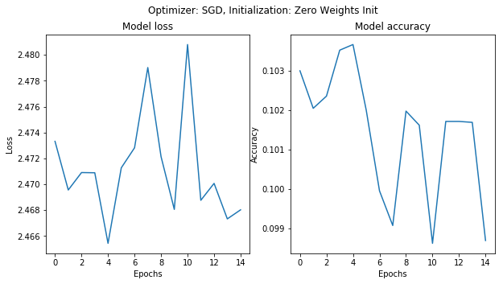

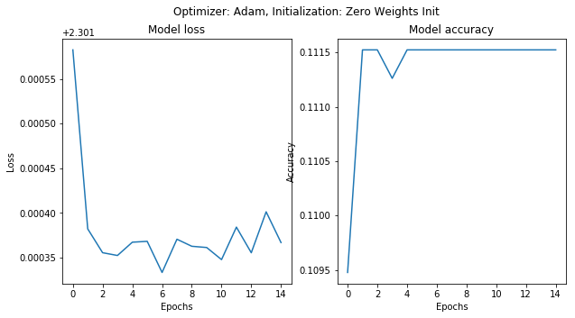


<center>
<p class="caption">
Figure 11: Accuracy and loss of the models through the epochs with zero weights initialization.
</p>
</center>

If the network is initialized to zero weights, the activations of the hidden layers are always set to zero, whatever the value of the inputs. The gradient is always zero for all training samples and no learning can happen with any gradient-based optimizer (SGD, Adam, ...): the loss stays constant.

A network with null weigths has null gradients but this is not a local minimum (nor a local maximum): it is a saddle point at the center of a neighborhood with very low gradients.

### Initialization with small scale

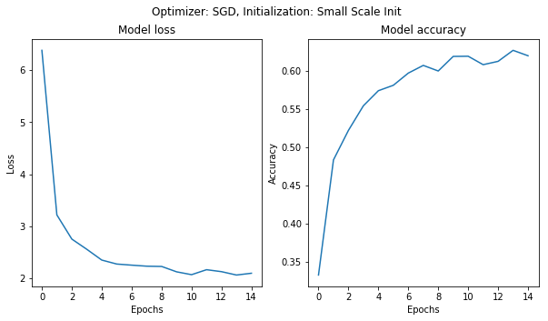

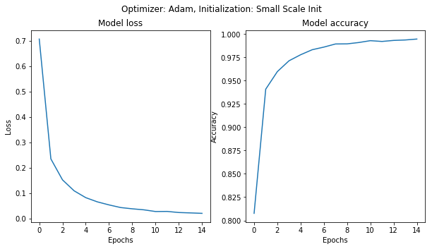

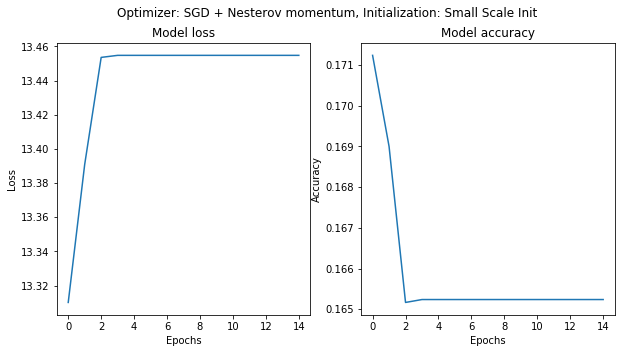
<center>
<p class="caption">
Figure 12: Accuracy and loss of the model through the epochs with small scale initialization.
</p>
</center>

Therefore when the scale of a random initializations of the weights is too small, SGD has a hard time evading that area of low gradients. Adding momentum can help but especially for deep networks it can take many epochs to evade the area.

### Initialization with large scale


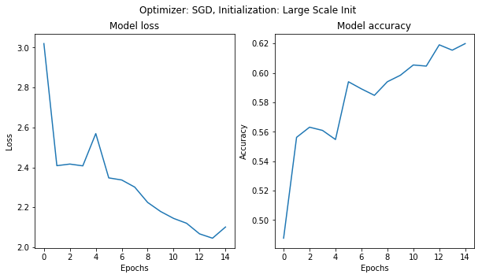

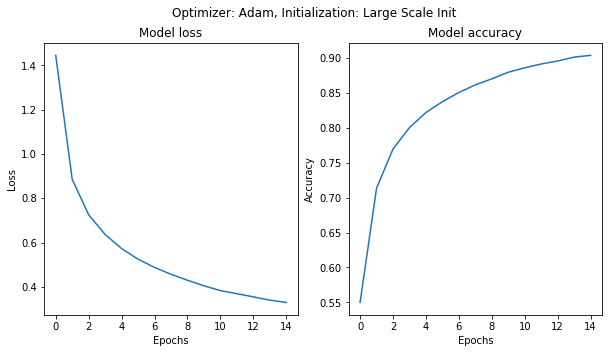

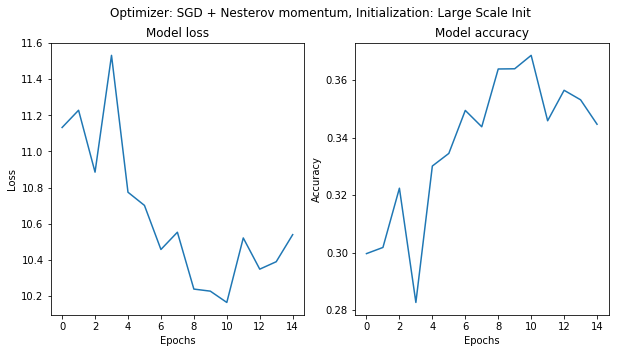
<center>
<p class="caption">
Figure 13: Accuracy and loss of the model through the epochs with large scale initialization.
</p>
</center>

Initializating the weights with large random values will make the ouput distribution (softmax) very peaky: the network is very "confident" of its predictions even if they are completely random. This leads to a very high initial loss value.

The softmax function does not saturate (bad classification always have a non-zero gradient). However, the intermediate tanh layers can saturate, therefore squashing the gradient of the loss with respect to the parameters of the first "Dense" layer and making the network train much slower.

### Initialization with Glorot Uniform

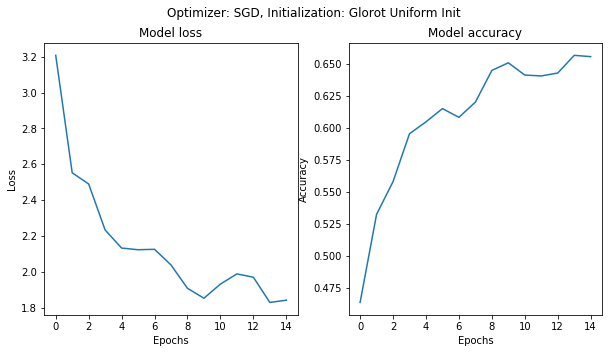

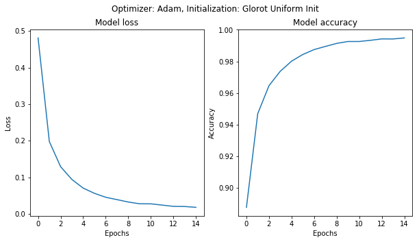


<center>
<p class="caption">
Figure 13: Accuracy and loss of the model through the epochs with Glorot Uniform initialization.
</p>
</center>


The Glorot uniform init uses a scale that depends on the dimensions of the weight matrix so has to preserve the average norm of activations and flowing gradients so as to make learning possible. Keras provides alternatives that can be better in some cases. Look at this [paper](http://proceedings.mlr.press/v9/glorot10a/glorot10a.pdf) for more information.

Adam tends to be more robust when it comes to bad initialization thanks to its per-weight learning rate adjustments but still benefits from a good initialization. 

Things to remember if your network fails to learn at all (the loss stays at its inital value):

* ensure that the weights are properly initialized;
* inspect the per-layer gradient norms to help identify the bad layer;
* use Adam instead of SGD as your default go to initializer.
