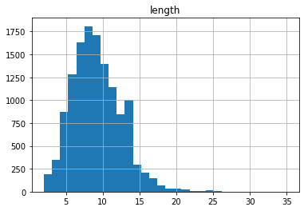
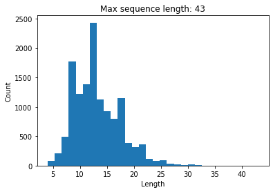

This notebook is based on the Deep Learning course from the Master Datascience Paris Saclay. Materials of the course can be found [here](https://github.com/m2dsupsdlclass/lectures-labs). The complete code can be found on a Kaggle [kernel](https://www.kaggle.com/stevengolo/join-intent-classification-and-slot-filling).

**Goal**
* Fine-tune a pretrained transformer-based neural network model to convert a user query expressed in English into a representation that is structured enough to be processed by an automated service.

Here is an example of interpretation computed by such a Natural Language Understanding system:
    
    >>> nlu('Book a table for two at Le Ritz for Friday night",
            tokenizer, joint_model, intent_names, slot_names)
    {
        'intent': 'BookRestaurant',
        'slots': {
            'party_size_number': 'two',
            'restaurant_name': 'Le Ritz',
            'timeRange': 'Friday night'
        }
    }
    
Intent classification is a simple classification problem. The trick is to treat the structured knowledge extraction part ("Slot Filling") as a token-level classification problem using BIO-annotations:

    >>> show_predictions('Book a table for two at Le Ritz for Friday night',
                         tokenizer, joint_model, intent_names, slot_names)
    ## Intent: BookRestaurant
    ## Slots:
      Book : O
         a : O
     table : O
       for : O
       two : B-party_size_number
        at : O
        Le : B-restaurant_name
         R : I-restaurant_name
     ##itz : I-restaurant_name
       for : O
    Friday : B-timeRange
     night : I-timeRange
     
We will show hhow to train a such "sequence classification" and "token classification" joint model on a voice command dataset published by snips.ai. This notebook is a partial reproduction of some of the results presented in this paper: BERT for Joint Intent Classification and Shot Filling, Qian Chen, Zhu Zhuo, Wen Wang [link](https://arxiv.org/abs/1902.10909).

## The data

We will use a speed command dataset collected, annotated and published by French startup snips.ai (bought in 2019 by Audio device manufacturer Sonos). The original dataset comes in [YAML format with inline markdown annotations](https://snips-nlu.readthedocs.io/en/latest/dataset.html). Instead, we will use a preprocessed variant with token level B-I-O annotations closer to the representation our model will predict. This variant of the snips dataset was prepared by [Su Zhu](https://github.com/sz128).


```python
SNIPS_DATA_BASE_URL = (
    "https://github.com/ogrisel/slot_filling_and_intent_detection_of_SLU/"
    "blob/master/data/snips/"
)
for filename in ["train", "valid", "test", "vocab.intent", "vocab.slot"]:
    path = Path(filename)
    if not path.exists():
        urlretrieve(SNIPS_DATA_BASE_URL + filename + "?raw=true", path)
```

Let's have a look at the first lines from the training set.


```python
lines_train = Path('train').read_text('utf-8').strip().splitlines()
```

    First line of training set: Add:O Don:B-entity_name and:I-entity_name Sherri:I-entity_name to:O my:B-playlist_owner Meditate:B-playlist to:I-playlist Sounds:I-playlist of:I-playlist Nature:I-playlist playlist:O <=> AddToPlaylist.


Some remarks:
* The class label for the voice command appears at the end of each line (after the "<=>" marker).
* Each word-level token is annotated with B-I-O labels using the "." separator.
* B-I-O stands for Beginning-Inside-Outside
* "Add:O" means that the token "Add" is "Outside" of any annotation span.
* "Don:B-entity_name" means that "Don" is the "Beginning" of an annotation of type "entity_name".
* "and:I-entity_name" means that "and" is "inside" the previously started annotation of type "entity_name".

Let's write a parsing function and test it on the first line.


```python
def parse_line(line):
    utterance_data, intent_label = line.split(" <=> ")
    items = utterance_data.split()
    words = [item.rsplit(':', 1)[0] for item in items]
    word_labels = [item.rsplit(':', 1)[1] for item in items]
    return {
        'intent_label': intent_label,
        'words': " ".join(words),
        'words_label': " ".join(word_labels),
        'length': len(words)
    }
```


```python
parse_line(lines_train[0])
```

    {'intent_label': 'AddToPlaylist',
     'words': 'Add Don and Sherri to my Meditate to Sounds of Nature playlist',
     'words_label': 'O B-entity_name I-entity_name I-entity_name O B-playlist_owner B-playlist I-playlist I-playlist I-playlist I-playlist O',
     'length': 12}


This utterance is a voice command of type "AddToPlayist" with annotations:
* an entity-name: "Don and Sherri",
* a playlist: "Medidate to Sounds of Nature".

The goal of this project is to build a baseline Natural Understanding model to analyse such voice commands and predict:
* the intent of the speaker: the sentence level class label ("AddToPlaylist");
* extract the interesting slots (typed named entities) from the sentence by performing word level classification using the B-I-O tags as target classes. This second task is often referred to as "NER" (Named Entity Recognition) in the NLP litterature. Alternatively, this is also known as "slot filling" when we expect a fixed set of named entity per sentence of a given class.

The list of possible classes for the sentence level and the word level classification problems are given as:


```python
print(Path('vocab.intent').read_text('utf-8'))
```

    AddToPlaylist
    BookRestaurant
    GetWeather
    PlayMusic
    RateBook
    SearchCreativeWork
    SearchScreeningEvent
    

"POI" stands for "Point of Interest". Let's parse all the lines and store the results in a Pandas dataframes.


```python
parsed = [parse_line(line) for line in lines_train]
df_train = pd.DataFrame([p for p in parsed if p is not None])
```


<center>
<p class="caption">
Figure 1: Histogram of sentences lengths
</p>
</center>


```python
# Get validation and test set
lines_validation = Path('valid').read_text('utf-8').strip().splitlines()
lines_test = Path('test').read_text('utf-8').strip().splitlines()

df_validation = pd.DataFrame([parse_line(line) for line in lines_validation])
df_test = pd.DataFrame([parse_line(line) for line in lines_test])
```

## Intent classification (sentence level)

Let's ignore the slot filling task for now and let's try to build a sentence level classifier by fine-tuning a pre-trained Transformer-based model using the `huggingface/transformers` package that provides both Tensorflow/Keras and Pytorch APIs.

### The BERT tokenizer

First let's load a pre-trained tokenizer and test it on a test sentence from the training set.


```python
model_name = 'bert-base-cased'
tokenizer = BertTokenizer.from_pretrained(model_name)
```


```python
first_sentence = df_train.iloc[0]['words']
print(first_sentence)
```

    Add Don and Sherri to my Meditate to Sounds of Nature playlist


```python
tokenizer.tokenize(first_sentence)
```

    ['Ad',
     '##d',
     'Don',
     'and',
     'She',
     '##rri',
     'to',
     'my',
     'Me',
     '##dit',
     '##ate',
     'to',
     'Sounds',
     'of',
     'Nature',
     'play',
     '##list']


Notice that BERT uses subword tokens. So the length of the tokenized sentence is likely to be larger than the number of words in the sentence. It is particularly interesting to use subword tokenization sentence for general purpose language models such as BERT because it should be possible to generalize the model and then to fine-tuned it to be a specialized one.

Each token string is mapped to a unique integer id that makes it fast to lookup the right column in the input layer token embedding.


```python
# Encode sentence to id
tokenizer.encode(first_sentence)
```

    [101,
     24930,
     1181,
     1790,
     1105,
     1153,
     14791,
     1106,
     1139,
     2508,
     17903,
     2193,
     1106,
     10560,
     1104,
     7009,
     1505,
     7276,
     102]


```python
# Do the inverse operation
tokenizer.decode(tokenizer.encode(first_sentence))
```

    '[CLS] Add Don and Sherri to my Meditate to Sounds of Nature playlist [SEP]'

Remarks:
* The first token `[CLS]` is used by the pre-training task for sequence classification.
* The last token `[SEP]` is a separator for the pre-training task that classifies if a pair of sentences are consecutive in a corpus or not (next sentence prediction).
* Here, we want to use BERT to compute a representation of a single voice command at a time.
* We could reuse the representation of the `[CLS]` token for sequence classification.
* Alternatively, we can pool the representations of all the tokens of the voice command (*e.g.* global average) and use that as the input of the final sequence classification layer.



<center>
<p class="caption">
Figure 2: Histogram of sequence lengths
</p>
</center>

To perform transfer learning, we will need to work with padded sequences. So, they all have the same sizes. The above histograms, shows that after tokenization, $43$ tokens are enough to represent all the voice commands in the training set.

The mapping can be introspected in the `tokenizer.vocab` attribute.


    Vocabulary size: 28996 words.


```python
# Get the items in BERT
bert_vocab_items = list(tokenizer.vocab.items())
```


Remarks:
* $30000$ is a reasonable vocabulary size and is small enough to be used in a softmax output layer.
* It can represent multi-lingual sentences, including non-western alphabets.
* Subword tokenization makes it possible to deal with typos and morphological variations with a small vocabulary size and without any language-specific preprocessing.
* Subword tokenization makes it unlikely to use the `[UNK]` special token as rare words can often be represented as a sequence of frequent enough short subwords in a meaningful way.

### Encoding the dataset with the tokenizer

Let's now encode the full train/validation and test sets with our tokenizer to get a padded integer numpy arrays.


```python
def encode_dataset(tokenizer, text_sequences, max_length):
    token_ids = np.zeros(shape=(len(text_sequences), max_length),
                         dtype=np.int32)
    for i, text_sequence in enumerate(text_sequences):
        encoded = tokenizer.encode(text_sequence)
        token_ids[i, 0:len(encoded)] = encoded
    attention_masks = (token_ids != 0).astype(np.int32)
    
    return {'input_ids': token_ids, 'attention_masks': attention_masks}
```


```python
encoded_train = encode_dataset(tokenizer, df_train['words'], 45)
encoded_validation = encode_dataset(tokenizer, df_validation['words'], 45)
encoded_test = encode_dataset(tokenizer, df_test['words'], 45)
```


### Encoding the sequence classification targets

To do so, we build a simple mapping from the auxiliary files.


```python
intent_names = Path('vocab.intent').read_text('utf-8').split()
intent_map = dict((label, idx) for idx, label in enumerate(intent_names))
```


```python
intent_train = df_train['intent_label'].map(intent_map).values
intent_validation = df_validation['intent_label'].map(intent_map).values
intent_test = df_test['intent_label'].map(intent_map).values
```

### Loading and feeding a pretrained BERT model

Let's load a pretrained BERT model using the [huggingface transformers](https://github.com/huggingface/transformers) package.


```python
base_bert_model = TFBertModel.from_pretrained('bert-base-cased')
base_bert_model.summary()
```

    Model: "tf_bert_model"
    _________________________________________________________________
    Layer (type)                 Output Shape              Param #   
    =================================================================
    bert (TFBertMainLayer)       multiple                  108310272 
    =================================================================
    Total params: 108,310,272
    Trainable params: 108,310,272
    Non-trainable params: 0
    _________________________________________________________________


```python
outputs = base_bert_model(encoded_validation)
```

The first output of the BERT model is a tensor with shape: `(batch_size, seq_len, output_dim)` which computes features for each token in the input sequence.


    Shape of the first output of the BERT model: (700, 45, 768).


The second output of the BERT model is a tensor with shape `(batch_size, output_dim)` which is the vector representation of the special token `[CLS]`. This vector is typically used as a pooled representation for the sequence as a whole. This will be used as the features of our latent classifier.


    Shape of the second output of the BERT model: (700, 768).


Let's build an train a sequece classification model using to predict the intent class. We will use the `self.bert` pretrained model in the `call` method and only consider the pooled features (ignore the token-wise features for now).


```python
# Define IntentClassification model
class IntentClassificationModel(tf.keras.Model):
    def __init__(self, intent_num_labels=None,
                 model_name='bert-base-cased',
                 dropout_prob=0.1):
        super().__init__(name='joint_intent_slot')
        # Let's preload the pretrained model BERT in the constructor
        # of our classifier model.
        self.bert = TFBertModel.from_pretrained(model_name)
        self.dropout = Dropout(dropout_prob)
        
        # Define a (Dense) classification layer to compute for each
        # sequence in a batch of samples. The number of output classes
        # is given by the intent_num_labels parameter.
        # Use the default linear activation (no softmax) to compute
        # logits. The softmax normalization will be computed in the
        # loss function instead of the model itself.
        self.intent_classifier = Dense(intent_num_labels)
        
    def call(self, inputs, **kwargs):
        # Use the pretrained model to extract features from our
        # encoded inputs.
        sequence_output, pooled_output = self.bert(inputs, **kwargs)
        
        # The second output of the main BERT layer has shape:
        # (batch_size, output_dim) and gives a "pooled" representation
        # for the full sequence from the hidden state that corresponds
        # to the "[CLS]" token.
        pooled_output = self.dropout(pooled_output,
                                     training=kwargs.get('training', False))
        
        # Use the classifier layer to compute the logits from the
        # pooled features.
        intent_logits = self.intent_classifier(pooled_output)
        return intent_logits
```

The classification model outputs logits instead of probabilities. The final softmax normalization layer is implicit, that is, included in the loss function instead of the model directly. We need to configure the loss function `SparseCategoricalCrossentropy(from_logits=True)` accordingly.


```python
# Build the model
intent_model = IntentClassificationModel(intent_num_labels=len(intent_map))

intent_model.compile(optimizer=Adam(learning_rate=3e-5, epsilon=1e-08),
                     loss=SparseCategoricalCrossentropy(from_logits=True),
                     metrics=[SparseCategoricalAccuracy('accuracy')])
```


```python
# Train the model
history = intent_model.fit(encoded_train, intent_train,
                           epochs=2, batch_size=32,
                           validation_data=(encoded_validation, intent_validation))
```

    Train on 13084 samples, validate on 700 samples
    Epoch 1/2
    13084/13084 [==============================] - 101s 8ms/sample - loss: 0.2610 - accuracy: 0.9113 - val_loss: 0.0608 - val_accuracy: 0.9843
    Epoch 2/2
    13084/13084 [==============================] - 82s 6ms/sample - loss: 0.0298 - accuracy: 0.9912 - val_loss: 0.0481 - val_accuracy: 0.9871


```python
def classify(text, tokenizerzer, model, intent_names):
    inputs = tf.constant(tokenizer.encode(text))[None, :] # Batch size = 1
    class_id = model(inputs).numpy().argmax(axis=1)[0]
    return intent_names[class_id]
```


```python
# Example of classification
classify('Will it snow tomorrow in Paris?',
         tokenizer, intent_model, intent_names)
```

    'GetWeather'


## Join intent classification and slot filling

Let's now refine our natural language understanding system by trying to retrieve the important structured elements of each voice command. To do so, we will perform word level (or token level) classification of the BIO labels. Since we have word level tags but BERT uses a wordpiece tokenizer, we need to align the BIO labels with the BERT tokens. Let's load the list of possible word token labels and augment it with an additional padding label to be able to ignore special tokens.


```python
slot_names = ["[PAD]"]
slot_names += Path('vocab.slot').read_text('utf-8').strip().splitlines()

slot_map = {}
for label in slot_names:
    slot_map[label] = len(slot_map)
```

The following function generates token-aligned integer labels from the BIO word-level annotations. In particular, if a specific word is too long to be represented as a single token, we expand its label for all the tokens of that word while taking care of using "B-" labels only for the first token and then use "I-" for the matching slot type for subsequent tokens of the same word.


```python
def encode_token_labels(text_sequences, slot_names, tokenizer, slot_map, max_length):
    encoded = np.zeros(shape=(len(text_sequences), max_length), dtype=np.int32)
    for i, (text_sequence, word_labels) in enumerate(
            zip(text_sequences, slot_names)):
        encoded_labels = []
        for word, word_label in zip(text_sequence.split(),
                                    word_labels.split()):
            tokens = tokenizer.tokenize(word)
            encoded_labels.append(slot_map[word_label])
            expand_label = word_label.replace("B-", "I-")
            if not expand_label in slot_map:
                expand_label = word_label
            encoded_labels.extend([slot_map[expand_label]] *\
                                    (len(tokens) - 1))
        encoded[i, 1:len(encoded_labels) + 1] = encoded_labels
    return encoded
```


```python
slot_train = encode_token_labels(df_train['words'], df_train['words_label'],
                                  tokenizer, slot_map, 45)
slot_validation = encode_token_labels(df_validation['words'],
                                      df_validation['words_label'],
                                      tokenizer, slot_map, 45)
slot_test = encode_token_labels(df_test['words'], df_test['words_label'],
                                tokenizer, slot_map, 45)
```

Note that the special tokens such as "[PAD]" and "[SEP]" and all padded positions receive a $0$ label.


```python
# Define JointIntentAndSlotFilling model
class JointIntentAndSlotFillingModel(tf.keras.Model):

    def __init__(self, intent_num_labels=None, slot_num_labels=None,
                 model_name="bert-base-cased", dropout_prob=0.1):
        super().__init__(name="joint_intent_slot")
        self.bert = TFBertModel.from_pretrained(model_name)
        self.dropout = Dropout(dropout_prob)
        self.intent_classifier = Dense(intent_num_labels,
                                       name="intent_classifier")
        self.slot_classifier = Dense(slot_num_labels,
                                     name="slot_classifier")

    def call(self, inputs, **kwargs):
        sequence_output, pooled_output = self.bert(inputs, **kwargs)

        # The first output of the main BERT layer has shape:
        # (batch_size, max_length, output_dim)
        sequence_output = self.dropout(sequence_output,
                                       training=kwargs.get("training", False))
        slot_logits = self.slot_classifier(sequence_output)

        # The second output of the main BERT layer has shape:
        # (batch_size, output_dim)
        # and gives a "pooled" representation for the full sequence from the
        # hidden state that corresponds to the "[CLS]" token.
        pooled_output = self.dropout(pooled_output,
                                     training=kwargs.get("training", False))
        intent_logits = self.intent_classifier(pooled_output)

        return slot_logits, intent_logits
```


```python
joint_model = JointIntentAndSlotFillingModel(
    intent_num_labels=len(intent_map), slot_num_labels=len(slot_map))

# Define one classification loss for each output:
opt = Adam(learning_rate=3e-5, epsilon=1e-08)
losses = [SparseCategoricalCrossentropy(from_logits=True),
          SparseCategoricalCrossentropy(from_logits=True)]
metrics = [SparseCategoricalAccuracy('accuracy')]
joint_model.compile(optimizer=opt, loss=losses, metrics=metrics)
```


```python
history = joint_model.fit(
    encoded_train, (slot_train, intent_train),
    validation_data=(encoded_validation, (slot_validation, intent_validation)),
    epochs=2, batch_size=32)
```

    Train on 13084 samples, validate on 700 samples
    Epoch 1/2
    13084/13084 [==============================] - 101s 8ms/sample - loss: 0.5645 - output_1_loss: 0.3241 - output_2_loss: 0.2402 - output_1_accuracy: 0.9278 - output_2_accuracy: 0.9221 - val_loss: 0.1283 - val_output_1_loss: 0.0545 - val_output_2_loss: 0.0733 - val_output_1_accuracy: 0.9859 - val_output_2_accuracy: 0.9857
    Epoch 2/2
    13084/13084 [==============================] - 83s 6ms/sample - loss: 0.0823 - output_1_loss: 0.0503 - output_2_loss: 0.0320 - output_1_accuracy: 0.9865 - output_2_accuracy: 0.9893 - val_loss: 0.0953 - val_output_1_loss: 0.0288 - val_output_2_loss: 0.0660 - val_output_1_accuracy: 0.9923 - val_output_2_accuracy: 0.9886


The following function uses our trained model to make prediction on a single text sequence and display both the sequence-wise and the token-wise class labels.


```python
def show_predictions(text, tokenizer, model, intent_names, slot_names):
    inputs = tf.constant(tokenizer.encode(text))[None, :]  # batch_size = 1
    outputs = model(inputs)
    slot_logits, intent_logits = outputs
    slot_ids = slot_logits.numpy().argmax(axis=-1)[0, 1:-1]
    intent_id = intent_logits.numpy().argmax(axis=-1)[0]
    print("## Intent:", intent_names[intent_id])
    print("## Slots:")
    for token, slot_id in zip(tokenizer.tokenize(text), slot_ids):
        print(f"{token:>10} : {slot_names[slot_id]}")
```


```python
# Example of classification
show_predictions('Will it snow tomorrow in Paris?',
                 tokenizer, joint_model, intent_names, slot_names)
```

    ## Intent: GetWeather
    ## Slots:
          Will : O
            it : O
          snow : B-condition_description
      tomorrow : B-timeRange
            in : O
         Paris : B-country
             ? : O


## Decoding predictions into structured knowledge

For completeness, here a minimal functional to naively decode the predicted BIO slot ids and convert it into a structured representation for the detected slots as a Python dictionaries.


```python
def decode_predictions(text, tokenizer, intent_names, slot_names,
                       intent_id, slot_ids):
    info = {"intent": intent_names[intent_id]}
    collected_slots = {}
    active_slot_words = []
    active_slot_name = None
    for word in text.split():
        tokens = tokenizer.tokenize(word)
        current_word_slot_ids = slot_ids[:len(tokens)]
        slot_ids = slot_ids[len(tokens):]
        current_word_slot_name = slot_names[current_word_slot_ids[0]]
        if current_word_slot_name == "O":
            if active_slot_name:
                collected_slots[active_slot_name] = " ".join(active_slot_words)
                active_slot_words = []
                active_slot_name = None
        else:
            # Naive BIO: handling: treat B- and I- the same...
            new_slot_name = current_word_slot_name[2:]
            if active_slot_name is None:
                active_slot_words.append(word)
                active_slot_name = new_slot_name
            elif new_slot_name == active_slot_name:
                active_slot_words.append(word)
            else:
                collected_slots[active_slot_name] = " ".join(active_slot_words)
                active_slot_words = [word]
                active_slot_name = new_slot_name
    if active_slot_name:
        collected_slots[active_slot_name] = " ".join(active_slot_words)
    info["slots"] = collected_slots
    return info
```


```python
def nlu(text, tokenizer, model, intent_names, slot_names):
    inputs = tf.constant(tokenizer.encode(text))[None, :]  # batch_size = 1
    outputs = model(inputs)
    slot_logits, intent_logits = outputs
    slot_ids = slot_logits.numpy().argmax(axis=-1)[0, 1:-1]
    intent_id = intent_logits.numpy().argmax(axis=-1)[0]

    return decode_predictions(text, tokenizer, intent_names, slot_names,
                              intent_id, slot_ids)
```


```python
nlu('Will it snow tomorrow in Paris?',
                 tokenizer, joint_model, intent_names, slot_names)
```

    {'intent': 'GetWeather',
     'slots': {'condition_description': 'snow',
      'timeRange': 'tomorrow',
      'country': 'Paris?'}}


```python
nlu('I would like to listen to Wake me up by Avicii.',
    tokenizer, joint_model, intent_names, slot_names)
```

    {'intent': 'PlayMusic',
     'slots': {'album': 'up', 'track': 'me', 'artist': 'Avicii.'}}


## Limitations

### Language

BERT is pretrained primarily on English content. It can therefore only extract meaningful features on text written in English.

Note that there exists alternative pretrained model that use a mix of different languages (e.g. [XLM](https://github.com/facebookresearch/XLM/) and others that have been trained on other languages. For instance [CamemBERT](https://camembert-model.fr/) is pretrained on French text. Both kinds of models are available in the transformers package:

https://github.com/huggingface/transformers#model-architectures

The public snips.ai dataset used for fine-tuning is English only. To build a model for another language we would need to collect and annotate a similar corpus with tens of thousands of diverse, representative samples.

### Biases embedded in the pre-trained model

The original data used to pre-trained BERT was collected from the Internet and contains all kinds of data, including offensive and hateful speech.

While using BERT for or voice command understanding system is quite unlikely to be significantly impacted by those biases, it could be a serious problem for other kinds of applications such as Machine Translation for instance.

It is therefore strongly recommended to spend time auditing the biases that are embedded in such pre-trained models before deciding to deploy system that derive from them.

### Computational ressources

The original BERT model has many parameters which uses a lot of memory and can be prohibitive to deploy on small devices such as mobile phones. It is also very computationally intensive and typically requires powerful GPUs or TPUs to process text data at a reasonable speed (both for training and at inference time).

Designing alternative architectures with fewer parameters or more efficient training and inference procedures is still a very active area of research.

Depending of on the problems, it might be the case that simpler architectures based on convolutional neural networks and LSTMs might offer a better speed / accuracy trade-off.
