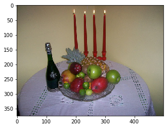
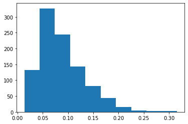
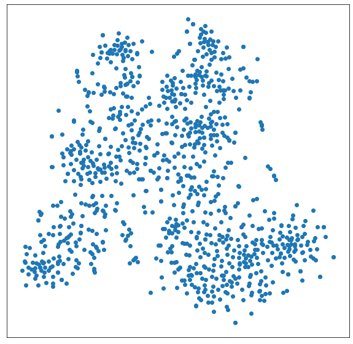
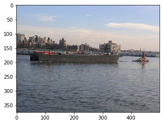
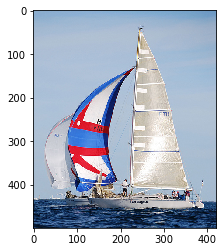
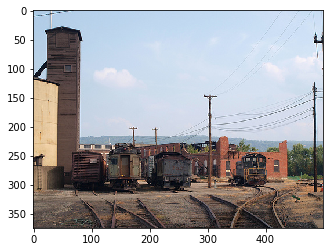
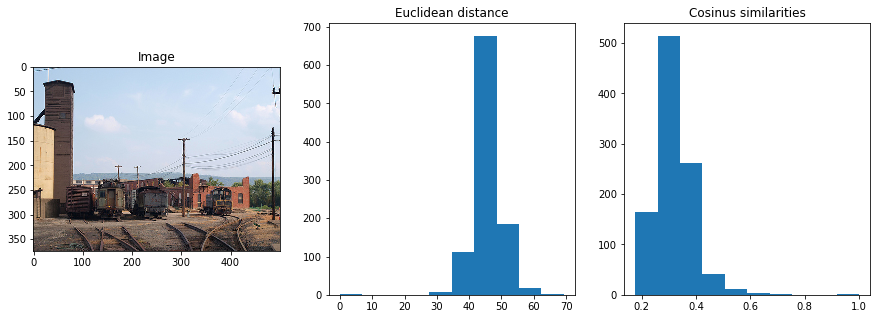
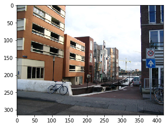
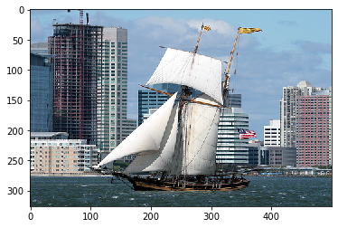
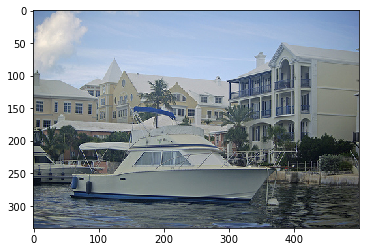

This notebook is based on the Deep Learning course from the Master Datascience Paris Saclay. Materials of the course can be found [here](https://github.com/m2dsupsdlclass/lectures-labs). The complete code can be found on a Kaggle [kernel](https://www.kaggle.com/stevengolo/pretrained-convnets-with-keras).

**Goals**
* Load a pre-trained model ResNet50 using Keras Zoo.
* Build a headless model and compute representations of images.
* Explore the quality of representation with $t$-SNE.
* Retrain last layer on an other dataset.


```python
# Load the model
model = ResNet50(include_top=True, weights='imagenet')
```


    Model: "resnet50"
    __________________________________________________________________________________________________
    Layer (type)                    Output Shape         Param #     Connected to                     
    ==================================================================================================
    input_1 (InputLayer)            [(None, 224, 224, 3) 0                                            
    __________________________________________________________________________________________________
    ...
    __________________________________________________________________________________________________
    avg_pool (GlobalAveragePooling2 (None, 2048)         0           conv5_block3_out[0][0]           
    __________________________________________________________________________________________________
    probs (Dense)                   (None, 1000)         2049000     avg_pool[0][0]                   
    ==================================================================================================
    Total params: 25,636,712
    Trainable params: 25,583,592
    Non-trainable params: 53,120
    __________________________________________________________________________________________________


## Classification of an image

We would like to classify an image using the ResNet50 model and decode the predictions using `decode_predictions` from Keras. Be careful that the Keras `ResNet50` expects floating poiint images of size $(224, 224)$ with a dynamic in $[0, 255]$ before preprocessing. The function `resize` from the `skimage` library with the `preserve_range` flag to do that. Moreover, the preprocessing of the image can be done using `preprocess_input`.


```python
# Load and show an image
DIR = '../input/pascal-voc-2012/VOC2012/JPEGImages'
img = imread(f'{DIR}/2007_000250.jpg')
```


<center>
<p class="caption">
Figure 1: Example image
</p>
</center>


```python
# Classify the image
img_resize = resize(img, (224, 224), preserve_range=True).astype('float32')
img_batch = preprocess_input(img_resize[np.newaxis])

preds = model.predict(img_batch)
preds_decode = decode_predictions(preds)
```

    candle: 26.4%
    wine_bottle: 20.2%
    croquet_ball: 8.75%
    red_wine: 7.96%
    hip: 7.11%


## Computing the representations of images

Let's build a new model that maps the image input space to the output of the layer before the last layer of the pretrained ResNet50 model. We call this new model the *base model*.


```python
input_layer = model.layers[0].input
output_layer = model.layers[-1].input
base_model = Model(input_layer, output_layer)
```

    The output shape of the base model is (None, 2048).


The base model can transform any image into a flat, high dimensional, semantic feature vector.


```python
representation = base_model.predict(img_batch)
```

    Shape of the representation of the image: (1, 2048).
    Proportion of zero valued axis: 7.08%.


In order to speed up the computations, we only select $50$ images (on 17125) from the complete dataset.


```python
# Preprocess a sample of images
PATHS = [DIR + '/' + path for path in random.choices(os.listdir(DIR), k=1000)]
IMGS = []
for path in PATHS:
    img = imread(path)
    img_resize = resize(img, (224, 224), preserve_range=True).astype('float32')
    IMGS.append(preprocess_input(img_resize[np.newaxis]))
```


```python
# Compute representation of sample of images
batch_tensor = np.vstack(IMGS)
out_tensors = base_model.predict(batch_tensor)
```

    Shape of the representations: (1000, 2048).
    Proportion of zero values axis for one representation: 4.88%



<center>
<p class="caption">
Figure 2: Histogram of zero values axis percentage
</p>
</center>

These zero values come the different reLU units. They propagate through the layers and there can be many. If a network has too many of them, a kot of compution/memory is wasted.

Let's find a 2D representation of that high dimensional feature space using $t$-SNE


```python
# Compute tSNE representation
img_emb_tsne = TSNE(perplexity=30).fit_transform(out_tensors)
```


```python
plt.figure(figsize=(10, 10))
plt.scatter(img_emb_tsne[:, 0], img_emb_tsne[:, 1])
plt.xticks(()); plt.yticks(());
plt.show()
```



<center>
<p class="caption">
Figure 3: $t$-SNE representation of the sampled images
</p>
</center>


```python
def imscatter(x, y, paths, ax=None, zoom=1, linewidth=0):
    if ax is None:
        ax = plt.gca()
    x, y = np.atleast_1d(x, y)
    artists = []
    for x0, y0, p in zip(x, y, paths):
        try:
            im = imread(p)
        except:
            print(p)
            continue
        im = resize(im,(224,224))
        im = OffsetImage(im, zoom=zoom)
        ab = AnnotationBbox(im, (x0, y0), xycoords='data',
                            frameon=True, pad=0.1, 
                            bboxprops=dict(edgecolor='red',
                                           linewidth=linewidth))
        artists.append(ax.add_artist(ab))
    ax.update_datalim(np.column_stack([x, y]))
    ax.autoscale()
    return artists
```


```python
fig, ax = plt.subplots(figsize=(50, 50))
imscatter(img_emb_tsne[:, 0], img_emb_tsne[:, 1], PATHS, zoom=0.5, ax=ax)
plt.show()
```


<center>
<p class="caption">
Figure 4: $t$-SNE representation of the sampled images
</p>
</center>

## Visual search: finding similar images


```python
def most_similar(idx, top_n=4):
    # Compute Euclidean distance between every image reprentations
    # and the image idx.
    dists = np.linalg.norm(out_tensors - out_tensors[idx], axis=1)
    sorted_dists = np.argsort(dists)
    return sorted_dists[2:(top_n + 2)]
```


```python
IDX = 50

similar = most_similar(IDX)
```







<center>
<p class="caption">
Figure 5: Most similar images of the $50$th image according to Euclidean distance
</p>
</center>

## Classification from Nearest Neighbors

Using these representations, it may be possible to build a nearest neighbor classifier. However, the representations are learnt on ImageNet, which are centered images, and may not directly be extensible to input images from PascalVOC, which are more plausible inputs of a real world system.

Here, we explores the possibility by computing the histogram of similarities between one images and the others.


```python
# Compute the norms of each representation
out_norms = np.linalg.norm(out_tensors, axis=1, keepdims=True)
normed_out_tensors = out_tensors / out_norms
```


```python
IDX = 50

eucl_dist = np.linalg.norm(out_tensors - out_tensors[IDX], axis=1)
cos_dist = np.dot(normed_out_tensors, normed_out_tensors[IDX])
```



<center>
<p class="caption">
Figure 6: Histograms of similarities
</p>
</center>

Unfortunately, there is no clear separation of class boundaries visible in the histogram of similarites alone. We need some supervision to be able to classify images.

With a labeled dataset, even with very little labels per class, one would be able to:
* build a $k$-Nearest Neighbors model;
* build a classification model such as a SVM.

These approximate classifiers are useful in practice.


```python
items = np.where(cos_dist > 0.5)
```








<center>
<p class="caption">
Figure 7: Most similar images of the $50$th image according to cosine similarities
</p>
</center>
